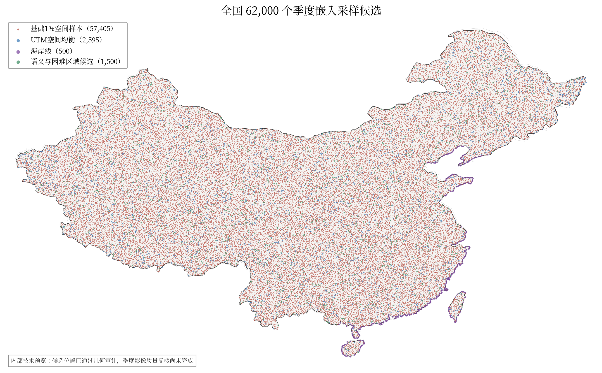
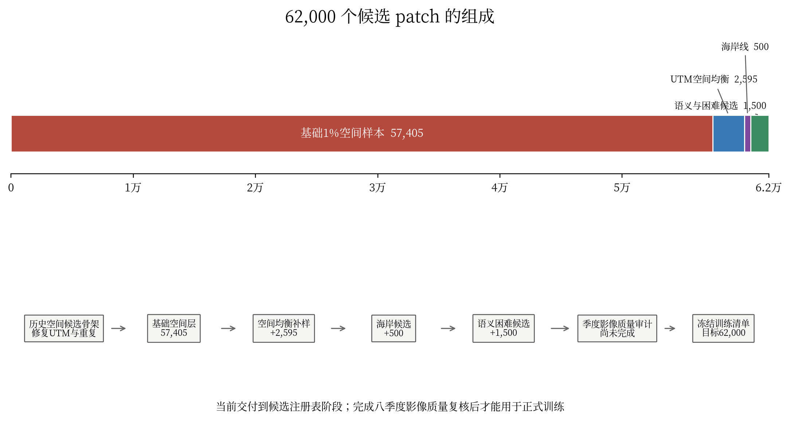

# 先读我：中国版季度嵌入采样数据说明

版本：2026-07-27

## 一、先看结论

本次已经生成 **62,000 个全国采样候选位置**。每个位置对应一个
**1,280 m × 1,280 m** 的遥感影像块（patch），后续在相同位置整理
2020 年和 2021 年共八个季度的 Sentinel-2、Sentinel-1、Landsat 等多源数据，
用于训练全国季度地理嵌入模型。

这 62,000 个位置已经完成数量、唯一性、国界范围、UTM 归属和跨分区重叠检查。
它们目前是**数据下载和质量复核用的候选清单**，还不是最终训练集。正式训练前，
还要检查每个位置八个季度的云、缺测、有效观测数和跨源配准质量，并复核少量
海岸候选和 1,500 个语义/困难区域候选。

**当前状态：** 当前交付物只包含候选中心、裁切范围和注册表，不包含
Sentinel-1、Sentinel-2、Landsat 季度影像，也没有生成 embedding。
审计状态为 `quality_eligible_for_training=false`，因此当前不能直接启动正式训练。

## 二、为什么这样采样

如果把全国陆地按 1,280 m × 1,280 m 切成连续网格，大约有 586 万个 patch。
全部下载和训练的存储、计算成本过高，因此首版先选择约 1% 的位置建立全国空间
骨架，再补充容易被均匀随机采样遗漏的区域。

最终采用“全国基础抽样 + 三类补样”的方法：

| 采样层 | 数量 | 作用 |
| --- | ---: | --- |
| 全国基础 1% 空间样本 | 57,405 | 尽量均匀覆盖全国陆地 |
| UTM 空间均衡补样 | 2,595 | 补足较小、狭长和边界复杂分区 |
| 海岸线补样 | 500 | 加强真实陆海交界的几何覆盖 |
| 语义与困难区域待复核候选 | 1,500 | 为后续核验城市、稀有地物、基础设施和困难观测区预留配额 |
| **合计** | **62,000** | 形成全国季度模型的空间采样骨架 |

方案设计中的补样是在基础样本之外增加新位置。实际物化时，为修复历史候选中的
UTM 归属和重复问题，修复了 992 个位置、删除了 27 个越界位置，并重新补齐
116 个基础层位置。因此不能再用旧 patch ID 或旧坐标清单继续下载。目标补样
属于有目的的加强候选，不能当作全国等概率统计样本；当前基础层也不能直接按
0.01 入选概率进行无偏统计推断。

数量关系为：`57,405 + 2,595 = 60,000`，再增加 500 个海岸候选和 1,500 个
语义/困难候选，得到 62,000 个位置。“1%”表示空间抽样设计的目标概率，不是用
全国面积估算值简单乘以 1% 后强制取整。基础层还经过边界宏网格概率修正、历史
候选骨架 UTM 修复、跨区去重和确定性补齐，所以实际数量为 57,405。

## 三、具体怎么采

### 1. 建立全国规则网格

全国陆地按 UTM 分区建立米制规则网格。每个 patch 边长为 1,280 m，对应
128 × 128 个 10 m 像素。相邻 10 × 10 个 patch 组成一个约
12.8 km × 12.8 km 的宏网格。

### 2. 选取基础 1% 样本

完整宏网格内用固定随机种子 `20260717` 和 SHA-256 哈希确定一个 patch。
海岸、岛屿和国界附近不足 100 个有效 patch 的宏网格按实际有效数量修正入选
概率，避免边界地区被过度采样。相同边界、网格原点、种子和输入清单可以复现
相同结果。

当前基础层是对已有 57,405 点历史候选骨架进行 UTM 归属修复、宏网格去重和
确定性补齐后得到的工程候选版，并不是从完整整数候选全集重新进行的一次全新
抽样。这一点已写入审计文件，后续冻结正式训练注册表时必须保留该来源说明。

### 3. 做空间均衡补样

基础样本之后，按各 UTM 分区有效候选数量的平方根分配 2,595 个新增名额。
这样既照顾面积较大的分区，也避免面积较小的分区没有补样。

### 4. 做海岸线补样

海岸候选同时参考中国陆地边界和独立海洋面，重点加强真实陆海交界的几何覆盖，
不把普通河岸、湖岸、省界或陆地国界误当成海岸。当前结果没有进一步证明这些
位置分别属于港口、滩涂、河口或岛屿等语义类别。

### 5. 做语义和困难区域补样

额外设置 1,500 个候选名额，其中城市和建成区 500 个、稀有自然地物 400 个、
稀有基础设施 300 个、困难观测区 300 个。后续使用土地覆盖、历史 OSM、DEM
和季度影像质量统计进行复核和排序，不使用最终下游人工测试标签。
目前四类均为待复核配额，不能解释为已经确认存在相应地物的训练标签。

### 6. 统一去重和检查

所有样本按中心经度唯一归属 UTM 分区，使用 patch ID、身份哈希和 footprint
哈希三重去重。跨 UTM 分区的两个 patch 如果重叠超过 1%，只保留一个，并从
同层候补池补足数量。

## 四、现在采到了什么

当前目录中已经落盘 62,000 个采样中心和对应的 1,280 m × 1,280 m 范围，
经度范围约为 73.81°E 至 134.78°E，纬度范围约为 18.23°N 至 53.30°N。

当前已有：

1. 62,000 个中心点和 62,000 个裁切范围。
2. 每个位置的 patch ID、UTM 网格、经纬度、采样层、采样原因和身份哈希。
3. 生成脚本、输入数据校验值、Git 提交号和完整审计结果。

当前尚无：

1. 2020Q1 至 2021Q4 的原始影像和季度合成影像。
2. 云、云影、无效值和饱和像素掩膜。
3. 跨源配准结果和影像质量准入结论。
4. 最终训练、验证、测试划分及全国 embedding。

几何和注册表审计结果如下：

| 检查项 | 结果 |
| --- | ---: |
| 候选总数 | 62,000 |
| 唯一 patch ID | 62,000 |
| 唯一身份哈希 | 62,000 |
| 唯一 footprint 哈希 | 62,000 |
| 中心位于中国边界之外 | 0 |
| UTM 归属错误 | 0 |
| 跨 UTM 重叠超过 1% | 0 |
| 基础层宏网格重复 | 0 |
| 补样层宏网格重复 | 0 |
| 严格通过陆海交界检查的海岸样本 | 481 |
| 待高精度海岸线复核的近海候选 | 19 |
| 未被当前冻结 ADM1 面覆盖的中心点 | 1,004 |

在物化过程中还修复了历史候选中的 UTM 归属问题、重复身份和跨分区重叠。
注册表统一记录主采样种子 `20260717`，具体补齐和选择还使用确定性的子种子。
目录中保存了生成脚本、输入数据校验值和 Git 提交号，便于追溯和复现。

“中心位于中国边界之外为 0”只表示中心点检查通过；海岸和边境 patch 的
1,280 m 范围可以跨出边界。审计文件中的 `admin1_values_filled_from_adm1`
是脚本多阶段赋值的累计计数，不能当作样本数；有效结果以 60,996 个已赋 ADM1
和 1,004 个 `ADM1_NOT_COVERED_BY_FROZEN_SOURCE` 为准。

**图 1  全国 62,000 个采样候选分布。** 红色为基础 1% 空间样本，蓝色为
UTM 空间均衡补样，紫色为海岸补样，绿色为语义与困难区域复核候选。该图是内部
技术预览，不作为对外公开地图使用。

**图 2  采样组成和处理流程。** 先建立全国空间骨架，再依次增加空间均衡、
海岸及语义困难样本，最后经过季度影像质量审计后冻结正式训练注册表。

## 五、采样使用的坐标系

本次采样同时使用两类坐标系，但用途不同。

### 1. 布设网格使用 WGS84 / UTM 米制坐标系

真正建立 1,280 m × 1,280 m patch、计算 10 × 10 宏网格以及判断 patch
重叠时，使用各位置所属的 **WGS84 / UTM 北半球投影坐标系**。中国范围涉及
UTM 43N 至 UTM 53N：

| UTM 分区 | EPSG 代码 | 主要经度带 |
| --- | ---: | --- |
| UTM 43N | EPSG:32643 | 72°E 至 78°E |
| UTM 44N | EPSG:32644 | 78°E 至 84°E |
| UTM 45N | EPSG:32645 | 84°E 至 90°E |
| UTM 46N | EPSG:32646 | 90°E 至 96°E |
| UTM 47N | EPSG:32647 | 96°E 至 102°E |
| UTM 48N | EPSG:32648 | 102°E 至 108°E |
| UTM 49N | EPSG:32649 | 108°E 至 114°E |
| UTM 50N | EPSG:32650 | 114°E 至 120°E |
| UTM 51N | EPSG:32651 | 120°E 至 126°E |
| UTM 52N | EPSG:32652 | 126°E 至 132°E |
| UTM 53N | EPSG:32653 | 132°E 至 138°E |

UTM 坐标的单位是米，因此一个 patch 可以严格定义为
1,280 m × 1,280 m，相邻网格的距离、面积和重叠比例也可以直接按米和平方米
计算。每个采样中心按照中心经度唯一归属一个 UTM 分区，避免同一个位置同时在
相邻两个分区生成重复 patch。注册表中的 `grid_id` 表示 UTM 分区，
`grid_epsg` 保存对应的 EPSG 代码，`grid_row` 和 `grid_col` 保存该分区规则
网格中的行列号。

### 2. 交付图层使用 WGS84 经纬度坐标系

采样方框在所属 UTM 分区内生成后，再转换为 **WGS84 地理坐标系
（EPSG:4326）**进行统一交付。中心点的 `longitude` 和 `latitude` 字段以及
GeoPackage、Shapefile 中的最终几何均使用 EPSG:4326，单位是十进制度。
在这些 GIS 文件中，坐标按 **X=经度、Y=纬度** 保存。例如一个中心坐标
`(116.3, 39.9)` 表示东经 116.3°、北纬 39.9°，不能把两列顺序颠倒。

因此，EPSG:4326 主要用于全国数据汇总、地图显示和跨平台交换；它不用于直接
按经纬度差值计算 1,280 米长度。纬度不同，同样的经度差对应的地面距离不同，
如果直接在经纬度坐标中画正方形，patch 的实际尺寸和面积会发生变化。

### 3. 使用时需要注意

1. 查看全国分布、与其他经纬度数据叠加时，可以直接使用交付图层的 EPSG:4326。
2. 裁切已经完成正射校正和地理编码的遥感影像时，应先确认影像坐标系，并使用
   GIS 或 GDAL 完成严格坐标转换，不能只把经纬度字段当作像素坐标。
3. 需要重新计算 patch 宽度、面积、缓冲区、邻接关系或重叠率时，应按照
   `grid_epsg` 转回该 patch 所属的 UTM 投影坐标系后计算。
4. 本次采样使用的是 WGS84 / UTM 和 WGS84 经纬度，不是 Web Mercator
   （EPSG:3857），也不是直接使用 CGCS2000 平面坐标。

## 六、交付包里每个文件是什么

| 文件 | 内容和用途 |
| --- | --- |
| `先读我.docx` | 本说明文档。介绍采样方法、实际成果、文件用途、当前限制和后续工作。 |
| `README.md` | 交付包的纯文本入口说明。适合在服务器或代码仓库中快速查看。 |
| `china_quarterly_62000_candidate.gpkg` | 推荐优先使用的空间数据文件。内含 `centers` 和 `footprints` 两个图层：前者是 62,000 个采样中心，后者是每个中心对应的 1,280 m × 1,280 m 裁切范围。 |
| `china_quarterly_62000_candidate_centers.shp` | 62,000 个采样中心点。属性中包含 patch ID、UTM 网格、经纬度、采样层、采样原因和注册表状态，适合空间查询、覆盖统计和下载任务分片。 |
| `china_quarterly_62000_candidate_centers.shx` | 中心点 Shapefile 的空间索引，GIS 软件读取中心点时需要。 |
| `china_quarterly_62000_candidate_centers.dbf` | 中心点 Shapefile 的属性表，保存每个采样点的字段信息。 |
| `china_quarterly_62000_candidate_centers.prj` | 中心点图层的坐标系定义，内容为 WGS84（EPSG:4326）。 |
| `china_quarterly_62000_candidate_centers.cpg` | 中心点属性表的字符编码说明，用于避免字段文字乱码。 |
| `china_quarterly_62000_candidate_footprints.shp` | 62,000 个 patch 的空间范围。每个面对应一个 1,280 m × 1,280 m 裁切框，主要用于裁切 Sentinel-1、Sentinel-2、Landsat 等遥感影像。 |
| `china_quarterly_62000_candidate_footprints.shx` | patch 范围 Shapefile 的空间索引。 |
| `china_quarterly_62000_candidate_footprints.dbf` | patch 范围 Shapefile 的属性表，保存 patch ID、位置和采样类型等信息。 |
| `china_quarterly_62000_candidate_footprints.prj` | patch 范围图层的坐标系定义，内容为 WGS84（EPSG:4326）。 |
| `china_quarterly_62000_candidate_footprints.cpg` | patch 范围属性表的字符编码说明。 |
| `china_quarterly_62000_candidate_registry.csv` | 62,000 条候选记录的表格版注册表。适合批量下载调度、统计分析和人工筛选；包含 `patch_id`、经纬度、UTM 网格、采样层、采样原因和当前状态等字段。 |
| `china_quarterly_62000_candidate_registry.jsonl` | 完整注册表，每行对应一个 patch。除 CSV 字段外，还保存身份哈希、footprint、选择子种子、行政区、生态区、季度质量状态和数据划分状态等完整审计信息。 |
| `china_quarterly_62000_candidate_audit.json` | 本次物化过程的审计报告。记录输入数据来源及 SHA-256、生成命令、Git 提交、UTM 修复、重复消解、跨区重叠处理、各采样层数量、检查结果和已知限制。 |
| `china_quarterly_62000_candidate_preview.png` | 62,000 个候选位置的全国分布预览图。不同颜色表示基础空间样本、UTM 空间均衡补样、海岸补样以及语义与困难区域候选。该图仅作内部技术检查。 |
| `SHA256SUMS.json` | 交付包主要文件的 SHA-256 校验值。文件传输或解压后可用它确认内容是否完整、是否被修改。 |

所有空间图层统一使用 WGS84（EPSG:4326）。patch 范围先在所属 UTM 分区内按
1,280 m 正方形生成，再转换到 WGS84，不是用经纬度近似画出的方框。

最小使用步骤：

1. 优先打开 GeoPackage；其中 `centers` 是中心点图层，`footprints` 是裁切范围
   图层。
2. 批量下载调度读取 CSV 中的 `patch_id`、`longitude`、`latitude`、
   `grid_epsg`、`sampling_layer` 和 `registry_status`。
3. 实际裁切遥感影像使用 `footprints`，不要只按中心经纬度估算范围。
4. 使用 `SHA256SUMS.json` 检查文件是否完整。使用 Shapefile 时，`.shp`、
   `.shx`、`.dbf`、`.prj` 和 `.cpg` 文件必须成套保留。
5. 当前 62,000 条记录的 `registry_status` 均为
   `design_candidate_not_quality_eligible`。

## 七、接下来还要做什么

1. 为 62,000 个位置统计 2020Q1 至 2021Q4 的 Sentinel-2、Sentinel-1 和
   Landsat 数据覆盖。
2. 生成云、云影、无效值、饱和等像素级掩膜，并统计每季度有效观测数。
3. 检查不同数据源之间的空间配准误差。
4. 使用高精度海岸线复核 19 个 `near_coast_pending` 候选。
5. 使用土地覆盖、历史 OSM、DEM 和影像质量数据重新核验 1,500 个语义与困难
   区域候选。
6. 复核并处理 1,004 个未被当前 ADM1 面覆盖的位置，避免影响省域统计和空间划分。
7. 从同层、同区域的固定候补池替换质量不合格位置，最终仍保持 62,000 个唯一
   patch。
8. 质量验收完成后冻结正式训练注册表，并建立空间隔离的训练、验证和测试划分。

在这些步骤完成之前，当前文件应标记为
`design_candidate_not_quality_eligible`，用于数据获取、覆盖统计和质量检查，
不能直接改名为最终训练集。

本说明只负责帮助使用者快速理解交付包。具体概率设计、质量阈值、季度合成和
验收规则以正式采样技术方案及 `china_quarterly_62000_candidate_audit.json`
为准。
