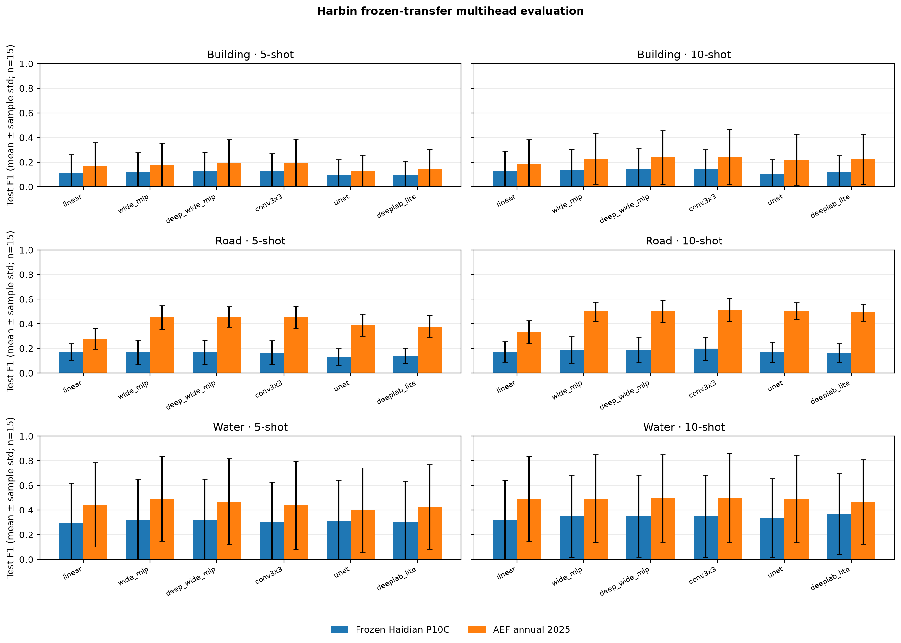

# Harbin frozen-transfer multihead evaluation

## Audit status

- **Passed:** 1080/1080 paired cells, with 1080 complete atomic bundles.
- The primary table contains only frozen Haidian P10C and AEF annual-2025; Harbin scratch is rejected and excluded.
- Thresholds are selected from the locked validation split; prediction archives are checked against locked validation/test patch IDs.

## Per-head test metrics

Each value is mean ± sample standard deviation over the locked 5 spatial folds × 3 seeds (n=15).

| Family | Task | Shot | Head | F1 | AP | AUC | n |
|---|---|---:|---|---:|---:|---:|---:|
| AEF annual 2025 | Building | 5 | conv3x3 | 0.193 ± 0.195 | 0.186 ± 0.194 | 0.919 ± 0.068 | 15 |
| AEF annual 2025 | Building | 5 | deep_wide_mlp | 0.193 ± 0.190 | 0.174 ± 0.178 | 0.941 ± 0.043 | 15 |
| AEF annual 2025 | Building | 5 | deeplab_lite | 0.143 ± 0.161 | 0.118 ± 0.137 | 0.779 ± 0.190 | 15 |
| AEF annual 2025 | Building | 5 | linear | 0.168 ± 0.188 | 0.144 ± 0.165 | 0.917 ± 0.075 | 15 |
| AEF annual 2025 | Building | 5 | unet | 0.128 ± 0.129 | 0.110 ± 0.113 | 0.829 ± 0.103 | 15 |
| AEF annual 2025 | Building | 5 | wide_mlp | 0.178 ± 0.176 | 0.155 ± 0.161 | 0.933 ± 0.049 | 15 |
| AEF annual 2025 | Building | 10 | conv3x3 | 0.243 ± 0.225 | 0.233 ± 0.226 | 0.906 ± 0.161 | 15 |
| AEF annual 2025 | Building | 10 | deep_wide_mlp | 0.238 ± 0.216 | 0.218 ± 0.210 | 0.951 ± 0.035 | 15 |
| AEF annual 2025 | Building | 10 | deeplab_lite | 0.224 ± 0.204 | 0.207 ± 0.201 | 0.932 ± 0.056 | 15 |
| AEF annual 2025 | Building | 10 | linear | 0.189 ± 0.195 | 0.162 ± 0.183 | 0.942 ± 0.057 | 15 |
| AEF annual 2025 | Building | 10 | unet | 0.221 ± 0.207 | 0.210 ± 0.210 | 0.932 ± 0.047 | 15 |
| AEF annual 2025 | Building | 10 | wide_mlp | 0.230 ± 0.207 | 0.207 ± 0.200 | 0.949 ± 0.036 | 15 |
| AEF annual 2025 | Road | 5 | conv3x3 | 0.452 ± 0.090 | 0.483 ± 0.100 | 0.851 ± 0.055 | 15 |
| AEF annual 2025 | Road | 5 | deep_wide_mlp | 0.458 ± 0.083 | 0.505 ± 0.090 | 0.896 ± 0.047 | 15 |
| AEF annual 2025 | Road | 5 | deeplab_lite | 0.378 ± 0.091 | 0.372 ± 0.094 | 0.783 ± 0.064 | 15 |
| AEF annual 2025 | Road | 5 | linear | 0.278 ± 0.084 | 0.194 ± 0.066 | 0.804 ± 0.071 | 15 |
| AEF annual 2025 | Road | 5 | unet | 0.389 ± 0.089 | 0.362 ± 0.107 | 0.759 ± 0.077 | 15 |
| AEF annual 2025 | Road | 5 | wide_mlp | 0.452 ± 0.097 | 0.488 ± 0.095 | 0.898 ± 0.047 | 15 |
| AEF annual 2025 | Road | 10 | conv3x3 | 0.515 ± 0.093 | 0.571 ± 0.087 | 0.889 ± 0.047 | 15 |
| AEF annual 2025 | Road | 10 | deep_wide_mlp | 0.500 ± 0.089 | 0.563 ± 0.086 | 0.909 ± 0.043 | 15 |
| AEF annual 2025 | Road | 10 | deeplab_lite | 0.492 ± 0.068 | 0.513 ± 0.092 | 0.861 ± 0.048 | 15 |
| AEF annual 2025 | Road | 10 | linear | 0.334 ± 0.093 | 0.287 ± 0.081 | 0.852 ± 0.075 | 15 |
| AEF annual 2025 | Road | 10 | unet | 0.505 ± 0.067 | 0.537 ± 0.074 | 0.872 ± 0.035 | 15 |
| AEF annual 2025 | Road | 10 | wide_mlp | 0.499 ± 0.078 | 0.560 ± 0.077 | 0.910 ± 0.042 | 15 |
| AEF annual 2025 | Water | 5 | conv3x3 | 0.439 ± 0.357 | 0.513 ± 0.364 | 0.827 ± 0.138 | 15 |
| AEF annual 2025 | Water | 5 | deep_wide_mlp | 0.468 ± 0.349 | 0.569 ± 0.362 | 0.845 ± 0.139 | 15 |
| AEF annual 2025 | Water | 5 | deeplab_lite | 0.426 ± 0.343 | 0.449 ± 0.365 | 0.760 ± 0.172 | 15 |
| AEF annual 2025 | Water | 5 | linear | 0.442 ± 0.342 | 0.533 ± 0.353 | 0.795 ± 0.189 | 15 |
| AEF annual 2025 | Water | 5 | unet | 0.398 ± 0.344 | 0.413 ± 0.366 | 0.752 ± 0.156 | 15 |
| AEF annual 2025 | Water | 5 | wide_mlp | 0.493 ± 0.345 | 0.594 ± 0.355 | 0.836 ± 0.150 | 15 |
| AEF annual 2025 | Water | 10 | conv3x3 | 0.499 ± 0.362 | 0.581 ± 0.353 | 0.825 ± 0.195 | 15 |
| AEF annual 2025 | Water | 10 | deep_wide_mlp | 0.496 ± 0.355 | 0.586 ± 0.371 | 0.844 ± 0.159 | 15 |
| AEF annual 2025 | Water | 10 | deeplab_lite | 0.467 ± 0.341 | 0.538 ± 0.353 | 0.810 ± 0.186 | 15 |
| AEF annual 2025 | Water | 10 | linear | 0.489 ± 0.347 | 0.603 ± 0.345 | 0.800 ± 0.224 | 15 |
| AEF annual 2025 | Water | 10 | unet | 0.492 ± 0.356 | 0.550 ± 0.359 | 0.818 ± 0.184 | 15 |
| AEF annual 2025 | Water | 10 | wide_mlp | 0.494 ± 0.356 | 0.605 ± 0.357 | 0.837 ± 0.175 | 15 |
| Frozen Haidian P10C | Building | 5 | conv3x3 | 0.129 ± 0.138 | 0.102 ± 0.119 | 0.812 ± 0.135 | 15 |
| Frozen Haidian P10C | Building | 5 | deep_wide_mlp | 0.127 ± 0.153 | 0.098 ± 0.131 | 0.831 ± 0.129 | 15 |
| Frozen Haidian P10C | Building | 5 | deeplab_lite | 0.094 ± 0.116 | 0.062 ± 0.084 | 0.701 ± 0.204 | 15 |
| Frozen Haidian P10C | Building | 5 | linear | 0.115 ± 0.146 | 0.076 ± 0.105 | 0.770 ± 0.183 | 15 |
| Frozen Haidian P10C | Building | 5 | unet | 0.097 ± 0.124 | 0.073 ± 0.102 | 0.676 ± 0.234 | 15 |
| Frozen Haidian P10C | Building | 5 | wide_mlp | 0.122 ± 0.153 | 0.093 ± 0.130 | 0.829 ± 0.114 | 15 |
| Frozen Haidian P10C | Building | 10 | conv3x3 | 0.142 ± 0.160 | 0.126 ± 0.146 | 0.888 ± 0.080 | 15 |
| Frozen Haidian P10C | Building | 10 | deep_wide_mlp | 0.141 ± 0.170 | 0.117 ± 0.155 | 0.876 ± 0.088 | 15 |
| Frozen Haidian P10C | Building | 10 | deeplab_lite | 0.117 ± 0.135 | 0.082 ± 0.104 | 0.770 ± 0.141 | 15 |
| Frozen Haidian P10C | Building | 10 | linear | 0.128 ± 0.165 | 0.096 ± 0.137 | 0.811 ± 0.149 | 15 |
| Frozen Haidian P10C | Building | 10 | unet | 0.103 ± 0.117 | 0.076 ± 0.094 | 0.794 ± 0.219 | 15 |
| Frozen Haidian P10C | Building | 10 | wide_mlp | 0.140 ± 0.165 | 0.116 ± 0.155 | 0.873 ± 0.076 | 15 |
| Frozen Haidian P10C | Road | 5 | conv3x3 | 0.167 ± 0.096 | 0.120 ± 0.079 | 0.632 ± 0.110 | 15 |
| Frozen Haidian P10C | Road | 5 | deep_wide_mlp | 0.169 ± 0.097 | 0.124 ± 0.081 | 0.654 ± 0.110 | 15 |
| Frozen Haidian P10C | Road | 5 | deeplab_lite | 0.140 ± 0.062 | 0.093 ± 0.051 | 0.587 ± 0.041 | 15 |
| Frozen Haidian P10C | Road | 5 | linear | 0.173 ± 0.067 | 0.104 ± 0.048 | 0.643 ± 0.085 | 15 |
| Frozen Haidian P10C | Road | 5 | unet | 0.132 ± 0.066 | 0.088 ± 0.051 | 0.558 ± 0.050 | 15 |
| Frozen Haidian P10C | Road | 5 | wide_mlp | 0.169 ± 0.100 | 0.123 ± 0.081 | 0.660 ± 0.105 | 15 |
| Frozen Haidian P10C | Road | 10 | conv3x3 | 0.198 ± 0.095 | 0.144 ± 0.081 | 0.680 ± 0.107 | 15 |
| Frozen Haidian P10C | Road | 10 | deep_wide_mlp | 0.188 ± 0.104 | 0.142 ± 0.090 | 0.668 ± 0.118 | 15 |
| Frozen Haidian P10C | Road | 10 | deeplab_lite | 0.165 ± 0.075 | 0.114 ± 0.066 | 0.625 ± 0.056 | 15 |
| Frozen Haidian P10C | Road | 10 | linear | 0.173 ± 0.084 | 0.110 ± 0.052 | 0.649 ± 0.110 | 15 |
| Frozen Haidian P10C | Road | 10 | unet | 0.170 ± 0.083 | 0.119 ± 0.073 | 0.633 ± 0.056 | 15 |
| Frozen Haidian P10C | Road | 10 | wide_mlp | 0.189 ± 0.106 | 0.141 ± 0.096 | 0.667 ± 0.116 | 15 |
| Frozen Haidian P10C | Water | 5 | conv3x3 | 0.301 ± 0.326 | 0.319 ± 0.358 | 0.669 ± 0.154 | 15 |
| Frozen Haidian P10C | Water | 5 | deep_wide_mlp | 0.317 ± 0.335 | 0.339 ± 0.361 | 0.705 ± 0.146 | 15 |
| Frozen Haidian P10C | Water | 5 | deeplab_lite | 0.305 ± 0.330 | 0.300 ± 0.341 | 0.660 ± 0.134 | 15 |
| Frozen Haidian P10C | Water | 5 | linear | 0.294 ± 0.326 | 0.306 ± 0.339 | 0.681 ± 0.134 | 15 |
| Frozen Haidian P10C | Water | 5 | unet | 0.310 ± 0.334 | 0.288 ± 0.333 | 0.646 ± 0.127 | 15 |
| Frozen Haidian P10C | Water | 5 | wide_mlp | 0.318 ± 0.334 | 0.345 ± 0.360 | 0.710 ± 0.143 | 15 |
| Frozen Haidian P10C | Water | 10 | conv3x3 | 0.351 ± 0.334 | 0.400 ± 0.343 | 0.757 ± 0.138 | 15 |
| Frozen Haidian P10C | Water | 10 | deep_wide_mlp | 0.353 ± 0.332 | 0.407 ± 0.346 | 0.746 ± 0.153 | 15 |
| Frozen Haidian P10C | Water | 10 | deeplab_lite | 0.368 ± 0.328 | 0.386 ± 0.345 | 0.751 ± 0.131 | 15 |
| Frozen Haidian P10C | Water | 10 | linear | 0.318 ± 0.323 | 0.346 ± 0.337 | 0.716 ± 0.157 | 15 |
| Frozen Haidian P10C | Water | 10 | unet | 0.335 ± 0.321 | 0.397 ± 0.333 | 0.744 ± 0.140 | 15 |
| Frozen Haidian P10C | Water | 10 | wide_mlp | 0.351 ± 0.334 | 0.401 ± 0.347 | 0.746 ± 0.154 | 15 |

## Modality-masking diagnostic status

No high-resolution-masked result is included in this primary table. The separate P10C-only diagnostic is valid only after a newly exported and sealed embedding set verifies that both high-resolution optical and high-resolution SAR availability are disabled. Unmasked embeddings are not treated as masked evidence.
