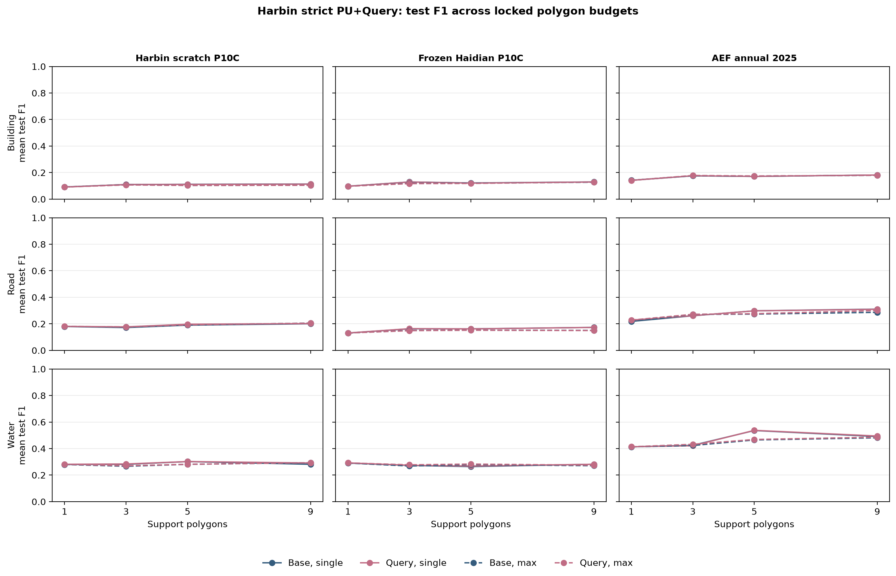

# Harbin PU+Query transfer: strict paired audit

## Audit result

- Audited exactly **2160/2160** locked cells from one v3 result root.
- Verified all 45 frozen schedules, every cell protocol lock, and train/validation/test isolation for all 2160 cells.
- The prior v1/v2 roots and their logs are explicitly excluded; no parent directory scan or legacy result file is used.
- Every aggregate is mean ± sample standard deviation across the locked 5 spatial folds × 3 seeds (n=15).

## Reference readout: 3 polygons, max prototype

| Family | Task | Query | F1 | AP | AUC | n |
|---|---|---|---:|---:|---:|---:|
| AEF annual 2025 | Building | adaptive | 0.179 ± 0.195 | 0.132 ± 0.156 | 0.935 ± 0.059 | 15 |
| AEF annual 2025 | Building | disabled | 0.177 ± 0.192 | 0.131 ± 0.154 | 0.935 ± 0.060 | 15 |
| Frozen Haidian P10C | Building | adaptive | 0.117 ± 0.145 | 0.082 ± 0.121 | 0.701 ± 0.195 | 15 |
| Frozen Haidian P10C | Building | disabled | 0.119 ± 0.147 | 0.083 ± 0.122 | 0.703 ± 0.198 | 15 |
| Harbin scratch P10C | Building | adaptive | 0.107 ± 0.125 | 0.079 ± 0.088 | 0.865 ± 0.099 | 15 |
| Harbin scratch P10C | Building | disabled | 0.108 ± 0.126 | 0.079 ± 0.088 | 0.866 ± 0.099 | 15 |
| AEF annual 2025 | Road | adaptive | 0.272 ± 0.100 | 0.200 ± 0.085 | 0.791 ± 0.101 | 15 |
| AEF annual 2025 | Road | disabled | 0.271 ± 0.098 | 0.204 ± 0.084 | 0.794 ± 0.100 | 15 |
| Frozen Haidian P10C | Road | adaptive | 0.149 ± 0.066 | 0.096 ± 0.036 | 0.599 ± 0.100 | 15 |
| Frozen Haidian P10C | Road | disabled | 0.150 ± 0.066 | 0.095 ± 0.036 | 0.601 ± 0.102 | 15 |
| Harbin scratch P10C | Road | adaptive | 0.177 ± 0.072 | 0.103 ± 0.053 | 0.606 ± 0.116 | 15 |
| Harbin scratch P10C | Road | disabled | 0.176 ± 0.071 | 0.103 ± 0.052 | 0.610 ± 0.103 | 15 |
| AEF annual 2025 | Water | adaptive | 0.432 ± 0.325 | 0.482 ± 0.374 | 0.730 ± 0.218 | 15 |
| AEF annual 2025 | Water | disabled | 0.423 ± 0.332 | 0.480 ± 0.373 | 0.734 ± 0.220 | 15 |
| Frozen Haidian P10C | Water | adaptive | 0.278 ± 0.326 | 0.324 ± 0.376 | 0.602 ± 0.186 | 15 |
| Frozen Haidian P10C | Water | disabled | 0.268 ± 0.314 | 0.322 ± 0.374 | 0.601 ± 0.185 | 15 |
| Harbin scratch P10C | Water | adaptive | 0.271 ± 0.309 | 0.212 ± 0.266 | 0.468 ± 0.163 | 15 |
| Harbin scratch P10C | Water | disabled | 0.266 ± 0.306 | 0.211 ± 0.264 | 0.469 ± 0.158 | 15 |

## Marginal effect of Query

The following paired differences are `adaptive − disabled`, averaged over each locked fold/seed pair. Positive values favor Query; they do not compare different schedules or thresholds.

| Family | Task | Polygons | Prototype | ΔF1 | ΔAP | ΔAUC | n |
|---|---|---:|---|---:|---:|---:|---:|
| AEF annual 2025 | Building | 1 | max | -0.001 ± 0.002 | -0.000 ± 0.001 | -0.000 ± 0.001 | 15 |
| AEF annual 2025 | Building | 1 | single | -0.001 ± 0.002 | -0.000 ± 0.001 | -0.000 ± 0.001 | 15 |
| AEF annual 2025 | Building | 3 | max | +0.002 ± 0.006 | +0.001 ± 0.004 | +0.000 ± 0.001 | 15 |
| AEF annual 2025 | Building | 3 | single | +0.001 ± 0.003 | +0.000 ± 0.003 | -0.000 ± 0.001 | 15 |
| AEF annual 2025 | Building | 5 | max | +0.001 ± 0.004 | +0.002 ± 0.003 | +0.001 ± 0.003 | 15 |
| AEF annual 2025 | Building | 5 | single | +0.000 ± 0.003 | +0.001 ± 0.003 | +0.000 ± 0.001 | 15 |
| AEF annual 2025 | Building | 9 | max | +0.000 ± 0.002 | +0.002 ± 0.005 | +0.001 ± 0.003 | 15 |
| AEF annual 2025 | Building | 9 | single | +0.000 ± 0.003 | +0.001 ± 0.003 | -0.000 ± 0.001 | 15 |
| AEF annual 2025 | Road | 1 | max | +0.010 ± 0.034 | -0.001 ± 0.003 | -0.000 ± 0.004 | 15 |
| AEF annual 2025 | Road | 1 | single | +0.010 ± 0.034 | -0.001 ± 0.003 | -0.000 ± 0.004 | 15 |
| AEF annual 2025 | Road | 3 | max | +0.001 ± 0.012 | -0.004 ± 0.008 | -0.003 ± 0.009 | 15 |
| AEF annual 2025 | Road | 3 | single | +0.001 ± 0.009 | -0.002 ± 0.004 | -0.002 ± 0.006 | 15 |
| AEF annual 2025 | Road | 5 | max | +0.003 ± 0.015 | -0.002 ± 0.004 | -0.000 ± 0.002 | 15 |
| AEF annual 2025 | Road | 5 | single | -0.000 ± 0.006 | -0.001 ± 0.003 | -0.001 ± 0.003 | 15 |
| AEF annual 2025 | Road | 9 | max | +0.013 ± 0.020 | -0.004 ± 0.004 | -0.001 ± 0.003 | 15 |
| AEF annual 2025 | Road | 9 | single | -0.001 ± 0.004 | -0.003 ± 0.002 | -0.001 ± 0.002 | 15 |
| AEF annual 2025 | Water | 1 | max | +0.000 ± 0.009 | -0.001 ± 0.008 | +0.000 ± 0.011 | 15 |
| AEF annual 2025 | Water | 1 | single | +0.000 ± 0.009 | -0.001 ± 0.008 | +0.000 ± 0.011 | 15 |
| AEF annual 2025 | Water | 3 | max | +0.009 ± 0.022 | +0.002 ± 0.015 | -0.003 ± 0.014 | 15 |
| AEF annual 2025 | Water | 3 | single | -0.003 ± 0.027 | -0.001 ± 0.008 | -0.001 ± 0.011 | 15 |
| AEF annual 2025 | Water | 5 | max | +0.004 ± 0.022 | -0.002 ± 0.008 | -0.002 ± 0.011 | 15 |
| AEF annual 2025 | Water | 5 | single | +0.001 ± 0.009 | +0.001 ± 0.005 | -0.000 ± 0.005 | 15 |
| AEF annual 2025 | Water | 9 | max | +0.005 ± 0.020 | -0.002 ± 0.009 | -0.003 ± 0.011 | 15 |
| AEF annual 2025 | Water | 9 | single | +0.004 ± 0.010 | +0.002 ± 0.005 | -0.001 ± 0.006 | 15 |
| Frozen Haidian P10C | Building | 1 | max | -0.000 ± 0.003 | -0.000 ± 0.002 | +0.003 ± 0.010 | 15 |
| Frozen Haidian P10C | Building | 1 | single | -0.000 ± 0.003 | -0.000 ± 0.002 | +0.003 ± 0.010 | 15 |
| Frozen Haidian P10C | Building | 3 | max | -0.003 ± 0.005 | -0.000 ± 0.001 | -0.002 ± 0.005 | 15 |
| Frozen Haidian P10C | Building | 3 | single | -0.001 ± 0.001 | +0.000 ± 0.001 | +0.004 ± 0.017 | 15 |
| Frozen Haidian P10C | Building | 5 | max | -0.002 ± 0.008 | -0.001 ± 0.004 | -0.004 ± 0.009 | 15 |
| Frozen Haidian P10C | Building | 5 | single | -0.001 ± 0.002 | -0.001 ± 0.002 | -0.000 ± 0.005 | 15 |
| Frozen Haidian P10C | Building | 9 | max | +0.002 ± 0.008 | -0.000 ± 0.002 | +0.002 ± 0.012 | 15 |
| Frozen Haidian P10C | Building | 9 | single | -0.001 ± 0.003 | -0.001 ± 0.002 | -0.002 ± 0.007 | 15 |
| Frozen Haidian P10C | Road | 1 | max | +0.000 ± 0.004 | -0.000 ± 0.001 | -0.002 ± 0.007 | 15 |
| Frozen Haidian P10C | Road | 1 | single | +0.000 ± 0.004 | -0.000 ± 0.001 | -0.002 ± 0.007 | 15 |
| Frozen Haidian P10C | Road | 3 | max | -0.002 ± 0.007 | +0.001 ± 0.002 | -0.002 ± 0.005 | 15 |
| Frozen Haidian P10C | Road | 3 | single | +0.001 ± 0.007 | +0.000 ± 0.002 | +0.000 ± 0.004 | 15 |
| Frozen Haidian P10C | Road | 5 | max | -0.001 ± 0.004 | +0.000 ± 0.002 | +0.001 ± 0.006 | 15 |
| Frozen Haidian P10C | Road | 5 | single | -0.000 ± 0.006 | +0.000 ± 0.001 | -0.000 ± 0.003 | 15 |
| Frozen Haidian P10C | Road | 9 | max | -0.001 ± 0.009 | -0.000 ± 0.002 | -0.000 ± 0.005 | 15 |
| Frozen Haidian P10C | Road | 9 | single | -0.000 ± 0.005 | +0.000 ± 0.001 | -0.002 ± 0.002 | 15 |
| Frozen Haidian P10C | Water | 1 | max | +0.002 ± 0.005 | +0.000 ± 0.003 | +0.002 ± 0.010 | 15 |
| Frozen Haidian P10C | Water | 1 | single | +0.002 ± 0.005 | +0.000 ± 0.003 | +0.002 ± 0.010 | 15 |
| Frozen Haidian P10C | Water | 3 | max | +0.009 ± 0.027 | +0.002 ± 0.003 | +0.001 ± 0.008 | 15 |
| Frozen Haidian P10C | Water | 3 | single | +0.001 ± 0.008 | +0.000 ± 0.003 | +0.001 ± 0.005 | 15 |
| Frozen Haidian P10C | Water | 5 | max | +0.004 ± 0.013 | +0.000 ± 0.004 | +0.001 ± 0.006 | 15 |
| Frozen Haidian P10C | Water | 5 | single | +0.004 ± 0.014 | +0.001 ± 0.003 | +0.001 ± 0.005 | 15 |
| Frozen Haidian P10C | Water | 9 | max | +0.004 ± 0.011 | -0.003 ± 0.013 | -0.005 ± 0.014 | 15 |
| Frozen Haidian P10C | Water | 9 | single | -0.000 ± 0.004 | -0.001 ± 0.005 | -0.002 ± 0.008 | 15 |
| Harbin scratch P10C | Building | 1 | max | -0.001 ± 0.002 | -0.000 ± 0.001 | -0.002 ± 0.005 | 15 |
| Harbin scratch P10C | Building | 1 | single | -0.001 ± 0.002 | -0.000 ± 0.001 | -0.002 ± 0.005 | 15 |
| Harbin scratch P10C | Building | 3 | max | -0.001 ± 0.003 | -0.001 ± 0.001 | -0.001 ± 0.003 | 15 |
| Harbin scratch P10C | Building | 3 | single | +0.001 ± 0.004 | -0.000 ± 0.001 | -0.001 ± 0.003 | 15 |
| Harbin scratch P10C | Building | 5 | max | +0.000 ± 0.003 | -0.000 ± 0.001 | -0.002 ± 0.002 | 15 |
| Harbin scratch P10C | Building | 5 | single | -0.001 ± 0.003 | -0.001 ± 0.002 | -0.001 ± 0.002 | 15 |
| Harbin scratch P10C | Building | 9 | max | -0.000 ± 0.002 | -0.001 ± 0.001 | -0.002 ± 0.003 | 15 |
| Harbin scratch P10C | Building | 9 | single | -0.001 ± 0.003 | -0.001 ± 0.002 | -0.001 ± 0.002 | 15 |
| Harbin scratch P10C | Road | 1 | max | +0.001 ± 0.003 | +0.001 ± 0.001 | +0.001 ± 0.003 | 15 |
| Harbin scratch P10C | Road | 1 | single | +0.001 ± 0.003 | +0.001 ± 0.001 | +0.001 ± 0.003 | 15 |
| Harbin scratch P10C | Road | 3 | max | +0.000 ± 0.003 | +0.000 ± 0.002 | -0.004 ± 0.020 | 15 |
| Harbin scratch P10C | Road | 3 | single | +0.005 ± 0.009 | +0.000 ± 0.001 | -0.001 ± 0.005 | 15 |
| Harbin scratch P10C | Road | 5 | max | +0.001 ± 0.003 | +0.001 ± 0.002 | +0.002 ± 0.005 | 15 |
| Harbin scratch P10C | Road | 5 | single | +0.007 ± 0.026 | -0.000 ± 0.001 | -0.002 ± 0.004 | 15 |
| Harbin scratch P10C | Road | 9 | max | -0.001 ± 0.005 | +0.000 ± 0.002 | +0.000 ± 0.005 | 15 |
| Harbin scratch P10C | Road | 9 | single | +0.001 ± 0.003 | +0.000 ± 0.000 | -0.000 ± 0.002 | 15 |
| Harbin scratch P10C | Water | 1 | max | +0.002 ± 0.005 | +0.002 ± 0.005 | -0.000 ± 0.007 | 15 |
| Harbin scratch P10C | Water | 1 | single | +0.002 ± 0.005 | +0.002 ± 0.005 | -0.000 ± 0.007 | 15 |
| Harbin scratch P10C | Water | 3 | max | +0.004 ± 0.009 | +0.001 ± 0.003 | -0.001 ± 0.009 | 15 |
| Harbin scratch P10C | Water | 3 | single | +0.002 ± 0.006 | +0.001 ± 0.003 | -0.001 ± 0.007 | 15 |
| Harbin scratch P10C | Water | 5 | max | +0.000 ± 0.004 | +0.001 ± 0.005 | +0.000 ± 0.014 | 15 |
| Harbin scratch P10C | Water | 5 | single | +0.000 ± 0.003 | +0.002 ± 0.005 | +0.001 ± 0.007 | 15 |
| Harbin scratch P10C | Water | 9 | max | -0.000 ± 0.006 | +0.001 ± 0.008 | -0.001 ± 0.014 | 15 |
| Harbin scratch P10C | Water | 9 | single | +0.010 ± 0.035 | +0.000 ± 0.008 | -0.003 ± 0.009 | 15 |

## Scope and interpretation boundary

This is a polygon-prompt PU+Query readout, not the patch-shot Conv3x3 benchmark. The three families share the same 380-patch universe, spatial folds, and frozen polygon schedules, seeds, and validation-only threshold. It therefore supports paired readout comparisons only; it must not be merged with the separate Conv3x3 table.

The complete 144-row family/task/budget/prototype/Query aggregate is provided in the companion CSV; the detailed cell and audit records remain under the sealed v3 data root.
