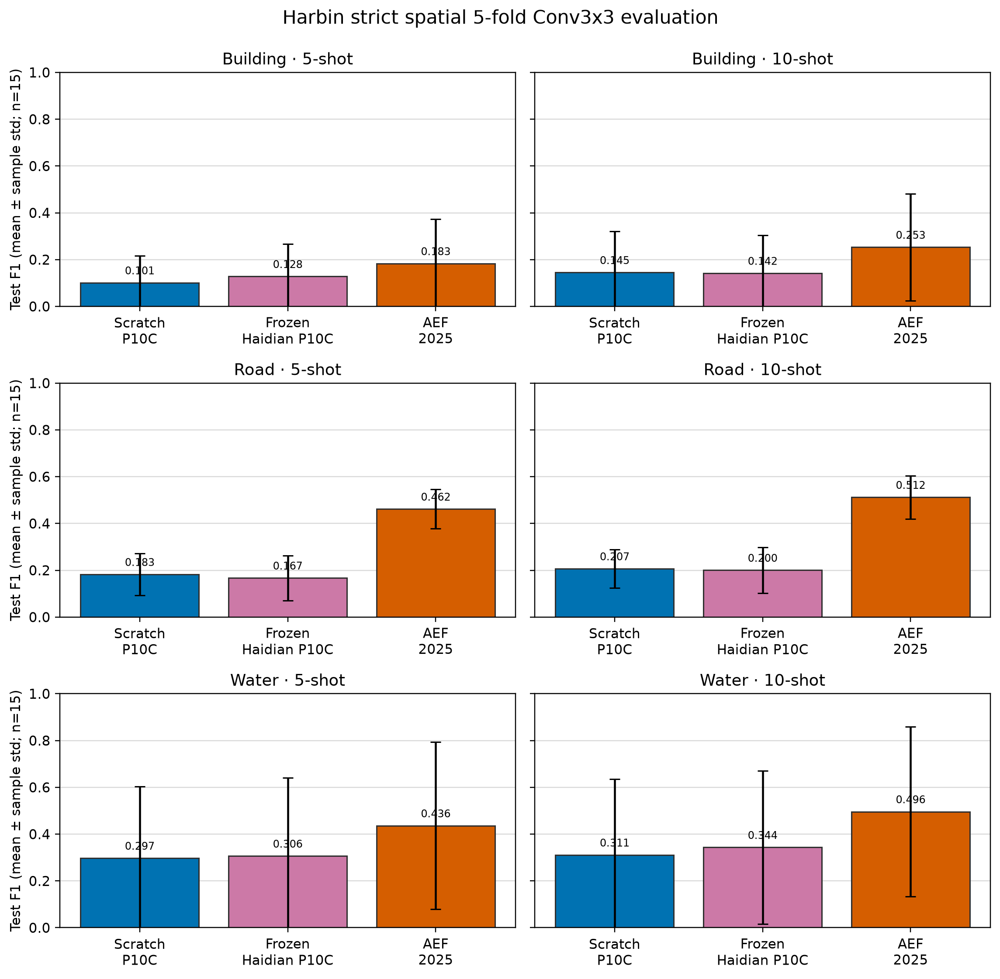

# 哈尔滨严格 Conv3x3 三方矩阵结果

## 技术摘要

本报告仅汇总锁定的 380-patch Harbin 协议：三种 embedding family、building/road/water、
5 个空间 fold、3 个 seed 和 5/10-shot 的 Conv3x3 readout。每个 family/task/shot 的
均值与样本标准差均基于 15 个独立的 fold×seed 单元；
阈值仅从同 fold 的 validation split 选择。

审计状态：**通过**（270/270 cells；
无缺失、重复或协议偏离）。

## F1 结果

图中误差线为跨 5 folds × 3 seeds 的样本标准差；图用于比较 representation，
不能说明跨年份输入之间的因果效应。

| Task | Shot | Harbin scratch P10C | Frozen Haidian P10C | AEF annual 2025 |
| --- | ---: | ---: | ---: | ---: |
| Building | 5 | 0.101 ± 0.116 | 0.128 ± 0.138 | 0.183 ± 0.189 |
| Building | 10 | 0.145 ± 0.175 | 0.142 ± 0.161 | 0.253 ± 0.229 |
| Road | 5 | 0.183 ± 0.090 | 0.167 ± 0.096 | 0.462 ± 0.084 |
| Road | 10 | 0.207 ± 0.082 | 0.200 ± 0.097 | 0.512 ± 0.092 |
| Water | 5 | 0.297 ± 0.306 | 0.306 ± 0.333 | 0.436 ± 0.358 |
| Water | 10 | 0.311 ± 0.325 | 0.344 ± 0.328 | 0.496 ± 0.363 |

## 完整指标

| Family | Task | Shot | F1 | AP | AUC-ROC |
| --- | --- | ---: | ---: | ---: | ---: |
| AEF annual 2025 | Building | 5 | 0.183 ± 0.189 | 0.177 ± 0.190 | 0.903 ± 0.075 |
| AEF annual 2025 | Building | 10 | 0.253 ± 0.229 | 0.243 ± 0.230 | 0.924 ± 0.126 |
| AEF annual 2025 | Road | 5 | 0.462 ± 0.084 | 0.497 ± 0.092 | 0.859 ± 0.047 |
| AEF annual 2025 | Road | 10 | 0.512 ± 0.092 | 0.569 ± 0.088 | 0.894 ± 0.044 |
| AEF annual 2025 | Water | 5 | 0.436 ± 0.358 | 0.513 ± 0.371 | 0.821 ± 0.146 |
| AEF annual 2025 | Water | 10 | 0.496 ± 0.363 | 0.584 ± 0.353 | 0.829 ± 0.189 |
| Frozen Haidian P10C | Building | 5 | 0.128 ± 0.138 | 0.102 ± 0.119 | 0.774 ± 0.187 |
| Frozen Haidian P10C | Building | 10 | 0.142 ± 0.161 | 0.124 ± 0.147 | 0.874 ± 0.064 |
| Frozen Haidian P10C | Road | 5 | 0.167 ± 0.096 | 0.120 ± 0.079 | 0.636 ± 0.110 |
| Frozen Haidian P10C | Road | 10 | 0.200 ± 0.097 | 0.150 ± 0.085 | 0.689 ± 0.101 |
| Frozen Haidian P10C | Water | 5 | 0.306 ± 0.333 | 0.316 ± 0.358 | 0.659 ± 0.151 |
| Frozen Haidian P10C | Water | 10 | 0.344 ± 0.328 | 0.393 ± 0.340 | 0.751 ± 0.140 |
| Harbin scratch P10C | Building | 5 | 0.101 ± 0.116 | 0.073 ± 0.090 | 0.769 ± 0.227 |
| Harbin scratch P10C | Building | 10 | 0.145 ± 0.175 | 0.123 ± 0.158 | 0.872 ± 0.071 |
| Harbin scratch P10C | Road | 5 | 0.183 ± 0.090 | 0.124 ± 0.068 | 0.671 ± 0.084 |
| Harbin scratch P10C | Road | 10 | 0.207 ± 0.082 | 0.140 ± 0.063 | 0.703 ± 0.085 |
| Harbin scratch P10C | Water | 5 | 0.297 ± 0.306 | 0.320 ± 0.339 | 0.696 ± 0.119 |
| Harbin scratch P10C | Water | 10 | 0.311 ± 0.325 | 0.389 ± 0.324 | 0.718 ± 0.162 |

## 协议与审计边界

- 380 个 coverage-locked patch，所有 family 均绑定同一 matrix input lock
  和 45 份冻结 shot schedule。
- 每个结果均重新核验：路径/metadata cell、锁定协议、Conv3x3 超参数、阈值范围、
  40 个 test patch、per-patch confusion 与总量、预测概率/标签 archive、
  validation archive、probe state。
- 报告 F1、AP、AUC 的全量均值±标准差在数据盘的 aggregate CSV；该比较仍应表述为
  严格 paired spatial readout，AEF annual 2025 与 2026-04 Xuannv embedding
  存在时间上下文差异。

## 后续

建议在论文中报告此表和完整 CSV，并在结果叙述中将 Harbin scratch 与
冻结 Haidian P10C 的差异解释为迁移/区域训练条件下的 readout 差异，
而非仅凭该矩阵做因果或时间等价声明。
