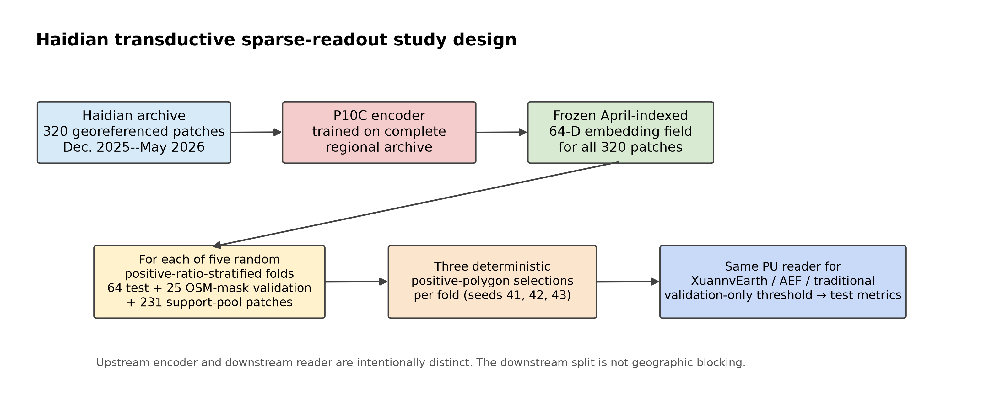
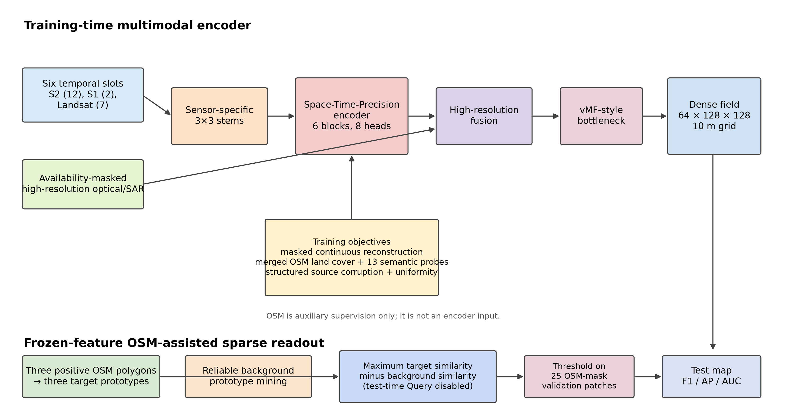
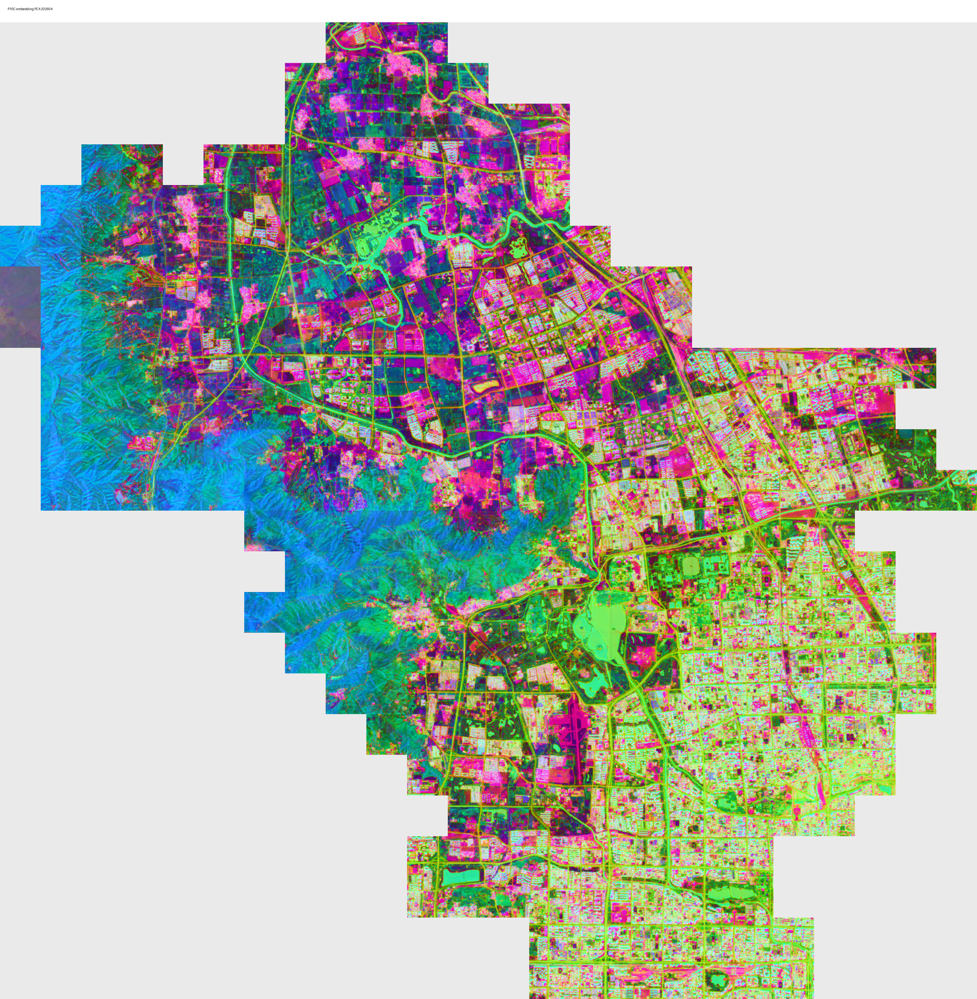

# XuannvEarth: Monthly multimodal embedding fields for OSM-assisted sparse urban mapping

> **Working RSE manuscript.** The P10C PU-retrieval results are preliminary working-draft evidence:
> they are internally reproducible but require immutable archival admission before submission.

## Title page

**Weijie Wu**\(^1\), **Xinyi Fan**\(^2\), and **Long Zhao**\(^1\)

\(^1\) Aerospace Information Research Institute, Chinese Academy of Sciences, Beijing, China 
\(^2\) Institute of Geographic Sciences and Natural Resources Research, Chinese Academy of Sciences, Beijing, China 
Corresponding author: Long Zhao (`zhaolong@aircas.ac.cn`)

> Author order, affiliations, ORCIDs, corresponding-author details, funding, and CRediT roles
> are provisional and require author confirmation before submission.

## Abstract

Urban mapping requires repeated extraction of buildings, roads, and water from heterogeneous and
partially observed Earth observations. We present XuannvEarth, a city-scale framework that encodes
six monthly slots of optical, radar, Landsat, and higher-resolution observations into frozen,
dense 64-dimensional embedding fields on a 10 m grid. The encoder combines sensor-specific stems,
availability-aware spatiotemporal fusion, higher-resolution pathways, a hyperspherical bottleneck,
structured source corruption, and OSM-derived auxiliary semantics. We evaluate the practical
question of whether three target polygons can initialise a reader that retrieves the same class
across an urban region with a lightweight positive--unlabelled (PU) reader. In Haidian District,
Beijing, we use five positive-pixel-ratio-stratified patch folds and three deterministic support
selections per fold. Three positive polygons initialise the reader, while 25 fully rasterized
OSM validation patches calibrate its threshold. Relative to an annual 2025 AlphaEarth Foundations (AEF)
embedding, XuannvEarth's April-indexed, six-slot contextual embedding has higher mean road F1 by
0.050 (95% fold-clustered bootstrap interval
[0.023, 0.093]) and water by 0.103 [0.033, 0.181]; building F1 is comparable (+0.010,
[-0.008, 0.033]) while ranking metrics are higher. The study is a single-city,
time-inequivalent, OSM-overlapping diagnostic comparison, not evidence of independent-label
transfer or global superiority.

**Keywords:** geospatial embedding; multimodal Earth observation; time series; weak supervision;
few-shot mapping; urban remote sensing.

## Highlights

- A monthly dense embedding interface for urban mapping readouts
- Heterogeneous EO observations are fused with availability awareness
- Three target polygons initialise a regional PU retrieval reader
- Stratified patch folds and labelled validation patches calibrate readout
- OSM-overlapping results are scoped as weak-label diagnostic evidence

> Final length and journal-specific requirements must be checked before submission.

## 1. Introduction

Urban mapping is not a one-time prediction problem. Municipal and scientific workflows repeatedly
request maps of buildings, roads, water, green space, facilities, and land-use proxies as new
imagery arrives. Training a separate high-capacity segmentation model for every category and date
duplicates upstream feature learning and ties each request to a new annotation campaign. Dense
geospatial embedding products offer a different interface: an encoder is trained once, frozen, and
read by small task-specific heads for subsequent mapping questions.

This interface is valuable only if it changes the downstream trade-off. A representation that is
visually smooth but cannot be read with a modest support set does not reduce the practical effort of
making a new map. Conversely, a representation need not outperform a fully supervised, task-specific
network trained on abundant labels to be useful: its intended operating point is repeated, diverse
mapping requests for which the feature extractor is already available and labels are scarce. The
relevant question is therefore one of reusable, label-efficient readout rather than universal
dominance over every raw-image segmentation pipeline.

Recent Earth-observation representation learners motivate reusable spatial features across sensors,
regions, and tasks. A monthly urban setting is materially different from an annual composite or a
globally aggregated product: a monthly slot can contain cloud and haze, missing optical
acquisitions, radar speckle, sparse higher-resolution imagery, and residual cross-sensor
registration error. It is therefore insufficient to show only an attractive embedding mosaic or
an in-region map. The representation must be evaluated with matched downstream readers and a
threshold protocol that never observes test labels.

XuannvEarth produces monthly-indexed dense geospatial embeddings from heterogeneous observations.
Each output is associated with one target month but may use six-month context through full temporal
attention; it is not a causal, month-local representation. For each 1.28 km by 1.28 km patch, the
model produces a 128 by 128 map of 64-dimensional unit-norm vectors, corresponding to a 10 m grid.
The representation is learned from multi-sensor reconstruction, a merged OSM land-cover target,
fine OSM-derived auxiliary probes, structured source corruption, and batch-uniformity regularisation.

The word *monthly* consequently describes the index and intended product cadence of the output, not
an assertion that all information is available within that calendar month. This distinction matters
for interpretation: the representation can use nearby-month context to compensate for missing or
degraded acquisitions, but a result at one target month is not evidence of causal monitoring or
instantaneous change detection. We make this information window explicit in the method and reserve
temporal-benefit claims for independently trained, information-matched ablations.

This paper asks a bounded question: can a frozen, transductive city embedding field support an
OSM-assisted urban retrieval workflow through the same lightweight reader and fixed support-polygon
budget? The protocol binds the encoder checkpoint, exported feature files, support selections,
validation-only thresholds, and downstream artifacts. Stratified patch folds quantify variation
under repeated support selections but do not remove spatial autocorrelation or establish geographic
generalisation.

The contributions are threefold. First, we specify a reusable dense monthly representation for
heterogeneous urban Earth observations. Second, we describe a multi-prototype PU reader for sparse
urban retrieval with validation-calibrated thresholds. Third, we document a bounded OSM-assisted
case study and its limitations: transductive training, random stratified patch splits, label
overlap, temporal mismatch, and single-city scope.

The remainder of the paper first situates this design among reusable EO representations and
weakly supervised geographic learning (Section 2). Section 3 specifies the data, architecture,
training objective, and evaluation protocol. Section 4 reports the preliminary case-study results;
Sections 5 and 6 interpret them within their geographic, temporal, and label-provenance boundaries.

## 2. Related work

### 2.1 Dense geospatial representations and EO foundation models

Large-scale Earth-observation encoders and embedding products motivate a stable feature interface
rather than a separate end-to-end model per task (Brown et al., 2025; Herzog et al., 2025;
Szwarcman et al., 2026). Temporal and multispectral masked pre-training has also shown that a
single encoder can support classification and segmentation readouts after downstream adaptation
(Cong et al., 2022). XuannvEarth follows this interface at city scale and monthly cadence. It is
not a global foundation model: its training extent, observation history, and label sources are
narrower than those of globally trained products. Accordingly, the paper does not infer global or
cross-region transfer from a single-city case study.

Large-scale supervised remote-sensing resources such as SatlasPretrain also demonstrate the value
of broad task and sensor coverage for transferable features (Bastani et al., 2023). In contrast,
this study asks a deliberately narrower systems question: whether a locally trained, dense monthly
field can serve as a reusable interface for repeated urban readouts when a global information budget
is not available. The distinction matters because scale, label ontology, observation period, and
sensor suite all alter what a downstream comparison can establish.

This distinction also affects the role of external products. A globally trained embedding can be a
useful contextual comparator because it exposes a common dense-feature interface to the same
downstream reader. It is not automatically an information-matched baseline: cadence, observation
period, input sensors, pretraining geography, and the treatment of weak labels can differ. We
therefore distinguish controlled *readout* comparisons from claims about upstream model scale or
general transfer, and retain that distinction in every comparator caption and interpretation.

XuannvEarth is closest in interface to AEF, which releases a dense embedding field intended for
sparse-label mapping, but differs in its single-city training extent and monthly-indexed output.
OlmoEarth emphasizes stable latent modelling of multimodal observations, whereas Prithvi-EO-2.0
emphasizes large-scale multitemporal pretraining and broad downstream adaptation (Herzog et al.,
2025; Szwarcman et al., 2026). Our contribution is not a claim to replace these global models. It
is an explicit city-product design in which missing observations, sparse higher-resolution inputs,
and a downstream sparse reader are treated as first-class operational constraints.

### 2.2 Multimodal and temporal Earth observation learning

Optical, radar, and Landsat observations offer complementary strengths but differ in noise,
availability, radiometry, and spatial resolution. Multimodal temporal models therefore require
availability-aware fusion and explicit treatment of missing sources. Masked reconstruction offers a
general self-supervised precedent for learning from partially observed visual inputs (He et al.,
2022), while SatMAE explicitly studies temporal and spectral positional encoding with both
consistent and independently masked observations (Cong et al., 2022). XuannvEarth uses
independent sensor stems and full temporal attention, while structured source corruption exposes
the encoder to missing modalities, months, and spatial blocks during training. This design targets
robustness; it does not by itself prove a causal contribution until matched ablations are admitted.

The central difficulty is that missingness is not exchangeable across sources. Optical data may be
obscured by cloud or haze, SAR remains available but is affected by speckle and different scattering
physics, and higher-resolution acquisitions may be sparse or temporally misaligned with the target
month. Treating absent values as ordinary observations can lead a reconstruction objective to model
acquisition artifacts rather than land surface. XuannvEarth therefore carries source-availability
information alongside the observations and evaluates reconstruction only where the original target
is valid. The construction is a robustness-oriented training mechanism, not an imputation product.

### 2.3 Reconstruction and weak geographic supervision

Masked reconstruction can encourage a representation to encode information shared across inputs,
but reconstruction targets must respect invalid pixels and source availability. OpenStreetMap is a
collaboratively maintained geographic database (Haklay and Weber, 2008); it can add weak semantic
structure while being incomplete, temporally uncertain, ontology-overlapping with downstream
labels, and spatially heterogeneous in quality (Barron et al., 2014). XuannvEarth therefore treats
OSM as auxiliary weak supervision and separates OSM-assisted
diagnostic evaluation from independent-label evidence.

This separation is especially important for dense urban tasks. A building, road, or water mask
derived from the same broad OSM ontology used to guide representation learning may be a useful
diagnostic of whether weak semantic structure is readable, but it cannot on its own demonstrate
that the encoder discovered an unseen ontology. In addition, locally retained OSM caches are not a
versioned historical snapshot aligned with the 2025--2026 observations. We thus neither treat them
as contemporaneous monthly ground truth nor use them to substantiate change claims.

### 2.4 Label-efficient and spatially valid evaluation

EO foundation-model evaluations commonly contrast limited-label adaptation with task-specific
learners, including linear-probe and segmentation settings (Dionelis et al., 2024; Szwarcman et
al., 2026). Such comparisons are only interpretable when the representation, support budget,
reader capacity, split, and decision rule are held fixed. They are particularly sensitive in spatial
data because nearby pixels and neighbouring patches are correlated (Roberts et al., 2017). We
therefore use
fixed support-patch schedules, training-only feature standardisation, and validation-only threshold
selection. In the present case study, patch folds are stratified but not geographically blocked;
these safeguards constrain the scope of our conclusions and do not replace independent labels,
spatial blocking, or a cross-city replication.

For imbalanced segmentation, threshold selection is a substantive part of the method rather than a
visualization detail. Reporting only ranking metrics can obscure a poor operating point, while
choosing a threshold after inspecting test masks leaks information into the final score. We report
both threshold-free metrics (AP and ROC-AUC) and thresholded metrics (F1, IoU, precision, and
recall), freeze the validation-selected threshold before test evaluation, and retain probabilities
and binary masks for audit. Fold-clustered uncertainty is likewise preferred to independent pixel
intervals because the latter can be artificially narrow in contiguous imagery.

The sparse reader is motivated by positive--unlabelled learning, where a labelled positive set is
paired with a mixture of unknown positives and negatives (Bekker and Davis, 2020). It is not a
formal class-prior-estimating PU risk minimiser: the OSM-derived support polygons are geographically
selected rather than randomly sampled positives, and the operating point is calibrated on separate
OSM masks. We therefore use *PU reader* as a description of its input interface and report its
operating assumptions explicitly, rather than claiming a distribution-free PU guarantee.

## 3. Materials and methods

### 3.1 Study area and spatial units

The study area is Haidian District, Beijing, China, and contains 320 georeferenced patches, each
covering 1.28 km by 1.28 km. The P10C regional encoder is trained as a transductive city product
using the complete regional observation archive from December 2025 through May 2026; its April
2026 embedding is the feature product evaluated here. The 320 patches are partitioned by
positive-pixel-ratio-stratified random five-fold cross-validation into five test sets of 64 patches.
Within each fold, 231 patches form the support pool and 25 fully rasterized OSM-mask patches form
the threshold-calibration set. No patch is discarded for the PU retrieval experiment.

The patch is the unit of support accounting and downstream holdout. The split is random stratified
at patch level, so adjacent patches can fall in different folds and spatial autocorrelation can
remain. All patches are also visible to the upstream P10C encoder. This is therefore a
transductive regional-product evaluation of sparse readout, not a spatial-generalisation or
inductive representation-generalisation experiment. Haidian contains dense urban fabric,
transport corridors, water bodies, green areas, and construction-related surfaces, but this local
diversity should not be interpreted as geographic representativeness of other cities.

**Figure 1. P10C transductive sparse-readout study design.** The encoder receives the complete
320-patch Haidian regional archive. For each downstream fold, 64 patches are used for test, 25
fully rasterized OSM-mask patches calibrate the threshold, and 231 patches form the support pool.
Three deterministic positive-polygon selections are drawn per fold. This is a random stratified
patch-level readout resampling protocol; it is not geographic blocking or inductive regional
generalisation.

### 3.2 Observations and auxiliary labels

Temporal inputs are Sentinel-2 optical imagery with 12 channels (Drusch et al., 2012), Sentinel-1
SAR with two channels (Torres et al., 2012), and a seven-channel Landsat stack. The model also
receives availability-masked higher-resolution optical imagery with three channels and
higher-resolution SAR imagery with one channel.
Higher-resolution observations are aggregated from available acquisitions and fused into every
target-month output; they are not assumed to be unique monthly acquisitions.

All sources are transformed to the common 128 by 128 output grid before fusion, while their
validity and availability are retained explicitly. Observations that are absent or invalid are
represented by their availability state rather than silently converted to nominal reflectance or
backscatter values. This distinction is central to the monthly setting, where cloudy optical scenes,
sparse higher-resolution acquisitions, and radar speckle are expected. Source-specific acquisition,
compositing, and alignment audits are retained as supplementary provenance material; they are not
inferred from visually selected examples.

The target-only categorical layer is an OSM-derived merged land-cover raster stored under the
legacy manifest key `worldcover`; it is removed before encoder input. The configured decoder has
11 output channels and its categorical loss ignores class 0. Fine auxiliary semantic supervision
separately uses 13 cleaned OSM
layers: building, major road, minor road, rail, water, green space, agriculture, residential,
commercial, industrial, construction, path/walk, and playground. OSM masks are not contemporaneous
ground truth for monthly change claims. Native resolutions, acquisition coverage, quality masks,
mosaicking, reprojection, alignment statistics, normalisation, source missingness, and OSM
provenance are retained in the project quality-control audit.

The label design has three deliberately separate roles. First, the merged categorical raster
provides broad, target-only land-surface structure during encoder training. Second, the cleaned
fine layers provide auxiliary semantic-probe supervision and hard-negative sampling. Third,
binary building, road, and water masks provide downstream diagnostic readouts. The latter overlap
with the broad OSM ontology and must not be described as independent labels. In particular, the
locally retained OSM material is re-rasterisable but lacks a versioned historical snapshot tied to
the observation window; it is consequently unsuitable as contemporaneous ground truth for monthly
change or for independent-transfer claims.

**Table 1. Inputs and auxiliary supervision in the P10C regional encoder.** All continuous sources
are availability-masked before fusion. The table records the model interface, rather than claiming
that every source is available in every target-month slot.

| Component | Channels | Role in P10C | Missingness / supervision treatment |
| --- | ---: | --- | --- |
| Sentinel-2 optical | 12 | Continuous reconstruction and temporal fusion | Availability mask; masked L1 on originally valid targets |
| Sentinel-1 SAR | 2 | Continuous reconstruction and temporal fusion | Availability mask; masked L1 on originally valid targets |
| Landsat stack | 7 | Continuous reconstruction and temporal fusion | Availability mask; masked L1 on originally valid targets |
| Higher-resolution optical | 3 | Fine-detail pathway and reconstruction | Availability mask; fused before bottleneck |
| Higher-resolution SAR | 1 | Fine-detail pathway and reconstruction | Availability mask; fused before bottleneck |
| Merged OSM land-cover raster | 11 classes | Target-only categorical reconstruction | Not encoder input; background ignored in loss |
| Fine OSM semantic layers | 13 binary layers | Auxiliary probe and hard-negative supervision | Includes building, road, water, and related urban classes |

### 3.3 XuannvEarth encoder

Each temporal sensor enters an independent 3 by 3 convolution, GroupNorm, and ReLU stem with 32
output channels. A learned source-aware gated-sum fusion combines available temporal stems. The
space-time-precision encoder has six blocks and eight attention heads. Its spatial, temporal, and
precision paths have dimensions 8 by 8 by 512, 16 by 16 by 256, and 128 by 128 by 128. Each block
performs spatial self-attention, per-pixel temporal self-attention with sinusoidal time encoding,
local precision convolutions, and cross-scale exchange.

More formally, let \(x_{m,s}\) denote the observation for month \(m\) and source \(s\), and let
\(a_{m,s}\) denote its availability mask. Sensor-specific stems map observations to features
\(h_{m,s}\), and a source-aware fusion operator combines only available sources to obtain a
month-conditioned feature \(h_m\). The spatiotemporal processor maps the full sequence
\(\{h_m, a_{m,s}\}_{m=1}^{6}\) to target-month maps \(z_m \in \mathbb{R}^{128\times128\times64}\).
Thus, an unavailable source can influence the fusion through its availability state but does not
contribute an invented observation. This notation also makes clear that target month \(m\) may
attend to other months in the six-slot window.

Higher-resolution optical and SAR features are resized to the output grid, encoded by three 3 by 3
convolutional layers with 32, 64, and 64 channels, and fused before the bottleneck. A learned 1 by
1 projection feeds a vMF-style hyperspherical bottleneck. The implementation L2-normalises each
embedding vector and, during training, adds isotropic Gaussian noise scaled by a learned
concentration before re-normalisation. Thus, *vMF-style* denotes an implemented approximation, not
a claim of exact vMF sampling.

The encoder returns six dense maps per sample, one for each target month, with shape 64 by 128 by
128. Per-month scene embeddings are spatial means followed by L2 normalisation. Continuous targets
are decoded by two-layer 1 by 1 convolutional heads; categorical targets use one 1 by 1
convolution.

The dense output preserves a spatially addressable interface: a downstream head receives one
64-dimensional vector per 10 m cell, rather than a patch-level descriptor that would require
reconstructing boundaries from a single global vector. Unit-norm embeddings make angular
relationships well defined for retrieval and regularisation, but do not themselves guarantee that
individual land-cover classes form disjoint clusters. We therefore evaluate the representation by
held-out downstream readout rather than by PCA appearance or an intrinsic-dimension estimate alone.

**Figure 2. XuannvEarth encoder and sparse-readout workflow.** Availability-masked temporal and
higher-resolution observations are fused into a 64-channel dense field. Reconstruction and OSM
semantic objectives are used only during encoder training. At readout, three OSM-derived support
polygons define target prototypes; a separate set of fully rasterized OSM validation masks selects
the operating threshold. The downstream reader does not use test labels to construct prototypes or
choose the threshold.

### 3.4 Objective and structured source corruption

Continuous reconstructions use masked L1 loss; the merged OSM land-cover target uses masked
cross-entropy with background ID 0 ignored. The P10C weights are 0.80 for Sentinel-2,
0.25 for Sentinel-1, 0.45 for Landsat, 0.45 for merged OSM land cover, 0.90 for higher-resolution
optical, and 0.35 for higher-resolution SAR. Fine OSM semantic-probe loss ramps to 0.14 over 80
epochs. Its hard-negative component uses a ratio of 0.02, weight 0.35, and 120-epoch warmup. The
batch-uniformity term uses temperature 2.0 and ramps to 0.06 over 60 epochs. Temporal-
endpoint, temporal-contrast, and supervised-change terms are disabled.

Corruption is applied during training after targets are prepared. Sentinel-2, Sentinel-1, and
Landsat are dropped independently with probabilities 0.18, 0.35, and 0.35. With probability 0.65,
one to four months are zeroed across temporal inputs. With probability 0.65, 16 by 16 spatial
blocks are selected and each is dropped with probability 0.32; this also masks higher-resolution
inputs. Availability masks are retained during configured corruptions, and reconstruction is
evaluated on originally valid targets.

For a continuous target \(y_t\) with original validity mask \(v_t\), the reconstruction term is
\(\mathcal{L}_{t}^{cont}=\|v_t\odot(\hat y_t-y_t)\|_1/(\sum v_t+\epsilon)\). For a categorical
target, the corresponding term is masked cross-entropy over non-background valid cells. The total
training objective is the weighted sum of continuous and categorical reconstruction terms, fine
semantic-probe loss, hard-negative loss, and batch-uniformity regularisation. Corruption changes
the inputs supplied to the encoder but not the definition of \(v_t\); a target is never made
"correct" merely because its source was synthetically dropped. This distinction prevents the
training loss from rewarding reconstruction of invalid or unavailable imagery.

The P10C configuration uses AdamW with learning rate 2e-6, weight decay 0.05, 30 epochs of linear
warmup, and cosine decay over 800 epochs. It uses batch size 3 per process, gradient accumulation
of two, mixed precision, gradient checkpointing, validation every 20 epochs, and a
checkpoint interval of 200 epochs. Realised wall-clock time, effective global batch size, and
energy use will be reported only from final run records.

The recipe is intentionally reported as a configuration rather than as a claim that every loss
term is independently beneficial. The high-resolution optical weight prioritises local visual
detail, whereas SAR-related reconstruction weights are lower because their noise statistics and
interpretation differ. The contribution of any one weight, the hard-negative term, or the
high-resolution pathway requires an admitted matched ablation. Until then, the configuration
documents the trained system but does not establish a mechanism of improvement.

**Table 2. P10C configuration used for the reported embedding.** Epoch-800 output is used below.

| Component | Setting |
| --- | --- |
| Output field | 64 channels on a 128 by 128 grid (10 m equivalent) |
| Temporal window | Six slots, December 2025 to May 2026; full temporal attention |
| STP encoder | Six blocks; eight heads; spatial/time/precision widths 512/256/128 |
| Continuous target weights | Sentinel-2 0.80; Sentinel-1 0.25; Landsat 0.45; higher-resolution optical 0.90; higher-resolution SAR 0.35 |
| OSM objectives | Merged land-cover 0.45; fine semantic probes ramp to 0.14 over 80 epochs; hard-negative ratio 0.02, weight 0.35, warmup 120 epochs |
| Uniformity | Weight ramps to 0.06 over 60 epochs; temperature 2.0 |
| Structured corruption | S2/S1/Landsat drop probabilities 0.18/0.35/0.35; month dropout 0.65; 16 by 16 block corruption probability 0.65, ratio 0.32 |
| Optimisation | AdamW, learning rate 2e-6, weight decay 0.05, 30-epoch warmup, cosine decay, 800 epochs, gradient accumulation 2 |

### 3.5 PU sparse-retrieval evaluation

For each task, a user-facing support set consists of three connected target polygons sampled from
the OSM-rasterized support pool. Each polygon is represented by the mean of its L2-normalised embedding vectors;
the reader retains all three prototypes and scores each pixel by its maximum similarity to a target
prototype. Reliable background vectors are mined from the lowest 30% foreground-similarity pixels
outside a three-pixel dilation of the support polygons. The score subtracts 0.65 times similarity
to the resulting background prototype. This is a positive--unlabelled reader: unlabelled pixels
are not assumed to be negative, and no test labels are used for prototype construction.

To avoid self-reinforcing false positives, the primary reported protocol disables test-patch Query
adaptation. The operating threshold is selected by maximising F1 on the 25 fully rasterized OSM
validation patches and
is then fixed for the 64 test patches. Building, road, and water results use five
positive-pixel-ratio-stratified patch folds and three deterministic polygon-selection seeds (41,
42, and 43), producing 15 paired cells per task.
We report F1, IoU, precision, recall, AP, and ROC-AUC. The three representations in each cell use
the same polygons, validation/test patches, PU parameters, and threshold rule.

For uncertainty, the three seed-level differences are averaged within each fold; the five randomly
stratified patch-fold means are then resampled with replacement. This fold-clustered bootstrap does
not treat different support selections on the same test patches as independent repetitions. Upstream P10C directly
uses OSM semantic probes for building, major/minor road, and water, while downstream masks are the
corresponding merged OSM task labels. The results are therefore task-aligned OSM weak-supervision
readouts, not ontology-independent transfer.

### 3.6 Annual-AEF contextual comparator

We compare against the official AEF annual-2025 embedding and a 42-channel April-2026 traditional
multisource feature stack. AEF is a contextual, time-inequivalent comparator: its annual 2025
product differs from XuannvEarth's monthly April-2026 product in observation period, inputs,
pretraining scale, and likely upstream geography. The comparison holds the *reader* fixed, not the
upstream information budget. Thus it assesses how available feature products behave under the same
three-polygon PU mapping interface; it does not establish global superiority or matched temporal
information.

The contextual AEF comparison consequently answers a narrow implementation question: given a
fixed PU reader and support schedule, how do the two available feature products behave on the
same downstream folds? It does not answer whether one representation has intrinsically better
temporal information, whether either product has seen related upstream geography, or whether a
monthly product should dominate an annual product for all applications. These questions require
additional information-matched experiments and are kept outside the stated comparison.

### 3.7 Registered assets, aggregation, and reproducibility

The P10C checkpoint, monthly embedding export, support polygons, validation/test patch identifiers,
thresholds, feature roots, PU hyperparameters, and per-cell metrics are retained in a machine-readable
record for each fold--seed cell. The evaluated implementation is
`scripts/eval/run_pu_query_sparse_eval.py`; each record explicitly stores the prototype mode,
Query mode, threshold mode, background weight, background quantile, and dilation width. The
evaluator prohibits nonlegacy variants from writing to the
original P10C result directory and prohibits validation-calibrated runs from using test-time Query
adaptation. These checks keep the historical single-prototype PU+Query case study separate from
the multi-prototype, validation-calibrated analysis reported here.

Reproducibility is treated as a chain rather than a collection of filenames. Each result record
identifies the feature product, support polygons, validation and test patch IDs, final threshold,
and PU hyperparameters. The complete 5-fold by 3-seed records remain available as supplementary
machine-readable material. This record does not substitute for independent pretraining repeats or
cross-city replication, both of which remain necessary for broader claims.

## 4. Results

### 4.1 OSM-assisted sparse mapping

**Table 3. OSM-assisted sparse PU-readout performance in Haidian.** Values are mean ± sample
standard deviation across five positive-pixel-ratio-stratified patch folds and three deterministic
support-polygon selections per fold (15 cells). XuannvEarth is an April-indexed output using the
December 2025 to May 2026 six-slot context; AEF is annual 2025. The PU reader uses three positive
polygons and a validation-only threshold selected from 25 fully rasterized OSM validation patches.

Table 3 reports the 15 fold--seed cells for each task. XuannvEarth exceeds the traditional
multisource feature stack on every reported mean metric. Relative to AEF, the largest gains occur
for road and water retrieval. Road F1 increases from 0.303 to 0.353, and water F1 increases from
0.245 to 0.348. Building F1 is similar (0.357 versus 0.347), whereas XuannvEarth has higher
building ranking metrics (AUC 0.793 versus 0.746; AP 0.288 versus 0.259).

| Task | Feature | F1 | AUC | AP |
| --- | --- | ---: | ---: | ---: |
| Building | XuannvEarth | **0.357 ± 0.063** | **0.793 ± 0.061** | **0.288 ± 0.073** |
| Building | AEF | 0.347 ± 0.088 | 0.746 ± 0.154 | 0.259 ± 0.083 |
| Building | Traditional multisource features | 0.204 ± 0.047 | 0.600 ± 0.106 | 0.141 ± 0.038 |
| Road | XuannvEarth | **0.353 ± 0.061** | **0.633 ± 0.124** | **0.256 ± 0.102** |
| Road | AEF | 0.303 ± 0.042 | 0.546 ± 0.120 | 0.186 ± 0.071 |
| Road | Traditional multisource features | 0.290 ± 0.019 | 0.529 ± 0.100 | 0.173 ± 0.043 |
| Water | XuannvEarth | **0.348 ± 0.195** | **0.771 ± 0.083** | **0.285 ± 0.208** |
| Water | AEF | 0.245 ± 0.168 | 0.720 ± 0.172 | 0.183 ± 0.174 |
| Water | Traditional multisource features | 0.158 ± 0.097 | 0.655 ± 0.133 | 0.099 ± 0.073 |

The standard deviations in Table 3 are descriptive variation across random stratified folds and
support draws, not independent encoder retraining uncertainty. High variation for water reflects
its sparse and clustered occurrence in some folds.

### 4.2 Contextual comparison with AEF

**Table 4. Paired XuannvEarth minus AEF differences under the fixed PU-reader protocol.** Brackets
give 95% percentile intervals from fold-clustered resampling: the three support-selection
differences are averaged within each fold, and the five fold means are resampled with replacement.
These intervals do not quantify independent pretraining, independent city, or multiple-comparison
uncertainty.

Table 4 reports paired differences using fold-clustered uncertainty. For roads, the F1,
AUC, and AP intervals are all positive: +0.050 [0.023, 0.093], +0.087 [0.044, 0.142], and +0.071
[0.030, 0.128], respectively. Water shows the same direction: +0.103 [0.033, 0.181] F1, +0.051
[0.008, 0.090] AUC, and +0.102 [0.027, 0.179] AP. For buildings, F1 is inconclusive (+0.010,
[-0.008, 0.033]), although AUC (+0.047 [0.016, 0.078]) and AP (+0.029 [0.005, 0.051]) are higher.

| Task | F1 difference | AUC difference | AP difference |
| --- | ---: | ---: | ---: |
| Building | +0.010 [-0.008, 0.033] | +0.047 [0.016, 0.078] | +0.029 [0.005, 0.051] |
| Road | +0.050 [0.023, 0.093] | +0.087 [0.044, 0.142] | +0.071 [0.030, 0.128] |
| Water | +0.103 [0.033, 0.181] | +0.051 [0.008, 0.090] | +0.102 [0.027, 0.179] |

These results establish a constrained feature-readout finding, not a globally matched model
ranking. AEF is annual-2025 while XuannvEarth and the traditional comparator are April-2026
products, and the readout labels overlap the OSM ontology used for auxiliary semantic training.
The experiments therefore show that the P10C feature product can support this sparse urban mapping
workflow; they do not establish independent semantic transfer, spatial generalisation, or universal
superiority.

**Figure 3. Contextual sparse-readout comparison.** XuannvEarth is the April 2026 output of the
P10C six-slot contextual encoder; AEF is the official annual 2025 product; traditional features
are an April 2026 42-channel multisource stack. Every bar uses the same three positive polygons,
validation/test patches, PU hyperparameters, and validation-only threshold selection. The figure is
an OSM-assisted, time-inequivalent feature-readout comparison, not an information-matched or
independent-label benchmark.

### 4.3 Interpretation of the comparison

The strongest contrast is against the traditional multisource stack, for which XuannvEarth has the
highest mean F1, AUC, and AP for all three tasks. The AEF comparison is more nuanced. The
fold-clustered intervals are positive for all three road and water metrics, while building F1 spans
zero. The ranking metrics for building nevertheless favour XuannvEarth. Because only five
stratified folds form the bootstrap unit and nine task--metric comparisons are reported without a
multiple-comparison correction, these intervals are descriptive paired evidence rather than a
claim of formal statistical significance.

The result also should not be interpreted as a controlled upstream-model comparison. The P10C
encoder used the complete Haidian archive and task-aligned OSM auxiliary supervision; AEF is an
annual 2025 public product, while the April-indexed P10C field has a six-slot 2025-12 to 2026-05
context. The common element is the frozen feature readout protocol. This makes the study useful for
the operational question of sparse urban mapping from available feature products, but insufficient
for a claim about information-matched representation quality.

### 4.4 Transductive full-region product illustration

Figure 4 visualizes the April-indexed P10C embedding field across the full 320-patch Haidian
product. The displayed red-green-blue image is a principal-component projection of the 64-channel
field; its colours have no class semantics. It is included to show spatial coverage and the
qualitative continuity of the exported product, not to quantify class separability. Because P10C
was trained transductively on the full regional archive, Figure 4 is not a held-out map and is not
used in Tables 3--4.

**Figure 4. Full-region P10C embedding product.** The 64-dimensional embedding map is projected
to three principal components for display. Empty regions denote locations outside the 320-patch
product extent. This qualitative illustration uses the same P10C epoch-800 artifact as the main
readout study, but does not constitute an independent evaluation.

## 5. Discussion

The central interpretation is limited to the preliminary case-study comparisons. They support the
narrower claim that a frozen monthly field can be read by a lightweight sparse PU reader in the
measured OSM-assisted setting. They do not demonstrate a universal land-surface ontology, transfer
independent of OSM, or parity with globally trained products.

The proposed interface is most naturally interpreted as an amortisation of upstream learning. Once
an embedding field is exported, a new mapping request can begin from a common spatial feature
representation rather than from a separate multisource ingestion and large end-to-end model. This
does not remove the need for labels, calibration, or domain review. Instead, it shifts the
downstream question toward whether a small, auditable reader can turn a fixed feature field into a
useful map under a stated support budget. The value of this framing is strongest where many
categories or repeated mapping questions share the same observation archive.

The protocol also clarifies a tension in weakly supervised geographic learning. OSM-derived
semantics can be scientifically useful because they introduce broad spatial structure without
manual labels for every cell. At the same time, they make downstream tasks with related ontologies
easier to read and thus limit the independence of the evidence. Treating these results as
diagnostic rather than hiding the overlap permits an ablation question to be asked honestly: how
does the representation behave when particular weak semantic ingredients are removed? It does not
make an OSM-overlapping result equivalent to an independently adjudicated benchmark.

Several extensions are required before broad claims can be made. A second-city clean-from-scratch
replication would assess whether the training recipe is reproducible beyond Haidian. Independently
created building, road, and water labels, selected before model comparison and accompanied by
adjudication records, are needed for ontology-independent transfer evidence. Information-matched
1-, 3-, and 6-month encoders are needed to identify the contribution of temporal context. Finally,
factorial high-resolution experiments and repeated encoder initialisations would separate recipe
effects from training variation. These are not cosmetic additions: each changes the type of claim
the study can support.

The design has several limitations. The present protocol is based on one urban region and randomly
stratified patch folds; it is not geographically blocked validation or second-city validation. OSM labels are incomplete, temporally
uncertain, and semantically related to downstream categories. Monthly observations have limited
temporal redundancy and can retain cloud, haze, source-missingness, radar speckle, and registration
artifacts. Sparse higher-resolution inputs are availability-masked and may be reused across target
months. Finally, a hyperspherical bottleneck does not guarantee uniformly distributed or linearly
separable semantic categories.

The reporting discipline has a practical cost: the current figures are a preliminary working-draft
case study until immutable archival admission binds the result records. We consider that boundary
preferable to reporting a convenient subset of folds, a threshold tuned on test labels, or a
qualitative full-region map as if it were independent validation.

## 6. Conclusion

XuannvEarth is a reusable monthly embedding framework for heterogeneous urban Earth observations.
It produces a 64-dimensional dense field at a 10 m grid and is designed for frozen-feature,
label-efficient readout. In a five-fold, three-support-selection OSM-assisted retrieval protocol,
the P10C embedding yields higher road and water metrics under this matched PU reader protocol, with
positive fold-clustered intervals; building F1 is comparable to AEF and its ranking metrics are
higher. These results are deliberately bounded: they use one city, a
transductive regional encoder, OSM-overlapping labels, and an annual-versus-monthly comparison.
Independent labels, matched-time comparators, repeated pretraining, and cross-city replication are
needed before making claims about general transfer or global foundation-model performance.

## Data and code availability

The project code, self-contained P10C configuration, evaluation reader, and figure-generation
script are maintained in the XuannvEarth repository. P10C checkpoint and embedding artifacts are
distributed through the `WeijieWu/xuannv_haidian_embdding` ModelScope dataset. Before submission,
an immutable release must bind the exact checkpoint, embedding export, OSM-rasterisation snapshot,
support polygons, patch splits, thresholds, per-cell predictions, aggregation report, and figure
inputs to a versioned manifest and a public archive identifier. This working draft does not yet
claim that this admission gate has been completed.

The release will document software and hardware environments sufficiently to rerun preprocessing,
encoder training, embedding export, PU-reader fitting, aggregation, and figure generation. Public
code excludes credentials and third-party imagery. Where a computation depends on a restricted
asset, the artifact manifest will state whether it can be reproduced from public inputs, requested
under a licence, or only inspected through a derived release product.

The OSM-derived training and readout masks can be released as derived rasters and documented
rasterisation rules where their source terms permit. Sentinel-1, Sentinel-2, and Landsat inputs
will be provided through reproducible acquisition/preprocessing instructions rather than
redistributed copies. Higher-resolution optical and SAR imagery are subject to third-party access
and redistribution terms and will not be redistributed; the archival release will state the source,
access condition, date window, preprocessing inputs, and a procedure for access requests. Any
artifact that cannot be publicly shared will be listed in the release manifest with its reason and
access route.

## Submission-package files

The submission package will contain the main manuscript, a separate title page if requested by the
submission system, a highlights file, figure files with captions, supplementary material, and a
graphical abstract only if required by the current RSE Guide for Authors. The graphical abstract
will communicate the input-to-embedding-to-lightweight-readout workflow without displaying
unadmitted quantitative claims. The final package will also include a data-availability statement
that distinguishes public code and derived artifacts from third-party higher-resolution imagery.

Before submission, the package will be checked against the current journal instructions for word
limits, figure specifications, reference style, data-availability wording, declarations, and any
requirements for graphical abstracts or highlights. This working manuscript deliberately keeps
author-dependent declarations separate so that project collaborators can review the technical text
without unintentionally asserting funding, authorship, or access conditions that have not been
confirmed.

## Supplementary material

The supplementary material will contain: (S1) acquisition, quality-mask, mosaicking,
reprojection, alignment, source-availability, and OSM-rasterisation audits; (S2) the stratified
five-fold split and three-polygon support manifests; (S3) self-contained P10C and PU-reader
configurations, commands, environment records, and checkpoint/export provenance; (S4) per-fold/
seed metrics, validation thresholds, prediction-file schemas, and held-out qualitative examples;
and (S5) the release-admission record, aggregation output, and fold-clustered bootstrap report.
Exact archive paths, version identifiers, and hashes will be inserted when the final immutable
release is created.

## CRediT authorship contribution statement

**[Author-confirmed roles required before submission.]**

## Funding

**[Author-confirmed funding information required before submission.]**

## Declaration of competing interests

**[Author-confirmed declaration required before submission.]**

## Acknowledgements

**[Author-confirmed acknowledgements required before submission.]**

## Prior dissemination statement

An earlier APGARSS conference abstract described the project direction and preliminary internal
experiments. This manuscript is a substantially expanded journal study with a separate
transductive OSM-assisted readout protocol, provenance-bound results, and a full methods and
limitations analysis.
The authors will provide the exact conference citation and ensure compliance with final publisher
policy before submission.

## Declaration of generative AI and AI-assisted technologies in the writing process

**[Author-confirmed disclosure required immediately before references if applicable under the
current Elsevier policy.]**

## References

Barron, C., Neis, P., and Zipf, A., 2014. A Comprehensive Framework for Intrinsic OpenStreetMap
Quality Analysis. Transactions in GIS 18, 877-895. https://doi.org/10.1111/tgis.12073.

Bastani, F., Wolters, P., Gupta, R., Ferdinando, J., and Kembhavi, A., 2023. SatlasPretrain: A
Large-Scale Dataset for Remote Sensing Image Understanding. Proceedings of the IEEE/CVF
International Conference on Computer Vision, 16772-16782. https://doi.org/10.48550/arXiv.2211.15660.

Bekker, J., and Davis, J., 2020. Learning from positive and unlabeled data: a survey. Machine
Learning 109, 719-760. https://doi.org/10.1007/s10994-020-05877-5.

Brown, C.F., Kazmierski, M.R., Pasquarella, V.J., Rucklidge, W.J., Samsikova, M., Zhang, C.,
Shelhamer, E., Lahera, E., Wiles, O., Ilyushchenko, S., Gorelick, N., Zhang, L.L., Alj, S.,
Schechter, E., Askay, S., Guinan, O., Moore, R., Boukouvalas, A., and Kohli, P., 2025.
AlphaEarth Foundations: An embedding field model for accurate and efficient global mapping from
sparse label data. arXiv:2507.22291. https://doi.org/10.48550/arXiv.2507.22291.

Cong, Y., Khanna, S., Meng, C., Liu, P., Rozi, E., He, Y., Burke, M., Lobell, D.B., and Ermon,
S., 2022. SatMAE: Pre-training Transformers for Temporal and Multi-Spectral Satellite Imagery.
arXiv:2207.08051. https://doi.org/10.48550/arXiv.2207.08051.

Dionelis, N., Fibaek, C., Camilleri, L., Luyts, A., Bosmans, J., and Le Saux, B., 2024.
Evaluating and Benchmarking Foundation Models for Earth Observation and Geospatial AI.
arXiv:2406.18295. https://doi.org/10.48550/arXiv.2406.18295.

Drusch, M., Del Bello, U., Carlier, S., Colin, O., Fernandez, V., Gascon, F., Hoersch, B., Isola,
C., Laberinti, P., Martimort, P., Meygret, A., Spoto, F., Sy, O., Marchese, F., and Bargellini,
P., 2012. Sentinel-2: ESA's Optical High-Resolution Mission for GMES Operational Services. Remote
Sensing of Environment 120, 25-36. https://doi.org/10.1016/j.rse.2011.11.026.

Haklay, M., and Weber, P., 2008. OpenStreetMap: User-Generated Street Maps. IEEE Pervasive
Computing 7, 12-18. https://doi.org/10.1109/MPRV.2008.80.

He, K., Chen, X., Xie, S., Li, Y., Dollar, P., and Girshick, R., 2022. Masked Autoencoders Are
Scalable Vision Learners. Proceedings of the IEEE/CVF Conference on Computer Vision and Pattern
Recognition, 16000-16009. https://doi.org/10.1109/CVPR52688.2022.01553.

Herzog, H., Bastani, F., Zhang, Y., Tseng, G., Redmon, J., Sablon, H., Park, R., Morrison, J.,
Buraczynski, A., Farley, K., Hansen, J., Howe, A., Johnson, P.A., Otterlee, M., Schmitt, T.,
Pitelka, H., Daspit, S., Ratner, R., Wilhelm, C., Wood, S., Jacobi, M., Kerner, H., Shelhamer, E.,
Farhadi, A., Krishna, R., and Beukema, P., 2025. OlmoEarth: Stable Latent Image Modeling for
Multimodal Earth Observation. arXiv:2511.13655. https://doi.org/10.48550/arXiv.2511.13655.

Roberts, D.R., Bahn, V., Ciuti, S., Boyce, M.S., Elith, J., Guillera-Arroita, G., Hauenstein, S.,
Lahoz-Monfort, J.J., Schröder, B., Thuiller, W., Warton, D.I., Wintle, B.A., Hartig, F., and
Dormann, C.F., 2017. Cross-validation strategies for data with temporal, spatial, hierarchical,
or phylogenetic structure. Ecography 40, 913-929. https://doi.org/10.1111/ecog.02881.

Szwarcman, D., Roy, S., Fraccaro, P., Gislason, T.E., Blumenstiel, B., Ghosal, R., de Oliveira,
P.H., de Sousa Almeida, J.L., Sedona, R., Kang, Y., Chakraborty, S., Wang, S., Gomes, C., Kumar,
A., Gaur, V., Truong, M., Godwin, D., Khallaghi, S., Lee, H., Hsu, C.-Y., Akbari Asanjan, A.,
Mujeci, B., Shidham, D., Balogun, R.O., Kolluru, V., Keenan, T., Arevalo, P., Li, W., Alemohammad,
H., Olofsson, P., Mayer, T., Hain, C., Kennedy, R., Zadrozny, B., Bell, D., Cavallaro, G., Watson,
C., Maskey, M., Ramachandran, R., and Moreno, J.B., 2026. Prithvi-EO-2.0: A Versatile
Multitemporal Foundation Model for Earth Observation Applications. IEEE Transactions on
Geoscience and Remote Sensing 64, 4400120. https://doi.org/10.1109/TGRS.2025.3642610.

Torres, R., Snoeij, P., Geudtner, D., Bibby, D., Davidson, M., Attema, E., Potin, P., Rommen, B.,
Floury, N., Brown, M., Traver, I.N., Deghaye, P., Duesmann, B., Rosich, B., Miranda, N., Bruno,
C., L'Abbate, M., Croci, R., Pietropaolo, A., Huchler, M., and Rostan, F., 2012. GMES Sentinel-1
mission. Remote Sensing of Environment 120, 9-24. https://doi.org/10.1016/j.rse.2011.05.028.
