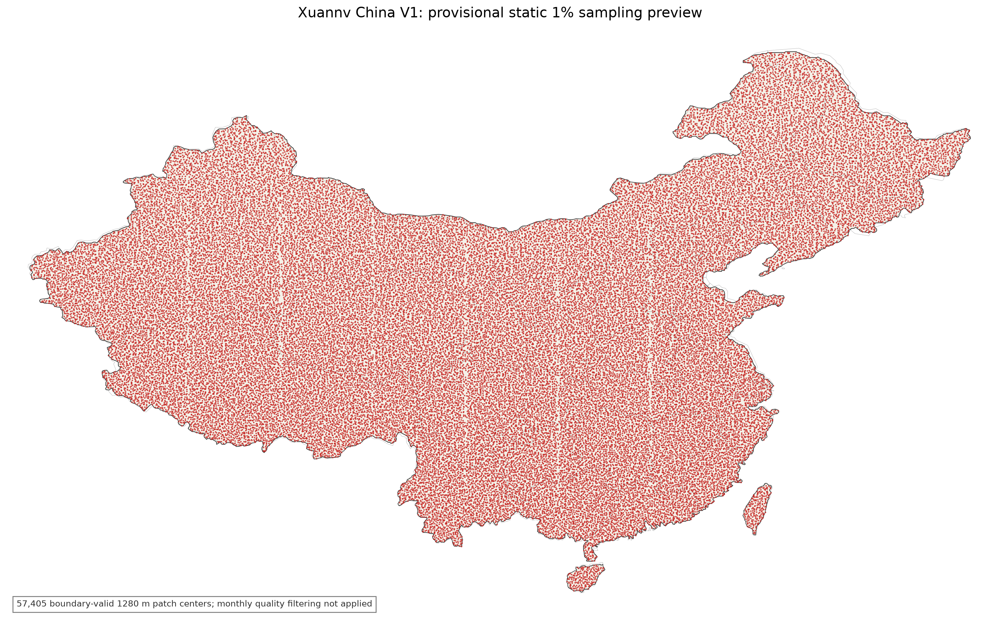

# 中国版 Alpha Earth 技术方案（高分辨率资源版）

版本：2026 年 7 月 21 日

建设内容：使用高分辨率数据训练全国地理嵌入模型，生成 2020 年和 2021 年共 8 期季度嵌入。

产品范围：中国陆地及主要近岸岛屿。

产品规格：真实 2 米空间分辨率，64 维，int8 编码。

计划启动时间：在高分辨率数据、存储和算力资源到位后启动。

计划交付时间：Option 1 启动后约 120--150 天；Option 2 启动后约 90--120 天。

## 一、资源和交付时间

### 1. Option 1：全部按照 2 米分辨率训练和导出

全国真实 2 米产品的像素数量是 10 米产品的 25 倍。现有 16 张 Ascend 910B 可以完成数据检查、模型试验和部分地区导出，不能在 2026 年 11 月前完成全国 8 期产品。

| 项目 | 最低配置 | 建议配置 |
| --- | ---: | ---: |
| Ascend 910B 数量 | 320 张 | 384--512 张 |
| 单卡物理显存 | 64 GB | 64 GB |
| 总物理显存 | 20 TB | 24--32 TB |
| 单卡显存控制线 | 不超过 48 GB | 不超过 48 GB |
| 聚合持续读写速度 | 不低于 30 GB/s | 50--80 GB/s |
| 计算网络 | 200 Gb/s 级 | 400 Gb/s RoCE/IB 级 |

320 张卡是项目启动的最低算力，不是宽松配置。考虑训练失败、数据返工和导出补片，建议使用 384--512 张 910B。

正式训练前依次完成 16 卡、32 卡和 64 卡测试。64 卡扩展效率达到 70%后，再扩大到生产规模。

### 2. Option 2：10 米语义主干加 2 米轻量细节分支

Option 1 的 320 张卡是按照训练和导出都随 2 米像素数量完整放大 25 倍估算的。实际建设可以复用已经训练好的 10 米语义主干，只增加一个计算量较小的 2 米细节分支。

Option 2 仍然输出全国真实 2 米、64 维嵌入。每个 2 米像素都读取高分辨率影像并生成独立向量，不是把 10 米结果直接插值放大。

具体做法如下。

1、10 米主干负责土地覆盖、植被、水体、城市和季度变化等主要语义。主干使用已有全国模型初始化，第一阶段冻结参数，后期只解冻最后一到两层。

2、2 米分支只处理高分辨率光学影像，使用深度可分离卷积和轻量 MLP 解码器，学习道路、建筑、岸线、田块和小型地物的边界细节。

3、2 米分支输出对 10 米嵌入的细节修正量。最终 64 维向量由 10 米语义向量和 2 米细节修正量共同生成。

4、训练时从 62,000 个位置的 25 个高分子块中随机抽取，不要求每个 epoch 遍历全部子块。经过多个 epoch 后逐步覆盖不同地区、季度和地物。

5、使用教师学生训练。10 米模型提供稳定语义，高分辨率重建和边界损失负责细节，避免轻量分支只学习纹理而丢失语义。

6、全国导出时，同一个 `1,280 m x 1,280 m` 位置的 10 米主干只计算一次，25 个 2 米子块共享主干结果。细节分支使用 BF16 计算和 int8 输出，并采用大分片顺序写入。

| 项目 | 最低配置 | 建议配置 |
| --- | ---: | ---: |
| Ascend 910B 数量 | 64 张 | 96--128 张 |
| 总物理显存 | 4 TB | 6--8 TB |
| 轻量分支训练时间 | 35--50 天 | 25--35 天 |
| 8 期全国导出时间 | 35--50 天 | 25--35 天 |
| 数据检查、测试和机动时间 | 30--40 天 | 30--40 天 |
| 项目总工期 | 约 110--140 天 | 约 90--120 天 |

Option 2 的推理目标是达到 Option 1 的 3--4 倍吞吐。这个数值是工程目标，不作为未测试的固定结论。项目启动前需要分别测试 16 卡、32 卡和 64 卡的端到端速度。

Option 2 可以减少训练和导出算力，但不能减少最终嵌入的存储量。8 期全国 2 米、64 维 int8 产品仍需要保存约 1.229 PB 净数据。

Option 2 的主要取舍是，小型地物的边界可以达到 2 米，但大部分语义来自 10 米主干。正式采用前，先选择城市、农业、山区和海岸四类区域，与 Option 1 小规模模型使用同一套建筑、道路、水体、土地覆盖和检索任务比较。Option 2 的主要指标下降不超过 2%时，再用于全国生产。

公开方法参考如下。

1、[RS-vHeat](https://arxiv.org/abs/2411.17984) 使用高效算子处理高分辨率遥感影像，论文报告相对注意力模型提高约 2.7 倍吞吐。

2、[FlexiMo](https://arxiv.org/abs/2503.23844) 使用分辨率感知和轻量通道适配模块处理不同空间分辨率数据。

3、[Channel-Wise Knowledge Distillation for Dense Prediction](https://openaccess.thecvf.com/content/ICCV2021/html/Shu_Channel-Wise_Knowledge_Distillation_for_Dense_Prediction_ICCV_2021_paper.html) 说明轻量学生模型可以通过稠密预测蒸馏继承教师模型的空间语义。

4、[SegFormer](https://arxiv.org/abs/2105.15203) 使用多尺度编码和轻量 MLP 解码器降低稠密预测计算量。

### 3. 磁盘存储

全国陆地面积按照 960 万平方千米估算。2 米像素面积为 4 平方米，全国约有 2.4 万亿个 2 米像素。

单季度 64 维 int8 嵌入约为 153.6 TB，8 个季度的净数据量约为 1,228.8 TB，即 1.229 PB。

| 内容 | 最低容量 | 建议容量 |
| --- | ---: | ---: |
| 8 期全国 2 米 int8 嵌入 | 1.35--1.50 PB | 1.50 PB |
| 2020--2021 年高分和多源源数据 | 0.50 PB | 0.60--0.80 PB |
| 训练数据、索引和像素掩膜 | 0.10 PB | 0.15--0.20 PB |
| 临时导出、补片、日志和权重 | 0.05 PB | 0.20--0.30 PB |
| 项目可用在线存储 | 至少 2 PB | 约 3 PB |
| 含备份和文件系统余量的物理容量 | 不建议低于 2.5 PB | 约 4 PB |

2 PB 只能支持单份正式产品和有限的临时空间。如需保存全国嵌入双副本，建议直接按照 3 PB 可用存储、约 4 PB 物理容量建设。

现有 300 TB 无法保存 8 期全国 2 米嵌入。即使不保存源数据和训练数据，也只能容纳全部嵌入净数据量的约四分之一。

### 4. 交付时间

| 工作 | Option 1 | Option 2 |
| --- | ---: | ---: |
| 高分数据许可、场景清单和季度覆盖检查 | 15--20 天 | 15--20 天 |
| 2,000 点试运行、云掩膜和配准检查 | 12--15 天 | 12--15 天 |
| 多卡性能测试 | 7--10 天 | 7--10 天 |
| 正式训练 | 55--75 天 | 25--35 天 |
| 8 期全国嵌入导出 | 25--35 天 | 25--35 天 |
| 下游测试、补片和验收 | 15--20 天 | 15--20 天 |
| 机动时间 | 10--15 天 | 10--15 天 |
| 项目总工期 | 约 120--150 天 | 约 90--120 天 |

上述工期允许训练后半程与已完成区域的嵌入导出并行。如果高分数据不能按季度提供或存储低于 2 PB，不安排全国 2 米版本的交付时间。Option 1 的算力低于 320 张、Option 2 的算力低于 64 张时，也不安排对应方案的全国交付时间。

## 二、训练需要的数据

### 1. 本地和 NODA 可提供的数据

| 数据 | 年份 | 分辨率 | 训练用途 | 资源情况 |
| --- | --- | ---: | --- | --- |
| NODA 全国高分一张图 | 2020 | 2 米 | 2020 年空间细节和边界监督 | 需要申请并核对场景清单 |
| NODA 高分一张图系列 | 2021 | 2 米 | 2021 年空间细节和边界监督 | 官方说明约 8,037 景、19.67 TB |
| GF-1/1B/1C/1D | 2020、2021 | 约 2--8 米 | 季度高分光学输入 | 按本地和 NODA 清单核对 |
| GF-2 | 2020、2021 | 亚米至 4 米 | 建筑、道路和地块细节 | 按场景许可使用 |
| GF-6、GF-7 | 2020、2021 | 亚米至 16 米 | 农业、城市和立体测绘信息 | 按场景清单核对 |
| ZY-3/302、ZY-1E/1F | 2020、2021 | 约 2--8 米 | 多星高分光学和地形信息 | 按场景清单核对 |
| CB04A、HJ-2A、HJ-2B | 2020、2021 | 以产品为准 | 国产多源补充 | 以本地清单为准 |
| 吉林一号 | 2020、2021 | 亚米至 5 米 | 城市、农业和重点区域补充 | 本地已有部分数据，其余需采购 |

NODA 2021 年高分一张图公开说明包括高分、资源、环境和 TripleSat 等多类卫星。项目需要取得景级成像时间、覆盖范围、云量、波段、位深和使用许可，不能只使用年度合成图名称作为季度数据依据。

相关数据入口：

1、[NODA 2021 年 2 米一张图发布说明](https://www.noda.ac.cn/aircas/news/showNewsById?id=6694ccca4782da475b5c8ffa)

2、[NODA 2020 年 2 米一张图专题](https://www.noda.ac.cn/datasharing/theme/viewThemeById?id=64ffc7a0ae06c00d8763ec3f)

3、[NODA 专题 6690d6](https://www.noda.ac.cn/datasharing/theme/viewThemeById?id=6690d6b3494be1036384ea58)

4、[NODA 专题 63ef0d](https://www.noda.ac.cn/datasharing/theme/viewThemeById?id=63ef0d710e2b985f5244c382)

5、[国家对地观测科学数据中心](https://www.cpeos.org.cn/dataSearch3D/)

### 2. 需要从外网下载或采购的数据

| 数据 | 年份 | 分辨率 | 训练用途 | 来源 |
| --- | --- | ---: | --- | --- |
| Sentinel-2 L2A | 2020、2021 | 10/20/60 米 | 季度动态光学和云质量信息 | [Copernicus Data Space](https://www.copernicus.eu/en/access-data) |
| Sentinel-1 GRD/RTC | 2020、2021 | 约 10 米 | 季度全天候结构信息 | [Copernicus Data Space](https://www.copernicus.eu/en/access-data) |
| Landsat-8 Collection 2 L2 | 2020、2021 | 30 米 | 季度光学、热红外和质量信息 | [USGS Landsat](https://www.usgs.gov/landsat-missions/landsat-collection-2) |
| PlanetScope 季度底图 | 2020、2021 | 约 4.77 米 | 高分季度覆盖补充 | [Planet Basemaps](https://docs.planet.com/data/imagery/basemaps/) |
| 吉林一号补充影像 | 2020、2021 | 亚米至数米 | 高分季度缺口补充 | [吉林一号](https://www.jl1.cn/eweb/product_view.aspx?id=759) |
| ESA WorldCover | 2020、2021 | 10 米 | 土地覆盖弱标签 | [ESA WorldCover](https://esa-worldcover.org/en/data-access) |
| Dynamic World | 2020、2021 | 10 米 | 土地覆盖概率标签 | [Dynamic World](https://www.dynamicworld.app/about/index.html) |
| GlobeLand30 / GLC_FCS30D / CLCD | 以 2020 年为主 | 30 米 | 土地利用辅助标签 | [GlobeLand30](https://www.ngcc.cn/xwzx/ywcg/202401/t20240103_1270.html) |
| Copernicus DEM GLO-30 | 静态 | 30 米 | 高程、坡度和坡向 | [Copernicus DEM](https://dataspace.copernicus.eu/explore-data/data-collections/copernicus-contributing-missions/collections-description/COP-DEM) |
| MODIS NDVI/EVI | 2020、2021 | 250 米 | 季度植被状态 | [NASA MODIS](https://modis.gsfc.nasa.gov/data/dataprod/mod13.php) |
| NODA 中国 NDVI/FVC | 2020、2021 | 250 米 | 中国植被状态辅助信息 | [NODA](https://www.noda.ac.cn/rsgs/news/showNewsById?id=6916eb157575fb4d046058df) |
| WorldCereal | 2021 | 10 米 | 农业、作物和灌溉信息 | [ESA WorldCereal](https://esa-worldcereal.org/en/products/global-maps) |
| 历史 OSM | 2020、2021 季末 | 矢量 | 道路、建筑、水体和土地利用弱标签 | [ohsome API](https://docs.ohsome.org/ohsome-api/stable/endpoints.html) |

PlanetScope 和部分吉林一号数据属于商业资源。采购前先核对批量训练、衍生嵌入发布和长期存储许可。

### 3. 年度高分数据和季度产品的关系

1、年度 2 米一张图可以用于学习建筑、道路、岸线和田块边界。

2、年度一张图不能说明地物在哪一个季度发生变化，不能直接复制为四个季度的训练真值。

3、季度变化主要由 Sentinel-2、Sentinel-1、Landsat 和带日期的季度高分场景提供。

4、如果只能取得年度 2 米一张图，本版产品应说明为“季度动态信息加年度高分空间细节”，不能说明为完整的季度 2 米观测重建。

5、如果需要严格的季度 2 米变化能力，必须取得 2020 年和 2021 年每个季度的全国高分场景及成像日期。

## 三、数据处理和模型训练

1、所有高分场景按照季度、卫星和覆盖范围建立索引，保留成像日期、云量、波段和许可信息。

2、不同卫星分别进行辐射归一化，不直接混合不同传感器的原始 DN 值。

3、每景数据生成云、薄云、阴影、雪、条带、饱和和无效区域的像素级掩膜。

4、同一季度有多景时先删除质量差的场景，再对有效影像进行组合。

5、2 米模型使用 `256 m x 256 m` 子块，每个子块输出 `128 x 128 x 64`，保持项目模型输出尺寸不变。

6、全国导出使用重叠窗口和中心裁边，减少相邻 patch 的边界接缝。

7、高分光学承担主要细节重建，Sentinel-1 使用较低重建权重，土地覆盖和 OSM 使用带有效区域掩膜的辅助标签。

8、训练期间定期检查下游任务，不以训练总损失作为唯一模型选择依据。

9、正式产品按照 2020Q1 至 2021Q4 分别导出，共 8 期。

## 四、时间安排

| 阶段 | 工作内容 | 预计时间 |
| --- | --- | ---: |
| 第一阶段 | 核对高分数据许可、季度覆盖、场景数量和真实存储 | 15--20 天 |
| 第二阶段 | 完成 2,000 点裁窗、掩膜、配准和训练输入可视化 | 12--15 天 |
| 第三阶段 | 完成 16/32/64 卡性能和恢复测试 | 7--10 天 |
| 第四阶段 | 使用 384--512 卡正式训练 | 55--75 天 |
| 第五阶段 | 分区导出 8 期全国嵌入 | 25--35 天 |
| 第六阶段 | 完成补片、下游测试、质量检查和交付 | 15--20 天 |
| 机动时间 | 处理数据返工、节点故障和导出失败 | 10--15 天 |

项目总工期按照 120--150 天安排。数据检查和算力准备可以并行，训练后半程和已完成区域的产品导出也可以并行。

## 五、项目支持

模型研发：赵龙、伍炜杰、陆君言。

数据支持：CB 项目负责现有遥感数据档案、NODA 数据申请、商业高分采购和批量数据迁移。

硬件支持：Option 1 至少提供 320 张 Ascend 910B，建议提供 384--512 张；Option 2 至少提供 64 张，建议提供 96--128 张。两个方案都需要 2--3 PB 在线存储。

网络支持：计算节点和存储之间持续读写不低于 30 GB/s，建议达到 50--80 GB/s。

软件支持：玄女 Embedding 项目提供数据处理、训练、分布式导出、下游测试、质量检查和 watchdog 代码。

交付内容：训练配置、best/last 模型权重、8 期全国 2 米嵌入、质量报告、下游测试结果和数据许可清单。

## 六、项目启动条件

1、2020 年和 2021 年高分场景清单、季度覆盖率和使用许可完成确认。

2、在线可用存储不少于 2 PB，建议达到 3 PB。

3、Option 1 的 Ascend 910B 不少于 320 张；Option 2 不少于 64 张。

4、64 卡扩展效率达到 70%，存储聚合持续读写不低于 30 GB/s。

5、2,000 点数据的云掩膜、跨源配准和训练输入可视化通过人工检查。

以上条件不能同时满足时，优先交付全国 10 米季度版，再选择重点城市和重点区域生成 2 米产品。

## 七、全国样本怎么选

### 1. 基础 1% 空间抽样

全国陆地按照不同 UTM 分区建立规则网格。训练位置仍使用 `1,280 m x 1,280 m` 的全国空间网格，保证与 10 米版使用同一套位置编号。

将相邻的 `10 x 10` 个位置组成一个宏网格。使用固定随机种子和 patch ID 的 SHA-256 哈希，在每个宏网格中选择一个位于中国陆地范围内的位置。

海岸和国界附近按照有效位置数量修正接纳概率，避免边界地区被重复采样。

经过国界、岛屿和完整位置检查后，基础样本为 57,405 个。

图 1  全国基础 1% 空间抽样分布。红点表示 57,405 个基础训练位置。

### 2. 空间均衡补样

增加 2,595 个空间均衡样本，将样本数补到 60,000 个。

新增样本按照 UTM 分区面积的平方根分配，与基础样本去重，每个宏网格原则上只增加一个位置。

### 3. 海岸线补样

增加 500 个海岸位置，用于学习海岸、港口、滩涂、河口和近海水体。

海岸位置同时参考中国陆地边界和 Natural Earth 海洋面，并与前 60,000 个位置去重。

### 4. 城市、稀有地物和困难区域补样

再增加 1,500 个位置，不删除、不替换前面的 60,500 个位置。

| 补样类型 | 数量 | 主要内容 |
| --- | ---: | --- |
| 城市和建成区 | 500 | 城市、道路密集区和建筑密集区 |
| 稀有自然地物 | 400 | 湿地、雪地、高原、裸地、绿洲和河湖 |
| 稀有基础设施 | 300 | 铁路、机场、港口、工业、教育和体育设施 |
| 困难观测区 | 300 | 长期多云、缺测、复杂地形和传感器差异较大区域 |
| 合计 | 1,500 | 与前 60,500 个位置去重 |

### 5. 高分辨率子块选择

每个 `1,280 m x 1,280 m` 位置分成 `5 x 5` 个 `256 m x 256 m` 子块。每个子块对应 `128 x 128` 个 2 米像素。

训练时根据高分场景质量、地物边界和季度覆盖选择子块，但保留原始位置 ID 和采样权重，避免城市和高分覆盖好的地区占比过高。

产品导出时覆盖全部 25 个子块，使用重叠窗口和中心裁边后拼接为完整的 2 米产品。

### 6. 最终样本数量

| 样本组成 | 数量 |
| --- | ---: |
| 全国基础空间样本 | 57,405 |
| 空间均衡补样 | 2,595 |
| 海岸线补样 | 500 |
| 城市、稀有地物和困难区域补样 | 1,500 |
| 最终合计 | 62,000 |

最终 62,000 个训练位置约占全国完整网格的 1.06%。高分辨率子块只增加每个位置内部的训练内容，不改变全国样本的地理权重。
