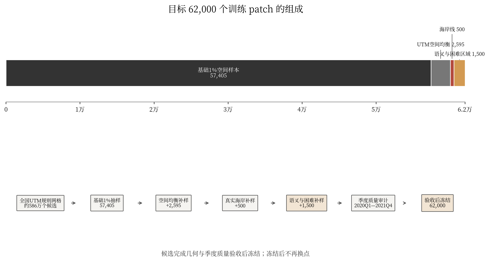
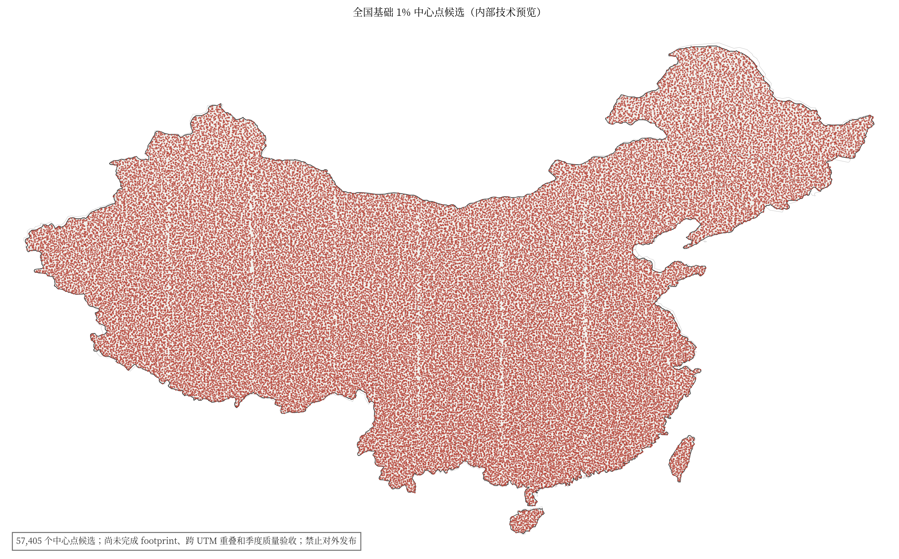

# 中国版 Alpha Earth 全国目标采样方案

> **一句话结论：** 2020 年和 2021 年八期季度嵌入拟共用一套 **62,000 个**
> 空间影像块的训练骨架。目标配额由 57,405 个全国基础候选、2,595 个空间
> 均衡候选、500 个海岸候选和 1,500 个城市/稀有地物/困难区域候选组成。
> 每个 patch 为 1,280 m × 1,280 m，模型输出为 128 × 128 × 64。

版本：2026-07-26  
适用产品：2020Q1--2021Q4 全国季度 10 米、64 维地理嵌入  
参考文件：《中国版 Alpha Earth：国家级地球嵌入建设方案（现有资源）》

参考文件中的全国采样数量、实施状态和“训练期间定期运行固定下游测试”的条款
均由本文件替代，不再作为完成状态或评测协议依据。

本文件只规范 62,000 点训练采样注册表，不覆盖约 586 万全域推理网格、全国
嵌入导出、量化、接缝处理和发布质量检查。

### 当前完成状态

| 项目 | 当前状态 | 是否可用于正式训练 |
| --- | --- | --- |
| 57,405 个基础点 | 已生成中心点静态候选，种子为 20260717 | 否，尚未完成 footprint、跨 UTM 重叠和季度质量验收 |
| 60,500 个临时候选 | 已有历史版本，但存在补样宏网格重复和字段不完整 | 否，必须按本方案重建 |
| 1,500 个语义/困难区域补样 | 目标配额已确定 | 否，选择器尚待实现 |
| 62,000 点最终注册表 | 尚未物化 | 否，必须通过本文全部验收门槛 |
| 2020Q1--2021Q4 季度数据 | 数据方案已确定 | 否，季度合成与质量汇总链路尚待实现 |

本文是正式采样口径和实施规范，不把规划配额表述为已经完成的数据成果。

## 一、方案目标

本方案解决两个问题：全国训练样本从哪里取，以及同一套样本怎样支持 2020 年
和 2021 年八个季度的多源训练。

按 960 万平方千米面积换算，全国陆地约有 586 万个 1,280 米 patch；现有宏
网格清单的面积等效估计约为 574 万个。两个数字都不是去除 UTM 重叠后的整数
总体，最终比例必须在全国唯一候选枚举完成后重算。首版采用“空间概率骨架加
目标补样”，加强海岸、城市、稀有自然地物、基础设施和困难观测区。

候选层先形成 62,000 个主候选和分层候补池；完成几何与季度质量验收后，才冻结
最终 62,000 个位置。Sentinel-2、Sentinel-1、Landsat 和其他可用数据按相同
位置整理 2020Q1 至 2021Q4 的季度观测。目标补样不是概率样本，不能用于全国
统计推断；全国面积分布或总体性能只在基础概率层上报告。

## 二、目标样本组成

| 样本层 | 目标数量 | 占目标样本 | 主要作用 |
| --- | ---: | ---: | --- |
| 全国基础 1% 空间样本 | 57,405 | 92.59% | 建立覆盖全国陆地的空间骨架 |
| UTM 空间均衡补样 | 2,595 | 4.19% | 补足面积较小或边界复杂的空间分区 |
| 海岸线补样 | 500 | 0.81% | 学习海岸、港口、滩涂、河口和近海水体 |
| 城市、稀有地物和困难区域补样 | 1,500 | 2.42% | 加强低频语义和复杂观测条件 |
| **合计** | **62,000** | **100%** | 面积换算约 1.06%，现有清单估计约 1.08%，最终重算 |



**图 1  62,000 点目标采样组成与执行流程。** 上图表示四层目标配额；下图
表示从全国规则网格、基础抽样、三类补样、质量审计到最终注册表的执行顺序。
补样只增加新 patch，不删除或替换已经选中的基础样本。

## 三、全国基础 1% 空间抽样

### 1. 建立全国规则网格

全国陆地按照 UTM 分区建立米制规则网格。每个 patch 的边长为 1,280 米，对应
128 × 128 个 10 米像素，面积为 1.6384 平方千米。

```text
中国陆地面积约 9,600,000 km²
单个 patch 面积 = 1.28 km × 1.28 km = 1.6384 km²
全国完整覆盖 patch 数约 = 9,600,000 / 1.6384 = 5,859,375
```

每个 UTM 分区必须固定投影、网格原点和网格版本。patch 中心按经度半开区间
唯一归属一个 UTM 分区，不允许再落入相邻分区。所有候选还要转换到统一 WGS84
footprint，使用空间索引检查跨分区重叠；任意两个 patch 的相交面积超过任一
patch 面积的 1%时，只保留确定性哈希优先级更高者并从同层候补池补足。

### 2. 组成 10 × 10 宏网格

相邻 10 × 10 个 patch 组成一个宏网格。完整宏网格包含 100 个候选 patch，
物理范围约为 12.8 km × 12.8 km。每个完整宏网格期望选取一个 patch，因此
全国空间入选概率约为 1%。

### 3. 使用固定哈希选择

采样不依赖文件排列顺序。固定随机种子为 `20260717`。宏网格接纳哈希与内部
patch 排序哈希使用不同域前缀；输入统一按 UTF-8 编码为
`用途|种子|边界版本|宏网格ID|候选ID`。取 SHA-256 前 8 字节无符号大端整数，
除以 `2^64` 映射到 `[0,1)`。候选排序按该值升序，并以 patch ID 作为并列
次序。

同一份边界、网格原点、随机种子和输入清单会得到完全相同的结果。新增影像或
改变文件名不会改变空间采样位置。

### 4. 修正海岸和国界宏网格

海岸、岛屿和国界附近的宏网格可能只有 `n` 个有效 patch。若仍然每个宏网格
固定取一个，就会让边界地区的入选概率高于 1%。

本方案逐个枚举宏网格内 100 个中心，根据唯一 UTM 归属和冻结国界得到准确整数
`n`，再以 `n / 100` 的概率接纳该宏网格。宏网格被接纳后，再从其中选择
SHA-256 哈希排名第一的有效 patch。初始设计中每个有效 patch 的期望入选概率
约为 1%。跨 UTM 去重后，从基础层有序候补池确定性补足到规划数量 57,405；
这一步会轻微改变边界 patch 的最终入选概率，因此注册表先保存名义入选概率；
实际概率和权重只在概率设计实现并审计后填写。混合样本不能用于全国统计推断。

现有 57,405 个点是种子 `20260717` 下得到的中心点静态候选。基础数量是概率
抽样的实现值，不是理论上必然等于 57,405 的固定配额。当前清单尚未完成完整
footprint、跨 UTM 重叠和八季度质量检查。



**图 2  全国基础 1% 空间抽样分布。** 红点表示 57,405 个中心位于静态国界内
的基础候选。该图是内部技术预览，不是标准地图，禁止直接用于对外发布；正式
公开材料须更换为带审图号的标准地图底图。该图尚未加入 2,595 个空间
均衡样本、500 个海岸样本和 1,500 个语义/困难区域样本，也没有替代季度影像
质量审计，因此不能标注为最终训练样本分布。

## 四、三类补采样

### 1. UTM 空间均衡补样：2,595 个

基础 1% 抽样完成后，目标是补到 60,000 个。补样不能只填充没有基础点的边界
宏网格，而要从全国所有未入选 patch 中选择；允许在已有基础点的宏网格增加
一个补样，但所有补样层合计每个宏网格最多增加一个。新增数量按照各 UTM 分区
去重后的准确有效候选数平方根分配：

```text
分区配额 = 2,595 × sqrt(分区有效候选数) / Σsqrt(各分区有效候选数)
```

使用平方根而不是直接按面积分配，可以让大区域获得更多样本，同时避免面积较小
的 UTM 分区没有补样。每个有候选的分区先分配 1 个基础名额，剩余名额使用
最大余数法；余数相同时按 UTM 编号升序。发布时必须附逐分区候选数、原始配额、
整数配额和实际完成数。

补样候选必须满足以下条件：

1. 不在 57,405 个基础样本中。
2. patch ID、身份 hash 和规范化 WGS84 footprint hash 均不重复。
3. 四个补样层合计每个宏网格最多新增一个 patch。
4. 使用固定哈希在同等候选中确定顺序。

### 2. 海岸线补样：500 个

海岸样本只识别真实陆海交界。判断时同时使用中国陆地边界和独立海洋面数据，
不能直接把行政边界当作海岸。

候选 patch 的 footprint 必须同时与冻结陆地面和海洋面相交。距离和面积全部
在局部米制 CRS 中计算，不使用固定经纬度差近似千米。500 个名额按沿海 UTM
分区分配，并检查省域和海岸类型分布。河流两岸、湖泊边缘、
省界和陆地国界全部排除。

海岸补样重点覆盖：

1. 港口和码头。
2. 滩涂和潮间带。
3. 养殖区和近海水体。
4. 河口、三角洲和岛屿。
5. 城市海岸和自然海岸。

### 3. 城市、稀有地物和困难区域补样：1,500 个

这 1,500 个样本在按本方案重建的前 60,500 个候选基础上直接增加，不删除、
不替换已通过几何检查的主候选。

| 子类 | 数量 | 选择依据 |
| --- | ---: | --- |
| 城市和建成区 | 500 | 建成比例、道路和建筑密度、行政区均衡 |
| 稀有自然地物 | 400 | 湿地、雪地、高原、裸地、绿洲、河湖 |
| 稀有基础设施 | 300 | 铁路、机场、港口、工业、教育和体育设施 |
| 困难观测区 | 300 | 长期多云、缺测、复杂地形、跨传感器差异 |
| **合计** | **1,500** | 与前 60,500 个样本去重 |

语义候选可以使用 WorldCover、Dynamic World、GLC_FCS30D、历史 OSM 和 DEM 等
粗粒度信息评分，但不能使用最后用于下游评测的人工建筑、道路、水体等测试标签。
OSM 空白区域只表示“未知”，不能当作“没有该地物”的负样本。

每个入选 patch 只能计入一个主配额类，主类别优先级为稀有基础设施、稀有自然
地物、城市和建成区、困难观测区；其他命中保存为次级原因。四类配额均指新增
唯一 patch 数。候选不足时不得静默少选，必须从同类冻结候补池补足或提交配额
变更审批。

区域组固定为东北、华北、华东、华中、华南、西南和西北七组。同一子类中，任何
单一省域或区域组不超过 40%。候选不足时只能使用同类有序候补池；仍不足则提交
配额变更，不允许把别的类别静默改记为该类。

## 五、八个季度如何使用同一套样本

| 产品期 | 时间范围 | 主要光学 | 主要 SAR |
| --- | --- | --- | --- |
| 2020Q1 | 2020-01-01 至 2020-03-31 | Sentinel-2、Landsat-8 | Sentinel-1 |
| 2020Q2 | 2020-04-01 至 2020-06-30 | Sentinel-2、Landsat-8 | Sentinel-1 |
| 2020Q3 | 2020-07-01 至 2020-09-30 | Sentinel-2、Landsat-8 | Sentinel-1 |
| 2020Q4 | 2020-10-01 至 2020-12-31 | Sentinel-2、Landsat-8 | Sentinel-1 |
| 2021Q1 | 2021-01-01 至 2021-03-31 | Sentinel-2、Landsat-8 | Sentinel-1 |
| 2021Q2 | 2021-04-01 至 2021-06-30 | Sentinel-2、Landsat-8 | Sentinel-1 |
| 2021Q3 | 2021-07-01 至 2021-09-30 | Sentinel-2、Landsat-8 | Sentinel-1 |
| 2021Q4 | 2021-10-01 至 2021-12-31 | Sentinel-2、Landsat-8/9 | Sentinel-1 |

空间位置不随季度改变。季度采用左闭右开的自然季度边界，不跨季度借景。每个
季度使用通过质量筛选的有效观测构建 medoid 合成，并为每个像素保存观测数、
最早日期、最晚日期和代表日期。
国产高分影像、HJ、ZY、吉林一号和 Hi-GLASS 等数据按照本地实际覆盖作为可选
辅助模态，不要求每个 patch、每个季度都齐全。

一年一期的土地覆盖、高程或指数产品不复制成虚假的季度变化。静态 DEM 作为
稳定物理条件输入；年度土地覆盖只监督年度聚合或稳定宽类，不监督季度变化。
WorldCover 2020 和 2021 的算法版本差异必须记录。Dynamic World 只作为带
置信度掩膜的同源伪标签，不作为独立验证真值。历史 OSM 使用 full history
重建八个季度末快照，只作为当期弱语义；编辑时间不解释为地物建成时间。

## 六、数据质量门槛

空间抽样和影像质量审计分两步执行。先冻结 62,000 个主候选和各层有序候补池，
再检查每个位置八个季度的数据；质量验收与审计替补完成后，才冻结最终 62,000
点注册表。不能为了追求“看起来完整”，静默把多云或缺测位置换成容易下载的位置。

### 1. 优先核心数据源

1. Sentinel-2：主要光学输入。
2. Sentinel-1：全天候结构和散射信息。
3. Landsat-8：独立光学和质量信息；30 米数据重采样到 10 米不代表获得 10 米细节。
4. Landsat-9：仅补充 2021Q4，不能写入此前季度。

三类来源优先齐全，但不要求每个季度三源全部通过，否则会系统性排除长期多云和
困难区域。每季度至少有一个光学源和另一个模态达到最低门槛；缺失模态使用有效
掩膜，不计算对应重建损失。

### 2. 像素级掩膜

每景光学影像必须保存云、云影、雪、无效值、饱和和几何无效区域掩膜。云、
云影、无效值、饱和和几何无效像素不参与重建损失。雪是有效季节地表状态，
单独保存 snow mask 并保留观测，不与云一起删除。

同一季度有多景影像时，先按有效像素比例、云影比例、辐射质量和配准质量排序，
仅使用通过门槛的观测进行合成。质量掩膜缺失时按不合格处理，不使用低质量影像
填满数据。

### 3. 可执行质量阈值

| 检查项 | 正式门槛 |
| --- | ---: |
| Sentinel-2 每季度有效像素比例 | 不低于 60% |
| Sentinel-2 每季度有效观测数 | 不少于 2 景 |
| Landsat-8 每季度有效像素比例 | 不低于 50% |
| Landsat-8 每季度有效观测数 | 不少于 1 景 |
| Sentinel-1 每季度空间覆盖 | 不低于 90% |
| Sentinel-1 每季度获取次数 | 不少于 2 次 |
| 每季度通过的模态 | 不少于 2 个，其中至少 1 个光学 |
| 稳定目标配准误差中位数 | 不超过 0.5 个 10 米像素 |
| 稳定目标配准误差 P95 | 不超过 1.0 个 10 米像素 |

Sentinel-1 固定为 RTC、IW、VV/VH，冻结轨向策略、DEM、单位和处理版本。
阈值需要在 2,000 点试运行后复核；任何调整都升级策略版本并重跑全量审计。

### 4. 缺失数据处理

某季度达到全部门槛记为 `accepted`；至少一个光学源和另一个模态通过时记为
`partial`，缺失目标不计算损失；其余或配准失败记为 `quarantined`。问题样本
进入“影像数据修复队列”，记录 patch、季度、数据源和失败原因。
`accepted` 和 `partial` 可以训练，但每个季度 `partial` 占比不超过 25%；
`quarantined` 不进入训练。

正式选择前，每层按不少于主配额 10% 冻结有序候补池。只有最终注册表冻结前
可以替换，替补必须匹配采样层、UTM 分区、省域和生态区，并留下版本记录。最终
62,000 点中的每个位置必须在八个季度均为 `accepted` 或 `partial`；存在任一
`quarantined` 季度的主候选须在冻结前修复或用同层候补替换。注册表冻结后
不再换点，只修复同一位置的数据或显式标记缺测。

### 5. 配准检查

所有输入统一到对应 UTM 分区的 10 米网格。抽查道路交叉口、河岸、建筑边缘和
海岸等高对比目标。明显错位的数据不能进入正式训练包。配准误差、有效像素比例
和重采样方法都写入质量统计。

## 七、训练集、验证集和最终全量训练

开发阶段在 EPSG:6933 上建立 50 km 父空间块，按父块执行目标为
90%/5%/5%的划分。不同集合之间设置 25.6 km 缓冲；同一位置的八个季度和
所有重叠 footprint 必须进入同一集合。比例允许上下浮动 1 个百分点：

| 集合 | 数量参考 | 用途 |
| --- | ---: | --- |
| 训练集 | 约 55,800 | 更新模型参数 |
| 验证集 | 约 3,100 | 选择 checkpoint、检查重建和固定 probe |
| 测试集 | 约 3,100 | 协议冻结后一次性报告 |

不能随机打散相邻 patch。相邻空间块必须进入同一集合，降低空间泄露。划分同时
保持省域、生态区和四层采样来源的比例基本一致。

内部测试标签在协议冻结前封存，训练过程中不得反复查看。完成模型结构、损失
权重和训练轮数选择后，可以使用全部 62,000 个 patch 进行
生产版最终训练。此时性能报告仍使用开发阶段已冻结的独立标签、外部区域或时间
留出数据，不能把全量训练后的模型再用原测试位置调参数。凡预训练影像覆盖了
测试位置的结果，明确标为 transductive；跨区域或跨时间完全留出结果才用于
inductive 泛化声明。

## 八、样本注册表

最终采样清单建议保存为 Parquet 和 JSONL 两种格式。Parquet 用于高效处理，
JSONL 用于抽查和跨系统交换。

| 字段 | 内容 |
| --- | --- |
| patch_id | 全局唯一 patch 编号 |
| identity_hash | CRS、网格版本、整数行列组成的身份校验值 |
| canonical_wgs84_footprint_hash | 规范化 WGS84 footprint 校验值 |
| grid_id / grid_epsg | 所属网格和 UTM 投影 |
| grid_row / grid_col | 规则网格行列号 |
| macro_id | 10 × 10 宏网格编号 |
| wgs84_bounds / utm_bounds | 两套空间范围 |
| longitude / latitude | patch 中心点 |
| admin1 / ecoregion | 省域和生态区 |
| sampling_layer | 四层采样来源 |
| sampling_reasons | 具体入选原因，可多值 |
| sampling_design_type | probability_base 或 non_probability_targeted_sample |
| nominal_inclusion_probability | 基础层的名义概率；目标补样为空 |
| design_weight_nullable | 仅概率设计实现并审计后填写，否则为空 |
| sampling_seed | 固定随机种子 |
| boundary_version | 国界和岛屿边界版本 |
| source_coverage_by_quarter | 八季度各数据源覆盖 |
| quality_summary_by_quarter | 云、缺测、配准等质量统计 |
| split | 开发阶段 train/validation/test |
| registry_version | 注册表版本 |

每次发布注册表同时保存配置文件、输入数据校验值、输出文件 SHA-256、脚本
Git commit 和生成日志。任何样本增删都必须升级 registry version，不能覆盖
已经用于训练或论文实验的旧清单。

## 九、执行步骤

1. 冻结中国研究边界、岛屿范围、UTM 网格原点和随机种子。
2. 生成全国约 586 万个候选 patch 及 10 × 10 宏网格清单。
3. 修复 UTM 唯一归属并逐 patch 枚举准确边界候选数，按种子 20260717 重新
   执行基础抽样；跨区去重后从基础有序候补池补足到规划数量 57,405。
4. 按 UTM 分区准确有效候选数平方根增加空间均衡样本，使前两层合计 60,000。
5. 使用独立海洋面增加 500 个真实海岸样本。
6. 建立 WorldCover、OSM、DEM 和影像质量候选池，增加 1,500 个重点样本。
7. 对 62,000 个样本执行唯一性、边界、区域分布和人工地图抽查。
8. 按相同位置建立 2020Q1--2021Q4 八季度数据目录和质量统计。
9. 对优先核心源、掩膜和配准执行质量门槛，生成影像数据修复清单。
10. 开发专用的季度策略适配器、四池语义选择器、质量汇总和注册表验证器。
11. 冻结注册表、checksum 和 Git commit 后，才开始正式数据裁窗和训练。

## 十、验收标准

| 检查项 | 通过条件 |
| --- | --- |
| 样本数量 | 质量验收与候补替换后四层合计严格等于 62,000 |
| 唯一性 | patch_id、identity hash 和规范化 footprint hash 均无重复 |
| 空间重叠 | 跨 UTM 相交面积不超过任一 patch 面积的 1% |
| 空间边界 | 所有中心位于冻结研究边界内 |
| 层级配额 | 57,405 + 2,595 + 500 + 1,500 全部满足 |
| 海岸真实性 | 不包含河流、湖泊、省界和陆地国界伪海岸 |
| 区域均衡 | 各 UTM 分区、省域和生态区无异常空洞或过密 |
| 季度覆盖 | 八季度逐源覆盖、观测数、有效像素和日期统计齐全 |
| 掩膜 | 云、云影、无效值和饱和不计损失；雪作为地表状态保留 |
| 可复现性 | 相同输入和配置重跑，输出 checksum 一致 |
| 空间划分 | 跨集合最近距离不小于 25.6 km |
| 人工抽查 | 每省每层至少抽 10 个、每季度至少抽 200 个并记录结论 |

## 十一、当前状态与边界

数据盘中已有 57,405 个基础 1% 中心点静态候选及全国分布预览，也有历史
60,500 点临时清单。独立审查发现旧清单存在 UTM 接缝重叠、补样宏网格重复和
字段不完整，不能升级为正式注册表。现有空间均衡、海岸和语义注册脚本采用旧的
2025--2026 月度策略接口，不能直接读取本季度策略。

本文冻结的是 62,000 点的目标配额、质量门槛和验收口径。端到端物化适配器、
四池语义选择器、季度合成和空间划分仍须按第九节开发并通过测试。

在最终 62,000 点注册表物化完成前，所有图表和汇报必须明确区分：

1. 基础 1% 静态预览。
2. 补样候选清单。
3. 通过八季度质量门槛的最终训练注册表。

只有第三类清单可以作为正式训练数据数量和最终全国分布的依据。

## 十二、项目文件

采样策略规范（不是旧注册脚本的直接输入）：
`configs/national/china_quarterly_2020_2021_sampling_policy_20260726.json`

基础抽样参考实现（须修复 UTM 唯一归属和准确边界枚举）：
`scripts/data/visualize_national_sampling.py`

空间均衡补样参考实现（须改为从所有未入选 patch 选择）：
`scripts/data/build_national_spatial_supplement.py`

海岸补样参考实现（须改为米制 footprint 陆海相交判定）：
`scripts/data/build_national_coastal_supplement.py`

旧语义注册脚本（接口不兼容，仅供重构参考）：
`scripts/data/build_national_sampling_registry.py`

基础样本预览图：
`docs/plans/assets/china_v1_2021_multisource/national_static_1pct_sampling_preview.png`
