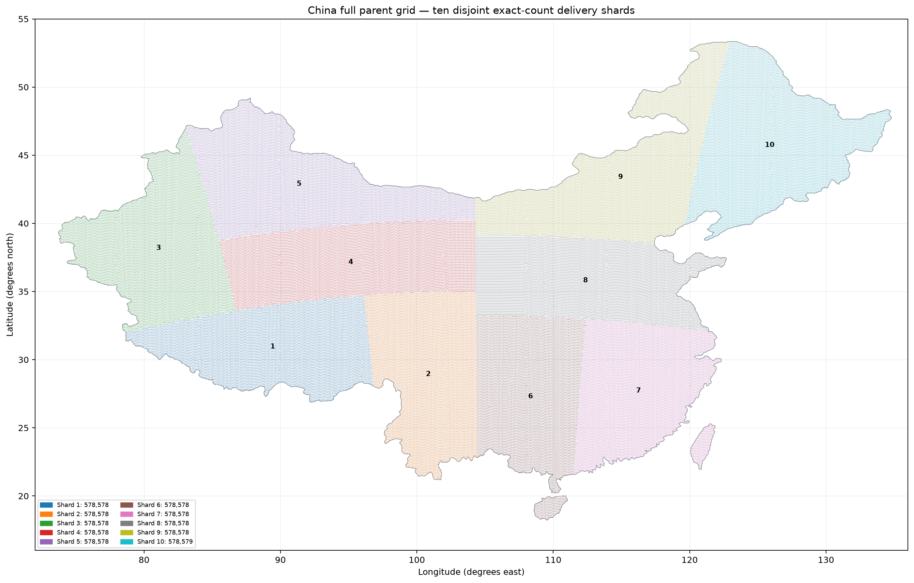

# 中国全国父网格十等分交付说明

版本：`china_full_grid_tenfold_spatial_partition_v3`  
生成日期：2026-08-19



## 交付目的

将全国 1,280 m 完整父网格划分为十个可独立生产的空间分片。每个分片可单独进行
数据收集、质量审计、预处理、embedding 推理和下游生产；分片之间不共享 Shape。

## 不变量

- 输入父网格：5,785,781 个 Shape。
- 分片 01--09：各 578,578 个 Shape。
- 分片 10：578,579 个 Shape。
- 十片总和：5,785,781 个 Shape。
- 每个原始 `parent_key` 恰好归属一个分片；没有重叠、没有遗漏。
- Shape 的原始几何、UTM 身份字段和哈希保持不变；交付仅追加 `shard_id`。

## 划分方法

在适合中国尺度的 Lambert Conformal Conic 米制坐标系中，对所有 Shape 中心进行联合、
递归的容量平衡切分。每次沿当前区域较长的轴切分，切分容量由最终十片的精确 Shape 配额
决定。它保证精确数量和空间相邻性优先；全国海岸、边界与岛屿使外缘片不要求是严格正方形。

## 分片范围

| 分片 | Shape 数 | 中心（经度，纬度） | 经度范围 | 纬度范围 |
| --- | ---: | --- | --- | --- |
| shard_01 | 578,578 | 89.4361, 30.9479 | 78.6539–96.8103 | 26.8861–34.6972 |
| shard_02 | 578,578 | 100.8443, 28.9307 | 96.1476–104.4246 | 21.1894–35.0292 |
| shard_03 | 578,578 | 81.0742, 38.1867 | 73.7352–86.7361 | 32.0078–46.9582 |
| shard_04 | 578,578 | 95.1628, 37.1469 | 85.4957–104.3386 | 33.6108–40.2782 |
| shard_05 | 578,578 | 91.3705, 42.8908 | 83.0508–104.2903 | 38.7596–49.1851 |
| shard_06 | 578,578 | 108.3421, 27.2929 | 104.3664–112.3955 | 18.2336–33.2186 |
| shard_07 | 578,578 | 116.2550, 27.7171 | 111.4932–122.3347 | 21.5808–32.9797 |
| shard_08 | 578,578 | 112.3698, 35.8058 | 104.3168–122.6947 | 32.0102–39.1502 |
| shard_09 | 578,578 | 114.9412, 43.3973 | 104.2887–122.9784 | 38.5381–53.3428 |
| shard_10 | 578,579 | 125.8714, 45.7365 | 119.6643–134.7931 | 38.7550–53.3428 |

范围是 Shape 中心的 WGS84 包络，仅用于快速定位；后续空间裁剪和数据读取应以分片中的
完整 Shape 几何、`parent_key` 与 `grid_epsg` 为准。

## 交付目录内容

- 根目录 `README.md`：总体用途与分片范围表。
- 根目录 `tenfold_partition_manifest.json`：机器可读分片、范围、UTM 计数与验证信息。
- 根目录 `china_tenfold_shard_regions.geojson`：十片的 WGS84 范围索引（Shape 中心经纬度外接矩形）。
- 根目录 `QA.md`：总量、唯一归属和未分配检查。
- `shards/shard_01/` 至 `shards/shard_10/`：每片的完整 GeoParquet Shape。
- 每个分片目录的 `README.md`：该片范围、中心点和 UTM 分区计数；`region_bounds.geojson`
  提供该片的范围索引。

范围索引仅供浏览、下载前筛选与经纬度定位，不能用于精确的成员判断。精确范围和唯一成员关系
始终以各分片 GeoParquet 中的 `geometry` 与 `parent_key` 为准。

## ModelScope 发布布局

发布到数据集 `WeijieWu/xuannv_china_full_grid` 的新目录：

```text
releases/china-full-grid-tenfold-v3-20260819/
├── README.md
├── QA.md
├── tenfold_partition_manifest.json
├── china_tenfold_shard_regions.geojson
├── china_tenfold_partition_overview.png
├── SHA256SUMS.json
├── china_full_grid_tenfold_delivery_v3_20260819.zip
└── shards/shard_01/ ... shards/shard_10/
```

与既有 `releases/china-full-1280m-v1-20260805/` 并列发布，绝不覆盖旧版。另一台机器若只需要第
一片，应先读取根清单和范围索引，再只下载 `shards/shard_01/`；无需下载全部十片。

## 后续生产建议

按 `shard_01` 至 `shard_10` 顺序或按可用计算资源并行生产；每片都应保留独立的输入
可用率、云/缺测、对齐质量、失败原因、耗时和存储统计。不要跨分片重新编号或重新划分
`parent_key`，以保证生产结果可拼接、可审计、可复跑。
