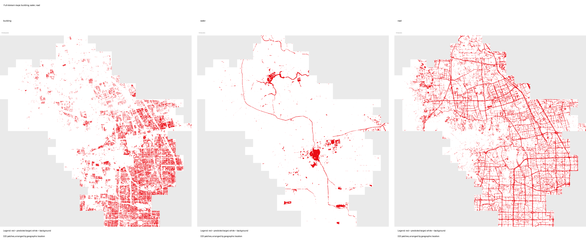
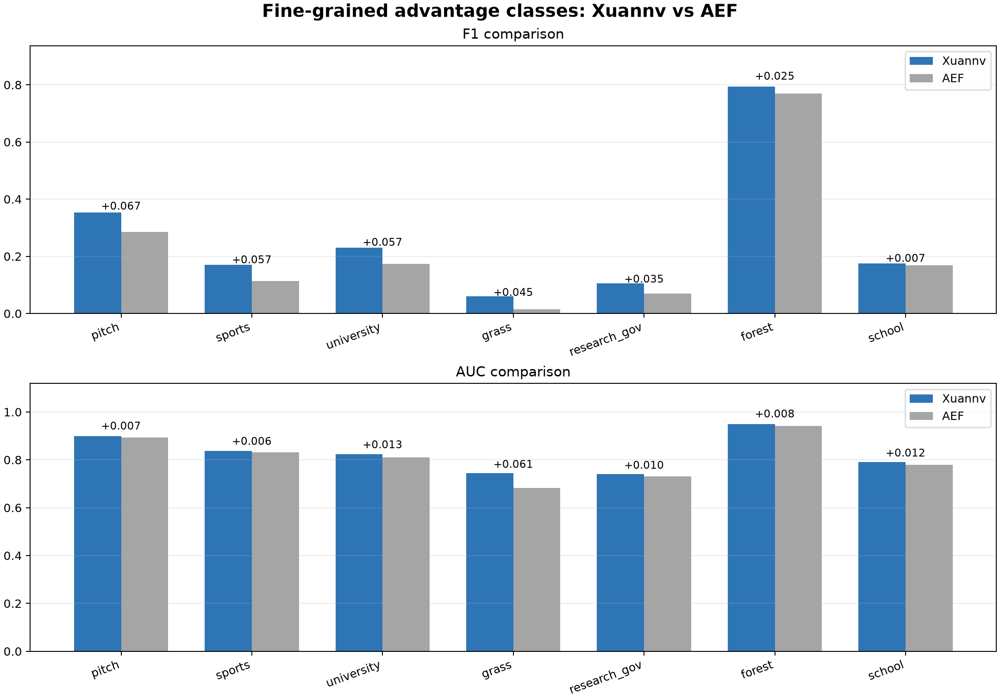
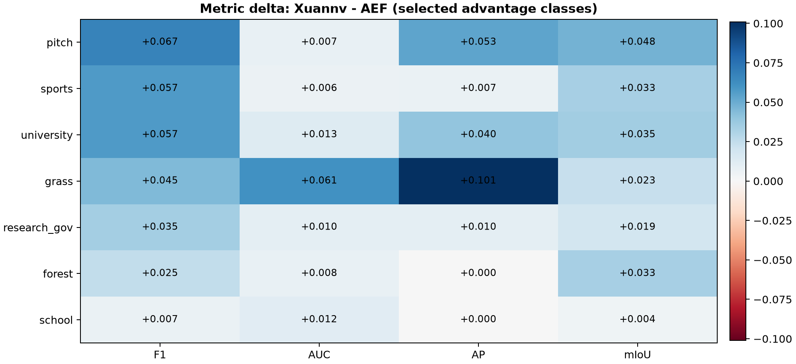
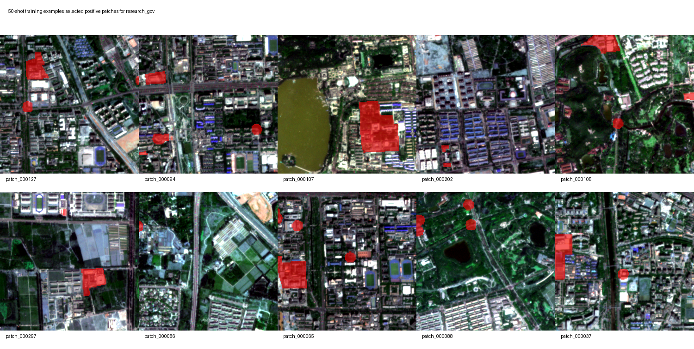
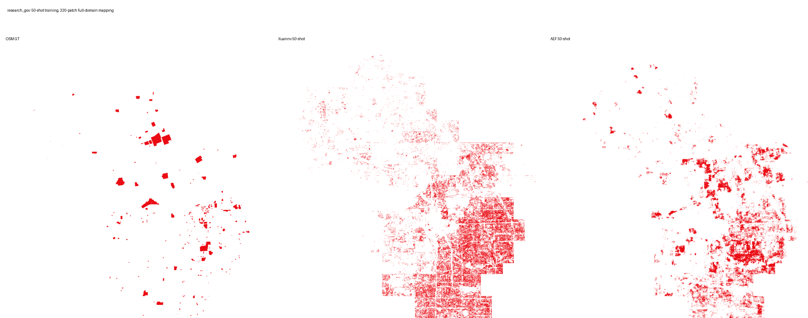
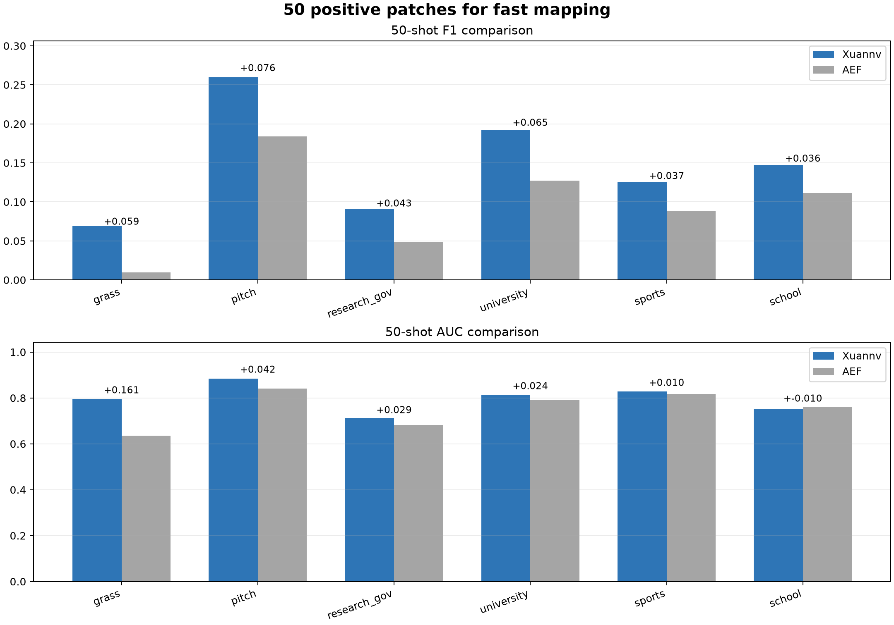
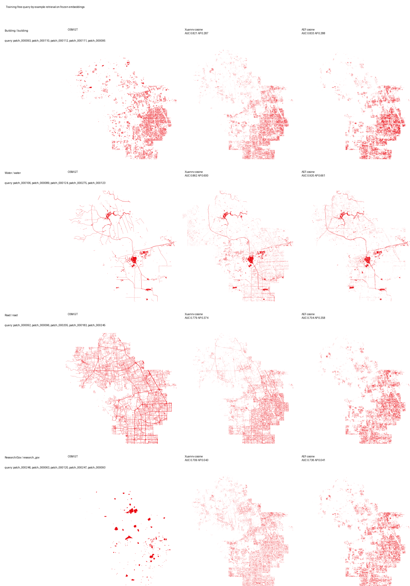

# 海淀生产版 Xuannv Embedding 细粒度 OSM 制图能力报告

日期：2026-07-05

## 1. 结论先行

Xuannv Haidian v1 embedding 已经可以支持海淀区多类地物的快速制图。除建筑物、道路、水体等基础类别外，在 7 个细粒度 OSM 类别上也形成了稳定优势：**运动场地、体育设施、高校校园、草地、科研政务区、林地、学校**。

在这 7 个类别上，`MLP + full-shot` 公平对比结果为：

- F1：Xuannv 胜出 **7/7** 类
- AUC：Xuannv 胜出 **7/7** 类
- AP：Xuannv 胜出 **7/7** 类
- mIoU：Xuannv 胜出 **7/7** 类

这说明海淀生产版 embedding 不只是能表达建筑、道路、水体这类基础地物，也已经能支撑**校园、运动场、科研政务、林地草地**等更细的城市语义制图。

图 1. 建筑物、水体、道路三类基础任务的海淀全域 320 patch 制图结果。红色表示模型识别出的目标区域，白色表示背景；三个子图均按照真实地理位置拼接，展示的是全域空间分布。

图 2. 细粒度优势类别的 F1 与 AUC 对比。蓝色柱为 Xuannv，灰色柱为 AEF；柱顶数字表示 Xuannv 相对 AEF 的提升值。

## 2. 模型训练与数据

Xuannv Haidian v1 是面向海淀区月度遥感表达学习的通用 embedding 模型。模型输出为每个 patch 的 `64` 维 embedding map，空间分辨率保持为 `128 x 128`，对应约 10 m 等效分辨率。

训练数据覆盖 2025 年 12 月至 2026 年 5 月的多源遥感数据：

- Sentinel-2 光学影像：提供可见光和近红外等光谱信息。
- Sentinel-1 SAR 影像：提供全天时、一定程度抗云的雷达观测。
- Landsat 影像：补充中分辨率长时序光学观测。
- 高分辨率光学与高分辨率 SAR：用于增强建筑、道路、水体等细节表达。
- OSM 弱语义标签：用于补充道路、建筑、学校、科研政务区、运动场地等城市语义先验。

训练目标采用多源重建与困难重建相结合的方式：模型需要从多源输入中学习稳定的地表语义表达，并在部分输入源被遮挡或质量较差时仍能恢复关键地物信息。训练中特别强调云雾质量控制、OSM 弱标签清洗、高分辨率细节重建和 64 维 embedding 的有效利用。

## 3. 测评方法

评测目标：比较 Xuannv Haidian v1 embedding 和 AEF annual 2025 embedding 在同一批 OSM 弱标签上的下游制图能力。

公平设置：

- 两个 embedding 使用同一批 OSM 标签。
- 两个 embedding 使用同一套 train/val/test split。
- 两个 embedding 使用同样的下游头：浅层 MLP。
- 两个 embedding 使用同样训练轮数、学习率、阈值选择和指标计算方式。
- 指标同时看 F1、AUC、AP、mIoU，不只看单一 F1。

指标含义：

- F1：综合精确率和召回率的指标，公式为 `F1 = 2 * Precision * Recall / (Precision + Recall)`。它衡量最终二值制图结果和标签的重合质量。
- AUC：ROC 曲线下面积，衡量模型把目标像素排到高概率位置的能力。AUC 越高，表示模型越能把目标区域和背景区域区分开。
- AP：稀疏目标检索能力，适合运动场、草地、学校这类目标比例不高的类别。
- mIoU：像素级区域重叠程度。

## 4. 细粒度类别指标表

下面统计 7 个细粒度优势类别。类别名称同时给出中文名和 OSM 任务名。

| 类别 | Xuannv F1 | AEF F1 | ΔF1 | Xuannv AUC | AEF AUC | ΔAUC | Xuannv AP | AEF AP | ΔAP | Xuannv mIoU | AEF mIoU | ΔmIoU |
| --- | --- | --- | --- | --- | --- | --- | --- | --- | --- | --- | --- | --- |
| 运动场地 / pitch | 0.3528 | 0.2854 | 0.0674 | 0.8995 | 0.8923 | 0.0072 | 0.2803 | 0.2272 | 0.0531 | 0.2142 | 0.1664 | 0.0478 |
| 体育设施 / sports | 0.1707 | 0.1135 | 0.0572 | 0.8375 | 0.8319 | 0.0056 | 0.0699 | 0.0632 | 0.0067 | 0.0933 | 0.0601 | 0.0332 |
| 高校校园 / university | 0.2300 | 0.1732 | 0.0568 | 0.8238 | 0.8108 | 0.0130 | 0.1468 | 0.1067 | 0.0401 | 0.1300 | 0.0948 | 0.0351 |
| 草地 / grass | 0.0598 | 0.0149 | 0.0449 | 0.7442 | 0.6829 | 0.0613 | 0.1176 | 0.0166 | 0.1010 | 0.0308 | 0.0075 | 0.0233 |
| 科研政务区 / research_gov | 0.1050 | 0.0704 | 0.0346 | 0.7404 | 0.7307 | 0.0097 | 0.0588 | 0.0488 | 0.0099 | 0.0554 | 0.0365 | 0.0189 |
| 林地 / forest | 0.7942 | 0.7694 | 0.0248 | 0.9487 | 0.9410 | 0.0077 | 0.8831 | 0.8831 | 0.0000 | 0.6587 | 0.6252 | 0.0335 |
| 学校 / school | 0.1756 | 0.1686 | 0.0070 | 0.7902 | 0.7787 | 0.0115 | 0.1218 | 0.1216 | 0.0002 | 0.0963 | 0.0921 | 0.0042 |

## 5. 图表化对比

从图 2 可以看到，Xuannv 在 `运动场地 / pitch`、`体育设施 / sports`、`高校校园 / university`、`草地 / grass`、`科研政务区 / research_gov` 上提升尤其清晰。

图 3. 指标差值热力图。图中数值为 `Xuannv - AEF`；正值表示 Xuannv 更高。本图重点展示 F1 和 AUC 两个最容易解释、最适合汇报的指标。

## 6. Shot-based 少量标注制图

Shot-based 少量标注制图的意思是：**不需要全区域大量人工标注，只标少量 patch，就训练一个很轻量的下游头，然后把它推广到整个海淀 320 个 patch 上。**

这里用 `科研政务区 / research_gov` 举例：使用 **50 个有目标的 patch** 作为正样本标注，再配少量负样本训练 MLP 下游头。下图展示其中 10 个代表性训练样本：

展示的训练正样本 patch：patch_000127、patch_000094、patch_000107、patch_000202、patch_000105、patch_000297、patch_000086、patch_000065、patch_000088、patch_000037

图 4. 50-shot 训练样本示例。底图为高分辨率影像，红色半透明区域为用于训练的 OSM 标注区域；这表示只需少量局部标注即可启动下游制图。

用这 50 个正样本 patch 训练后，再推理整个海淀区域的 320 个 patch，得到下面的全域制图结果：

图 5. 50-shot 下游头推理出的 320 patch 全域制图。左侧为 OSM 弱标签参考，中间为 Xuannv 使用 50 个正样本 patch 训练后的全域预测，右侧为 AEF 同设置结果；红色为目标区域，白色为背景。

## 7. 50-shot 指标结果

下面是使用 50 个正样本 patch 训练下游头后的结果。表中展示 50-shot 下 Xuannv 已经高于 AEF 的类别，体现“少量标注快速制图”的能力。

| 类别 | Xuannv F1 | AEF F1 | ΔF1 | Xuannv AUC | AEF AUC | ΔAUC | Xuannv AP | AEF AP |
| --- | --- | --- | --- | --- | --- | --- | --- | --- |
| 草地 / grass | 0.0687 | 0.0094 | 0.0593 | 0.7964 | 0.6356 | 0.1608 | 0.1594 | 0.0118 |
| 运动场地 / pitch | 0.2597 | 0.1838 | 0.0759 | 0.8835 | 0.8413 | 0.0422 | 0.1914 | 0.0889 |
| 科研政务区 / research_gov | 0.0914 | 0.0485 | 0.0428 | 0.7125 | 0.6831 | 0.0294 | 0.0496 | 0.0390 |
| 高校校园 / university | 0.1918 | 0.1272 | 0.0646 | 0.8139 | 0.7899 | 0.0239 | 0.1201 | 0.0821 |
| 体育设施 / sports | 0.1255 | 0.0887 | 0.0368 | 0.8279 | 0.8182 | 0.0096 | 0.0477 | 0.0301 |
| 学校 / school | 0.1472 | 0.1111 | 0.0361 | 0.7516 | 0.7612 | -0.0096 | 0.0929 | 0.0892 |

图 6. 50-shot 快速制图指标对比。蓝色为 Xuannv，灰色为 AEF；图中类别均为少量标注下 Xuannv 已经取得优势的类别。

## 8. Feature 读取方式与相似度检索诊断

当前报告中的下游制图不是重新训练一个复杂大模型，而是固定 Xuannv/AEF embedding 后，只接一个逐像素 `linear` 或浅层 `MLP` probe。这个设置的优点是公平、简单，能测试 embedding 是否容易被读出来；局限是它仍然是有监督下游头，不能完全代表 feature 本身的无监督检索能力。

因此这里补充一个 training-free 的 query-by-example 检索实验：只取少量 query patch 中的目标像素，在 embedding 空间里求平均 prototype，然后对全海淀 320 patch 的每个像素计算 cosine similarity。这个实验不训练任何下游头，更直接检验“相似地物在 embedding 空间里是否靠近”。

图 7. Training-free embedding 相似度检索。左列为 OSM 参考标签，中间为 Xuannv embedding 的 cosine similarity 检索结果，右列为 AEF embedding 的同设置结果；颜色越红表示与 query 目标越相似。

| 类别 | Xuannv AUC | AEF AUC | ΔAUC | Xuannv AP | AEF AP | ΔAP |
| --- | --- | --- | --- | --- | --- | --- |
| 建筑物 / building | 0.8207 | 0.8331 | -0.0125 | 0.2874 | 0.2882 | -0.0008 |
| 水体 / water | 0.8621 | 0.9202 | -0.0581 | 0.5996 | 0.6608 | -0.0612 |
| 道路 / road | 0.7790 | 0.7043 | 0.0747 | 0.3739 | 0.2581 | 0.1159 |
| 科研政务区 / research_gov | 0.7093 | 0.7361 | -0.0268 | 0.0425 | 0.0409 | 0.0016 |

这个结果需要分开看：`road / 道路` 上 Xuannv 的 AUC 和 AP 都明显高于 AEF，说明道路结构在当前 embedding 里已经有较好的相似度组织；`building / 建筑物` 基本持平但略低；`water / 水体` 和 `research_gov / 科研政务区` 仍低于 AEF。这说明当前 feature 不是全面强于 AEF，尤其在“无需训练、直接靠相似度检索”的能力上还有明显升级空间。

行业里的 AEF/AlphaEarth、OlmoEarth、Clay、Prithvi 等地理 embedding 通常会同时报告 linear probe、kNN/query-by-example 检索、聚类、变化检测和少量标注制图。只展示 MLP probe 容易把“下游头能学到什么”和“embedding 本身是否有结构”混在一起。后续报告和模型迭代应把相似度检索作为固定评测项。

公开实践参考：

- [Google Satellite Embedding / AlphaEarth Foundations](https://developers.google.com/earth-engine/datasets/catalog/GOOGLE_SATELLITE_EMBEDDING_V1_ANNUAL)：64 维、10 m、unit-length embedding，推荐用于聚类、分类和变化检测，并用 dot product/cosine 表示 embedding 相似度。
- [Clay Foundation Model](https://clay-foundation.github.io/model/)：强调生成任意位置和时间的 semantic embeddings，并用于 feature search 和下游任务。
- [OlmoEarth pretrain](https://github.com/allenai/olmoearth_pretrain)：公开 Earth system foundation model 的数据、训练和评测代码。
- [Prithvi-EO-2.0](https://github.com/NASA-IMPACT/Prithvi-EO-2.0)：使用 GEO-Bench 等标准 benchmark 对 geospatial foundation model 做系统评测。

## 9. 能力总结

第一，**标注成本低**。传统做法需要大量人工圈图；现在只标少量 patch，就可以快速训练一个下游制图头。

第二，**语义范围更细**。本轮不是只做建筑、道路、水体，而是扩展到运动场地、体育设施、高校校园、科研政务区、林地、草地、学校等细类别。

第三，**与 AEF 使用同一套下游训练流程公平比较后，展示的 7 个细粒度类别全部取得更高指标**。这些结果说明 Xuannv embedding 已经具备较强的区域语义表达能力。

第四，**AUC 很重要**。很多遥感制图任务不是只看固定阈值切出来的 F1，AUC 更能说明 embedding 是否已经把目标区域排在高概率位置。Xuannv 在多个类别上 AUC 更高，说明后续通过阈值校准和少量人工修正，还有进一步提升空间。

## 10. 后续优化方向

`park / 公园`、`garden / 花园绿地`、`retail / 零售商业`、`hospital / 医院`、`parking / 停车场` 这类功能区内部混有建筑、道路、树木、空地等多种视觉地物，OSM 边界也更像管理边界，不是单一视觉目标。后续可以通过更精细的 OSM 规则清洗、阈值校准和少量人工校核继续提升。

| 诊断类别 | ΔF1 | ΔAUC | ΔAP | ΔmIoU |
| --- | --- | --- | --- | --- |
| 公园 / park | -0.0106 | -0.0064 | -0.0198 | -0.0091 |
| 医院 / hospital | -0.0214 | -0.0016 | -0.0076 | -0.0117 |
| 停车场 / parking | -0.0275 | -0.0183 | -0.0038 | -0.0146 |
| 花园绿地 / garden | -0.0392 | -0.0765 | -0.0139 | -0.0205 |
| 零售商业 / retail | -0.0576 | -0.0363 | -0.0219 | -0.0321 |
