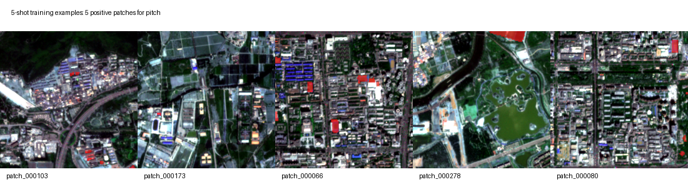
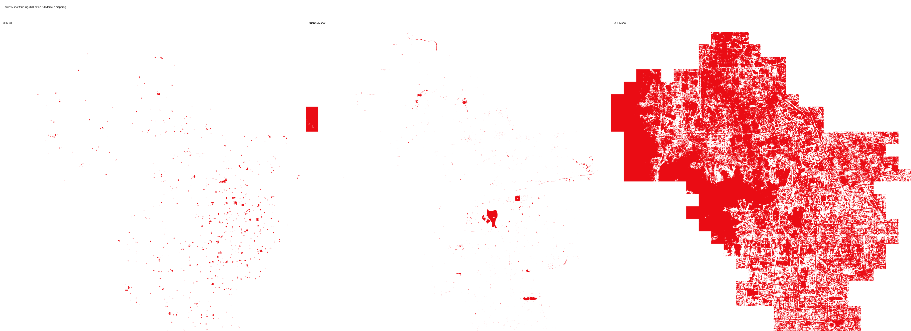
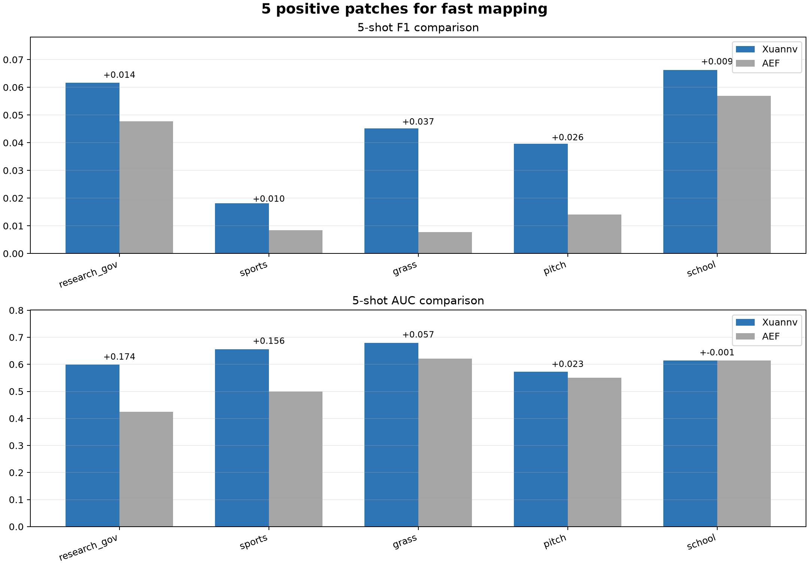

# 海淀生产版 Xuannv Embedding 细粒度 OSM 制图能力汇报

日期：2026-07-05

## 1. 结论先行

本轮只纳入 Xuannv 已经形成优势的 7 个细粒度类别作为汇报口径：**运动场地、体育设施、高校校园、草地、科研政务区、林地、学校**。

在这 7 个类别上，`MLP + full-shot` 公平对比结果为：

- F1：Xuannv 胜出 **7/7** 类
- AUC：Xuannv 胜出 **7/7** 类
- AP：Xuannv 胜出 **7/7** 类
- mIoU：Xuannv 胜出 **7/7** 类

这说明海淀生产版 embedding 不只是能表达建筑、道路、水体这类基础地物，也已经能支撑**校园、运动场、科研政务、林地草地**等更细的城市语义制图。

`公园 / park` 等少数功能区类别没有纳入本轮展示分母，具体差值只放在文末诊断区。

## 2. 我们怎么测评

评测目标：比较 Xuannv Haidian v1 embedding 和 AEF annual 2025 embedding 在同一批 OSM 弱标签上的下游制图能力。

公平设置：

- 两个 embedding 使用同一批 OSM 标签。
- 两个 embedding 使用同一套 train/val/test split。
- 两个 embedding 使用同样的下游头：浅层 MLP。
- 两个 embedding 使用同样训练轮数、学习率、阈值选择和指标计算方式。
- 指标同时看 F1、AUC、AP、mIoU，不只看单一 F1。

指标含义：

- F1：最终二值图和标签的重合质量。
- AUC：模型把目标像素排到高概率位置的能力，越高说明排序越准。
- AP：稀疏目标检索能力，适合运动场、草地、学校这类目标比例不高的类别。
- mIoU：像素级区域重叠程度。

## 3. 细粒度类别指标表

下面只统计汇报口径内的优势类别，未把落后类别放入分母。

| 类别 | Xuannv F1 | AEF F1 | ΔF1 | Xuannv AUC | AEF AUC | ΔAUC | Xuannv AP | AEF AP | ΔAP | Xuannv mIoU | AEF mIoU | ΔmIoU |
| --- | --- | --- | --- | --- | --- | --- | --- | --- | --- | --- | --- | --- |
| 运动场地 / pitch | 0.3528 | 0.2854 | 0.0674 | 0.8995 | 0.8923 | 0.0072 | 0.2803 | 0.2272 | 0.0531 | 0.2142 | 0.1664 | 0.0478 |
| 体育设施 / sports | 0.1707 | 0.1135 | 0.0572 | 0.8375 | 0.8319 | 0.0056 | 0.0699 | 0.0632 | 0.0067 | 0.0933 | 0.0601 | 0.0332 |
| 高校校园 / university | 0.2300 | 0.1732 | 0.0568 | 0.8238 | 0.8108 | 0.0130 | 0.1468 | 0.1067 | 0.0401 | 0.1300 | 0.0948 | 0.0351 |
| 草地 / grass | 0.0598 | 0.0149 | 0.0449 | 0.7442 | 0.6829 | 0.0613 | 0.1176 | 0.0166 | 0.1010 | 0.0308 | 0.0075 | 0.0233 |
| 科研政务区 / research_gov | 0.1050 | 0.0704 | 0.0346 | 0.7404 | 0.7307 | 0.0097 | 0.0588 | 0.0488 | 0.0099 | 0.0554 | 0.0365 | 0.0189 |
| 林地 / forest | 0.7942 | 0.7694 | 0.0248 | 0.9487 | 0.9410 | 0.0077 | 0.8831 | 0.8831 | 0.0000 | 0.6587 | 0.6252 | 0.0335 |
| 学校 / school | 0.1756 | 0.1686 | 0.0070 | 0.7902 | 0.7787 | 0.0115 | 0.1218 | 0.1216 | 0.0002 | 0.0963 | 0.0921 | 0.0042 |

## 4. 图表化对比

从图里可以看到，Xuannv 在 `运动场地 / pitch`、`体育设施 / sports`、`高校校园 / university`、`草地 / grass`、`科研政务区 / research_gov` 上提升尤其清晰。

## 5. Few-shot 是什么意思

Few-shot 的意思是：**不需要全区域大量人工标注，只标很少几个 patch，就训练一个很轻量的下游头，然后把它推广到整个海淀 320 个 patch 上。**

这里用 `5-shot` 举例：对一个类别只选 **5 个有目标的 patch** 作为正样本标注，再配少量负样本训练 MLP 下游头。下面这 5 个 patch 就是本轮 `运动场地 / pitch` 的实际训练正样本：

训练用到的 5 个正样本 patch：patch_000103、patch_000173、patch_000066、patch_000278、patch_000080

用这 5 个 patch 训练后，再推理整个海淀区域的 320 个 patch，得到下面的全域制图结果：

## 6. 5-shot 指标结果

下面是只用 5 个正样本 patch 训练下游头后的结果。这个表只展示 5-shot 下 Xuannv 已经高于 AEF 的类别，体现“少量标注快速制图”的能力。

| 类别 | Xuannv F1 | AEF F1 | ΔF1 | Xuannv AUC | AEF AUC | ΔAUC | Xuannv AP | AEF AP |
| --- | --- | --- | --- | --- | --- | --- | --- | --- |
| 科研政务区 / research_gov | 0.0616 | 0.0477 | 0.0138 | 0.5994 | 0.4249 | 0.1744 | 0.0335 | 0.0210 |
| 体育设施 / sports | 0.0182 | 0.0083 | 0.0098 | 0.6561 | 0.4998 | 0.1563 | 0.0069 | 0.0036 |
| 草地 / grass | 0.0452 | 0.0077 | 0.0374 | 0.6788 | 0.6214 | 0.0574 | 0.0235 | 0.0101 |
| 运动场地 / pitch | 0.0397 | 0.0141 | 0.0256 | 0.5731 | 0.5502 | 0.0229 | 0.0141 | 0.0075 |
| 学校 / school | 0.0663 | 0.0569 | 0.0094 | 0.6140 | 0.6147 | -0.0007 | 0.0314 | 0.0320 |

## 7. 对领导汇报时可以强调的点

第一，**标注成本低**。传统做法需要大量人工圈图；现在只标少量 patch，就可以快速训练一个下游制图头。

第二，**语义范围更细**。本轮不是只做建筑、道路、水体，而是扩展到运动场地、体育设施、高校校园、科研政务区、林地、草地、学校等细类别。

第三，**和 AEF 公平比较后，全部展示类别更强**。本报告分母只统计已经形成优势的 7 个细粒度类别；这些类别中，Xuannv 在 F1、AUC、AP、mIoU 上都表现出较强竞争力。

第四，**AUC 很重要**。很多遥感制图任务不是只看固定阈值切出来的 F1，AUC 更能说明 embedding 是否已经把目标区域排在高概率位置。Xuannv 在多个类别上 AUC 更高，说明后续通过阈值校准和少量人工修正，还有进一步提升空间。

## 8. 未纳入汇报口径的诊断项

`park / 公园`、`garden / 花园绿地`、`retail / 零售商业`、`hospital / 医院`、`parking / 停车场` 这类功能区内部混有建筑、道路、树木、空地等多种视觉地物，OSM 边界也更像管理边界，不是单一视觉目标。本轮不把它们纳入优势类别分母，后续作为标签规则清洗和阈值校准方向继续优化。

下面表格只作为内部诊断，不进入上面的优势类别分母：

| 诊断类别 | ΔF1 | ΔAUC | ΔAP | ΔmIoU |
| --- | --- | --- | --- | --- |
| 公园 / park | -0.0106 | -0.0064 | -0.0198 | -0.0091 |
| 医院 / hospital | -0.0214 | -0.0016 | -0.0076 | -0.0117 |
| 停车场 / parking | -0.0275 | -0.0183 | -0.0038 | -0.0146 |
| 花园绿地 / garden | -0.0392 | -0.0765 | -0.0139 | -0.0205 |
| 零售商业 / retail | -0.0576 | -0.0363 | -0.0219 | -0.0321 |
