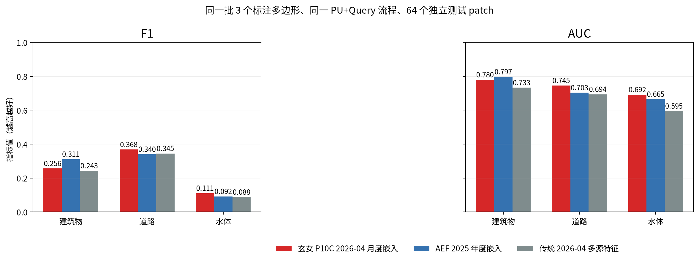
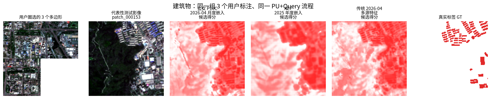
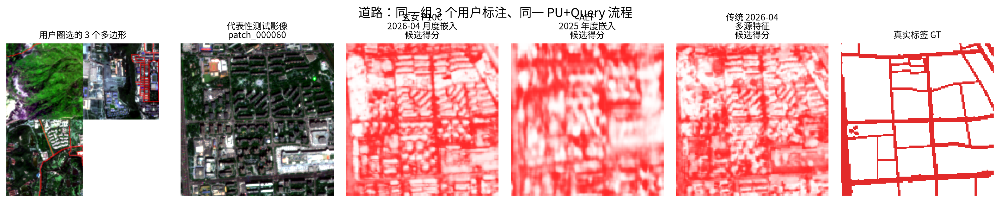
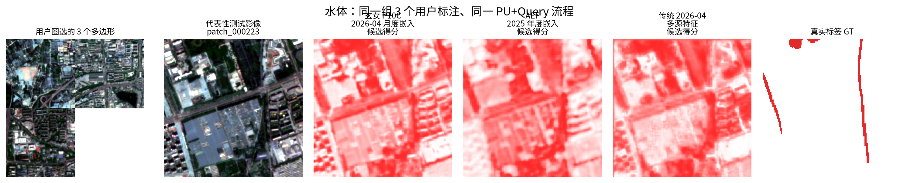

# 海淀区 3 多边形 PU+Query 公平对比

## 结论

只标注 3 个目标多边形时，玄女在道路和水体的 F1、AUC、AP 上均高于 AEF 与传统多源特征；建筑任务由 AEF 领先，说明玄女仍存在建筑假正例偏多的问题。

## 评测方法

1. 每个任务只从训练区随机选择 3 个目标多边形，模拟用户少量圈选。
2. 三种特征使用完全相同的标注、多边形顺序、64 个测试 patch、PU 背景挖掘、Query 自适应和阈值选择。
3. 玄女使用 P10C epoch800 的 2026-04 月度嵌入；AEF 使用官方 2025 年度嵌入；传统方法使用 2026-04 多源观测与指数构成的 42 维特征。
4. F1 衡量最终二值制图的准确性与完整性平衡；AUC 衡量排序能力；AP 更关注稀少目标在高置信区域中的检出质量。

## 指标

| 任务 | 特征 | F1 | AUC | AP | Precision | Recall |
|---|---|---:|---:|---:|---:|---:|
| 建筑物 | 玄女 P10C 2026-04 月度嵌入 | 0.256 | 0.780 | 0.221 | 0.150 | 0.894 |
| 建筑物 | AEF 2025 年度嵌入 | 0.311 | 0.797 | 0.234 | 0.193 | 0.808 |
| 建筑物 | 传统 2026-04 多源特征 | 0.243 | 0.733 | 0.183 | 0.144 | 0.792 |
| 道路 | 玄女 P10C 2026-04 月度嵌入 | 0.368 | 0.745 | 0.304 | 0.231 | 0.904 |
| 道路 | AEF 2025 年度嵌入 | 0.340 | 0.703 | 0.257 | 0.208 | 0.925 |
| 道路 | 传统 2026-04 多源特征 | 0.345 | 0.694 | 0.259 | 0.216 | 0.856 |
| 水体 | 玄女 P10C 2026-04 月度嵌入 | 0.111 | 0.692 | 0.075 | 0.059 | 0.873 |
| 水体 | AEF 2025 年度嵌入 | 0.092 | 0.665 | 0.057 | 0.052 | 0.375 |
| 水体 | 传统 2026-04 多源特征 | 0.088 | 0.595 | 0.049 | 0.047 | 0.689 |

## 可视化

每行左侧展示 3 个用户标注多边形，中间展示同一代表性测试 patch 的原始影像和三种方法的候选得分，右侧为真实标签。候选图仅做单 patch 百分位显示归一化，白色表示低分、红色表示高分，不改变汇总指标或二值阈值。为保证图像可读性，示例选择三种方法单 patch 平均 F1 的 75% 分位案例；该选择不参与汇总指标计算。

### 建筑物

### 道路

### 水体

## 结果边界

本实验是单个 fold、单次随机标注的严格稀疏标注对比，适合展示交互式快速制图能力；论文级结论仍应补充多 fold、多随机种子的均值与标准差。水体 F1 仍较低，当前更适合候选区域发现，而不是直接替代人工精确制图。
