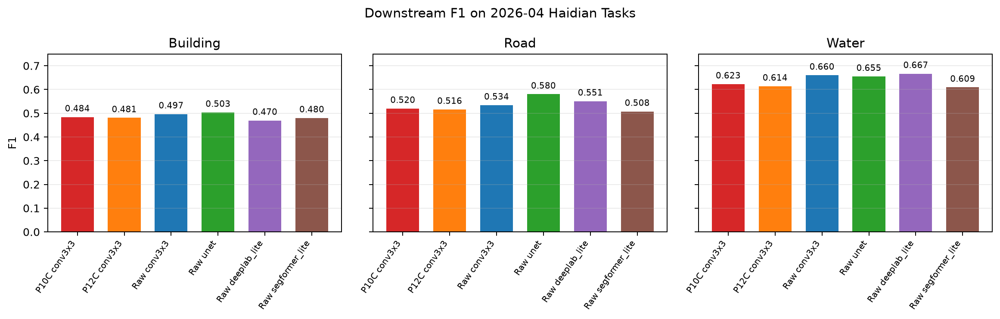
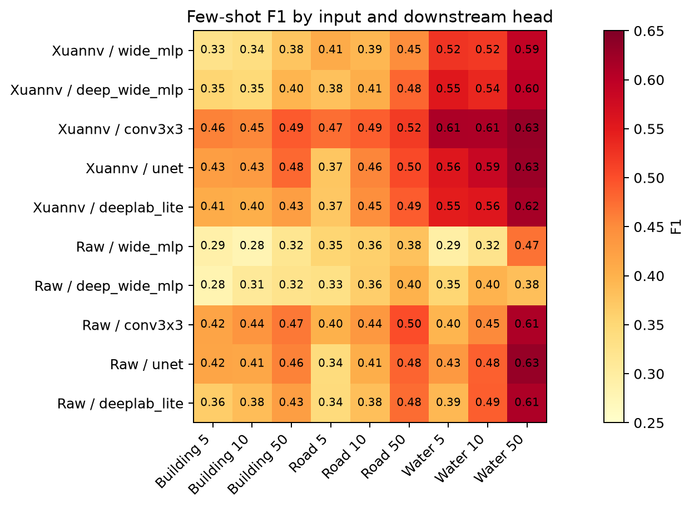

# 玄女海淀 V1 嵌入模型阶段性成果汇报

## 一、核心结论

玄女海淀 V1 的主要价值已经从实验中得到验证：在少量标注场景下，使用预训练 embedding 可以比直接使用原始多源影像训练下游模型更稳定、更省标注、更适合快速制图。

本轮重点做了两个层面的公平对比：

- **完整监督对比**：当每个任务都有较多标注，并允许训练 UNet、DeepLab-lite 这类强下游模型时，原始影像强模型在建筑、道路、水体任务上可以达到或略超过玄女轻量头。
- **少样本对比**：当只给 5、10、50 个少量标注 patch 时，玄女 embedding 在建筑、道路、水体任务上整体优于原始影像强基线，尤其在 5-shot、10-shot 场景优势明显。

因此，玄女 embedding 的定位不是替代所有强监督分割模型，而是提供一套可复用的地理表征底座，让下游任务在少量标注、轻量训练、快速迭代时更容易获得可用结果。

## 二、评测是否公平

本轮对比尽量控制变量，确保结论可信。

| 项目 | 设置 |
| --- | --- |
| 区域 | 海淀区 320 个 patch |
| 任务 | 建筑提取、道路提取、水体提取 |
| 标签 | 同一套 OSM 二值标签 |
| 数据划分 | 同一 fold，训练/验证/测试 patch 完全一致 |
| 玄女输入 | 2026 年 4 月 64 维 embedding |
| 原始影像输入 | 2026 年 4 月 Sentinel-2、Sentinel-1、Landsat、高分光学、高分 SAR 派生的 42 通道特征 |
| 下游头 | wide MLP、deep-wide MLP、conv3x3、UNet、DeepLab-lite |
| 阈值 | 在验证集选择最佳阈值，再报告测试集指标 |

其中，`shot` 表示只使用少量训练 patch：

- **5-shot**：只使用 5 个正样本 patch，并配同数量负样本 patch。
- **10-shot**：只使用 10 个正样本 patch，并配同数量负样本 patch。
- **50-shot**：只使用 50 个正样本 patch，并配同数量负样本 patch。

这模拟的是实际业务中“只标少量样本，快速生成全域制图结果”的使用场景。

## 三、完整监督结果

在完整训练集监督下，原始影像强模型表现很强。

| 任务 | 玄女 P10C conv3x3 F1 | 原始影像最佳模型 F1 | 原始影像最佳模型 |
| --- | ---: | ---: | --- |
| 建筑 | 0.484 | 0.503 | UNet |
| 道路 | 0.520 | 0.580 | UNet |
| 水体 | 0.623 | 0.667 | DeepLab-lite |

这个结果说明：如果每个任务都有较充分标注，并且允许单独训练一个较重的分割模型，原始影像 + UNet/DeepLab-lite 是非常强的基线。

但这类方法的代价也很明确：

- 每个任务都要重新训练一个较重模型；
- 需要完整多源原始影像输入；
- 对标注量、训练时间、工程部署要求更高；
- 不同任务之间难以直接复用已有训练结果。

## 四、少样本结果

少样本场景是玄女 embedding 的核心应用场景。本轮结果显示，在 5-shot 和 10-shot 下，玄女 embedding 的最佳下游头在三类任务上均超过原始影像最佳强头。

| 任务 | Shot | 玄女最佳 F1 | 原始影像最佳 F1 | 相对提升 |
| --- | ---: | ---: | ---: | ---: |
| 建筑 | 5 | 0.459 | 0.418 | +9.8% |
| 建筑 | 10 | 0.454 | 0.439 | +3.5% |
| 建筑 | 50 | 0.490 | 0.467 | +5.0% |
| 道路 | 5 | 0.474 | 0.401 | +18.3% |
| 道路 | 10 | 0.487 | 0.435 | +11.8% |
| 道路 | 50 | 0.517 | 0.501 | +3.3% |
| 水体 | 5 | 0.613 | 0.433 | +41.5% |
| 水体 | 10 | 0.612 | 0.487 | +25.6% |
| 水体 | 50 | 0.631 | 0.631 | 基本打平 |

从这个表可以看到：

- 标注越少，玄女 embedding 的优势越明显。
- 水体任务在 5-shot、10-shot 下提升最显著。
- 建筑和道路任务在 50-shot 下仍保持领先。
- 水体在 50-shot 下原始影像 UNet 追平玄女，说明当标注量增加后，原始影像强模型可以逐步追上。

## 五、可视化效果

下面展示 5-shot 场景下的代表性结果。每一行对应一个任务，包含原始高分影像、真实标签、玄女预测概率、玄女预测结果、原始影像强头预测概率、原始影像强头预测结果。

下游头完整热力图如下。可以看到，玄女 embedding 接入 `conv3x3` 空间头整体最稳定；这说明 embedding 本身已经包含可用语义信息，但下游头需要一点局部空间建模才能更好释放边界能力。

## 六、玄女 embedding 的业务意义

本轮实验说明，玄女 embedding 的价值主要体现在四个方面。

### 1. 少量标注快速制图

实际业务中，很多新类别没有大量人工标注。玄女 embedding 可以让用户只标少量样本，就训练一个轻量下游头，快速生成海淀区全域制图结果。

这比从原始多源影像训练一个完整 UNet 更轻、更快、更适合快速试错。

### 2. 多任务复用

同一份 embedding 可以服务建筑、道路、水体等多个任务。后续还可以扩展到公园绿地、学校、运动场、施工区域等类别。

这意味着主模型只需统一生成一次 embedding，下游任务可以按需接不同轻量头。

### 3. 降低工程使用门槛

原始影像方案需要同时管理 Sentinel-2、Sentinel-1、Landsat、高分光学、高分 SAR 等多源输入。玄女方案把这些复杂信息压缩到统一的 64 维 embedding 中，下游使用更简单。

### 4. 支持持续迭代

当前结果已经说明 embedding 具备可用价值。后续可以继续从主模型训练、embedding 维度利用、边界细节表达、云雾鲁棒性等方向增强，而不是每个任务单独堆更大的下游模型。

## 七、当前不足

当前模型仍有几个需要继续改进的地方。

- **完整监督上限仍不如 raw+强模型**：当标注充分时，原始影像 + UNet/DeepLab-lite 仍然是强基线。
- **建筑类假正例仍偏多**：建筑纹理复杂，部分道路、硬化地面、屋顶容易混淆。
- **下游头仍需要空间建模**：纯 MLP 不够稳定，说明 embedding 的边界信息还需要通过局部卷积释放。
- **不同类别优势不均衡**：水体在少样本优势明显，建筑和道路提升更温和。

这些不足说明下一步仍应继续提升 embedding 本体，而不是只依赖下游头。

## 八、下一步建议

建议下一阶段围绕“让 embedding 本身更强”推进：

1. **继续增强 embedding 的语义分离能力**  
   让建筑、道路、水体、绿地、裸地等地物在 64 维空间中分布更清晰，减少假正例。

2. **加强边界和局部结构学习**  
   当前 `conv3x3` 下游头明显优于纯 MLP，说明局部空间信息很重要。后续主模型训练中应加入更强的边界、纹理、局部一致性约束。

3. **扩大少样本任务池**  
   继续加入公园绿地、学校、运动场、施工地等类别，证明 embedding 不只适用于三个基础任务，而是一个通用地理表征底座。

4. **补充跨月份泛化评测**  
   在 2026 年 5 月、6 月等月份继续验证同一个下游头或少量重训是否稳定。

5. **形成产品化工作流**  
   将“导出 embedding、少样本标注、训练轻量头、全域制图、生成报告”封装成标准流程，支撑后续业务快速迭代。

## 九、一句话总结

玄女海淀 V1 已经证明：在少量标注和快速制图场景下，预训练地理 embedding 可以比直接使用原始多源影像训练下游模型更高效、更稳定；后续应继续围绕通用 embedding 能力增强，推动其成为海淀区多任务地物识别的基础底座。
