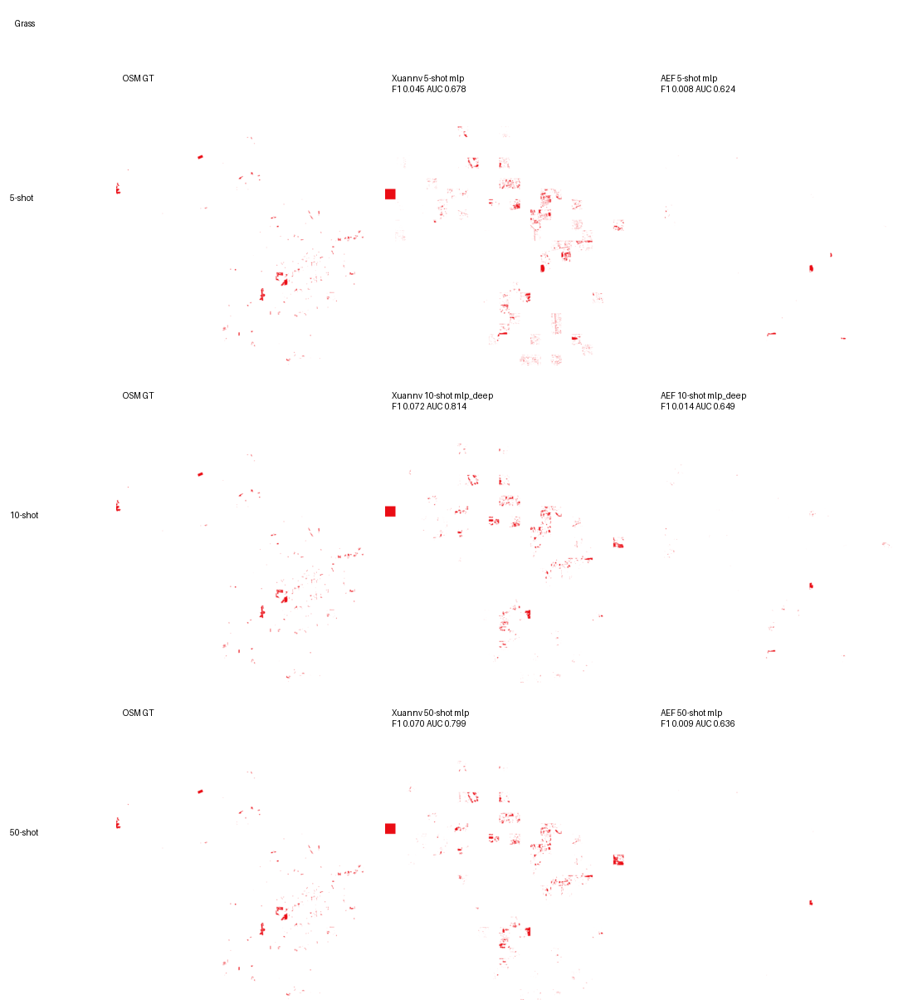
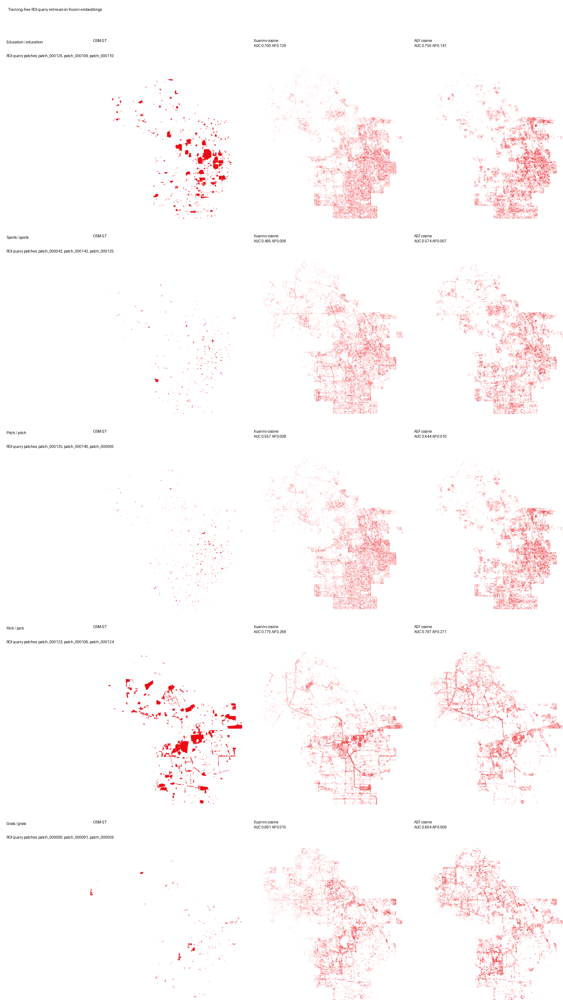

# 海淀非建筑语义 Few-shot 与 ROI 检索诊断

日期：2026-07-05

## 1. 本轮需求与调整

本轮不再用建筑类作为 few-shot 展示对象。建筑在高分辨率影像中容易和硬化地面、屋顶、停车场、道路边界混淆，少量标注时假正例较多，不适合单独代表 embedding 的语义能力。

本轮改为展示更偏语义的 OSM 类别：

- `education`：由 `university OR school` 合并得到，表示高校/学校教育区域。
- `sports`：体育设施。
- `pitch`：操场、球场等场地类目标。
- `park`：公园。
- `grass`：草地/绿地。

同时增加一个更强但仍然轻量的下游头 `mlp_deep`，用于验证 embedding 里是否有更深一点的非线性可读信息。公平性保持不变：Xuannv 和 AEF 使用同一标签、同一 split、同一 shot、同一 head、同一训练轮数。

## 2. 行业实践参考

地理 foundation embedding 的常见证明方式不是只看一个分割头，而是组合使用几类评测：

- 少量标注制图：用 5/10/50 个正样本 patch 训练轻量 probe，看 embedding 是否能快速推广到全域。
- Linear/MLP probe：检验 frozen embedding 的可读性。
- Query-by-example 检索：圈一个小区域，用该区域 embedding 在全域找相似区域，检验 embedding 空间是否有语义聚类结构。
- 聚类、变化检测和跨区域泛化：检验 embedding 是否真正稳定。

因此本轮把 few-shot 制图和 ROI 相似度检索分开做。few-shot 展示“少量标注能不能训练出地图”，ROI 检索展示“feature 本身能不能直接找相似区域”。

## 3. Few-shot 指标结论

下表中每个 task/shot 选择 Xuannv 上 F1 最好的 head，并让 AEF 使用同一个 head 做公平比较。

| task | shot | head | Xuannv F1 | AEF F1 | ΔF1 | Xuannv AUC | AEF AUC | ΔAUC | Xuannv AP | AEF AP | ΔAP |
| --- | --- | --- | ---: | ---: | ---: | ---: | ---: | ---: | ---: | ---: | ---: |
| education | 5 | mlp_deep | 0.1955 | 0.2007 | -0.0051 | 0.7773 | 0.7903 | -0.0131 | 0.1293 | 0.1273 | 0.0020 |
| education | 10 | mlp_deep | 0.2400 | 0.2510 | -0.0110 | 0.8051 | 0.8198 | -0.0147 | 0.1662 | 0.2044 | -0.0382 |
| education | 50 | mlp_deep | 0.2809 | 0.2696 | 0.0113 | 0.8342 | 0.8354 | -0.0011 | 0.2496 | 0.2482 | 0.0014 |
| sports | 5 | mlp_deep | 0.1064 | 0.1329 | -0.0265 | 0.7930 | 0.8108 | -0.0178 | 0.0366 | 0.0493 | -0.0128 |
| sports | 10 | mlp_deep | 0.1557 | 0.1372 | 0.0185 | 0.8175 | 0.8137 | 0.0038 | 0.0567 | 0.0597 | -0.0030 |
| sports | 50 | mlp_deep | 0.1668 | 0.1956 | -0.0287 | 0.8353 | 0.8586 | -0.0233 | 0.0611 | 0.0955 | -0.0344 |
| pitch | 5 | mlp_deep | 0.1672 | 0.1004 | 0.0667 | 0.8224 | 0.7801 | 0.0423 | 0.0942 | 0.0436 | 0.0505 |
| pitch | 10 | mlp_deep | 0.2742 | 0.2391 | 0.0352 | 0.8810 | 0.8316 | 0.0495 | 0.1902 | 0.1458 | 0.0444 |
| pitch | 50 | mlp_deep | 0.3759 | 0.3629 | 0.0130 | 0.8957 | 0.9046 | -0.0088 | 0.3064 | 0.2878 | 0.0187 |
| park | 5 | mlp_deep | 0.3462 | 0.2657 | 0.0805 | 0.7887 | 0.7507 | 0.0380 | 0.3276 | 0.2198 | 0.1078 |
| park | 10 | mlp_deep | 0.4108 | 0.3439 | 0.0670 | 0.8291 | 0.8197 | 0.0095 | 0.4183 | 0.3177 | 0.1005 |
| park | 50 | mlp_deep | 0.4499 | 0.4725 | -0.0227 | 0.8640 | 0.8810 | -0.0170 | 0.4344 | 0.5213 | -0.0870 |
| grass | 5 | mlp | 0.0452 | 0.0078 | 0.0374 | 0.6783 | 0.6236 | 0.0547 | 0.0236 | 0.0102 | 0.0134 |
| grass | 10 | mlp_deep | 0.0719 | 0.0144 | 0.0576 | 0.8142 | 0.6492 | 0.1650 | 0.0531 | 0.0120 | 0.0411 |
| grass | 50 | mlp | 0.0703 | 0.0094 | 0.0608 | 0.7987 | 0.6357 | 0.1630 | 0.1596 | 0.0118 | 0.1478 |

主要结论：

- `pitch`、`park`、`grass` 是本轮更适合展示的非建筑 few-shot 类别。
- `education = university OR school` 在 50-shot 下 Xuannv 略高于 AEF，但 5/10-shot AEF 仍略强。
- `sports` 目标太稀疏，图面展示不如 `pitch` 直观。
- `mlp_deep` 对 `park`、`pitch`、`education` 提升明显，说明 embedding 中存在更深一点的非线性可读语义；但它不能保证所有类别都超过 AEF。

## 4. Few-shot 全域可视化

图中每一行对应一个 shot 档位：5-shot、10-shot、50-shot。每行三列分别是 OSM GT、Xuannv 预测、AEF 预测。红色表示目标区域，白色表示背景。

### Education = University OR School

### Sports Facilities

### Pitch / Playground-like Fields

### Park

### Grass

## 5. ROI Query-by-example 检索

这里重新定义了相似度检索方式：不是只取标签内目标像素，而是选一个小 ROI 区域，计算该 ROI 内所有像素的 embedding 平均向量，然后在全海淀区域检索 cosine similarity 最高的区域。

这个更接近真实使用方式：用户圈一小块操场、公园或绿地，系统在全域找 embedding 距离近的区域。

ROI 检索指标如下：

| task | Xuannv AUC | AEF AUC | ΔAUC | Xuannv AP | AEF AP | ΔAP |
| --- | ---: | ---: | ---: | ---: | ---: | ---: |
| education | 0.6995 | 0.7501 | -0.0506 | 0.1292 | 0.1414 | -0.0122 |
| sports | 0.4954 | 0.5740 | -0.0787 | 0.0062 | 0.0071 | -0.0009 |
| pitch | 0.5566 | 0.6442 | -0.0876 | 0.0080 | 0.0098 | -0.0018 |
| park | 0.7753 | 0.7966 | -0.0213 | 0.2686 | 0.2708 | -0.0022 |
| grass | 0.6914 | 0.6038 | 0.0876 | 0.0151 | 0.0093 | 0.0058 |

结论很明确：ROI 检索目前仍是 Xuannv feature 的短板，只有 `grass` 明显超过 AEF，`park` 接近，`education/sports/pitch` 低于 AEF。这说明当前 embedding 在“接下游头做制图”时已经有可用语义，但在“不训练、直接相似度检索”上还没有形成足够干净的全局语义空间。

## 6. 下一步建议

下一轮模型升级应重点优化 feature 空间本身，而不只是提升下游 probe：

- 加入对比学习或 prototype consistency，让同类 ROI 在 embedding 空间更近。
- 在训练中加入区域级 pooling loss，而不是只做逐像素重建和逐像素弱监督。
- 对 OSM 类别做更干净的语义合并，例如 education、sports/pitch、park/grass 分层处理。
- 固定保留 ROI query retrieval 作为每轮评测项，避免只看 supervised probe 造成误判。
