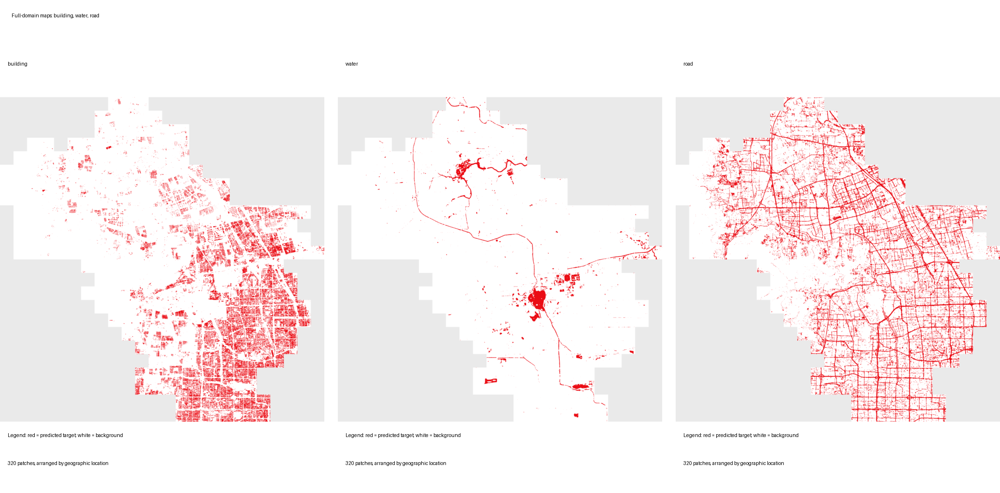
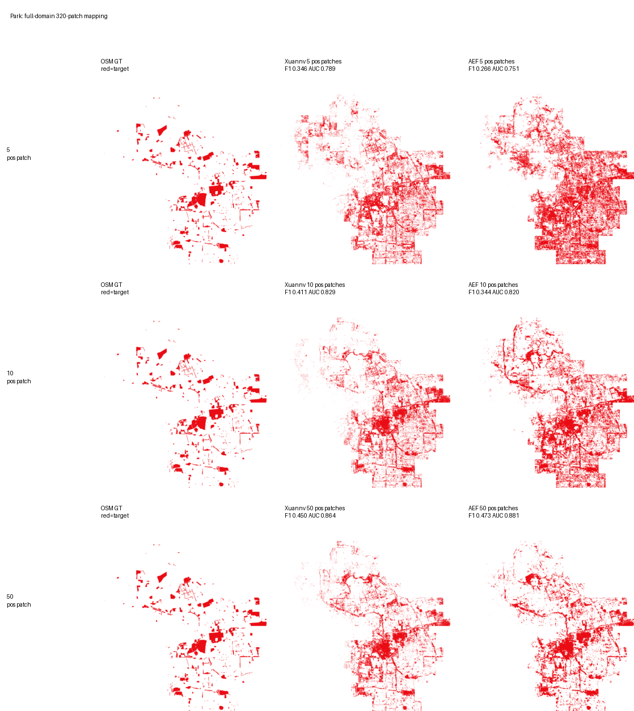
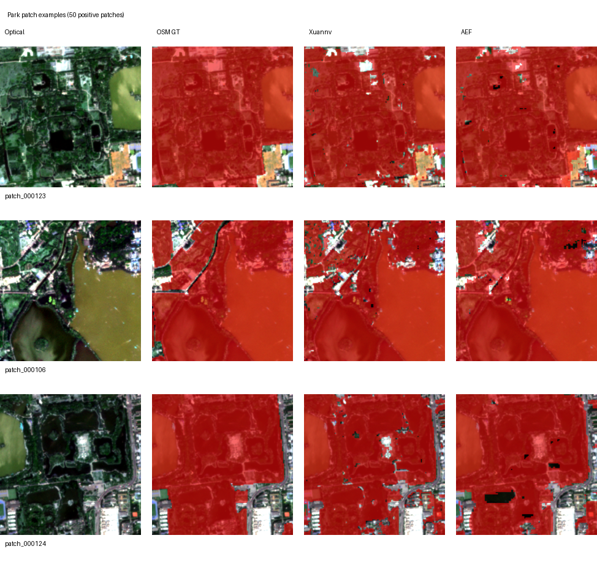
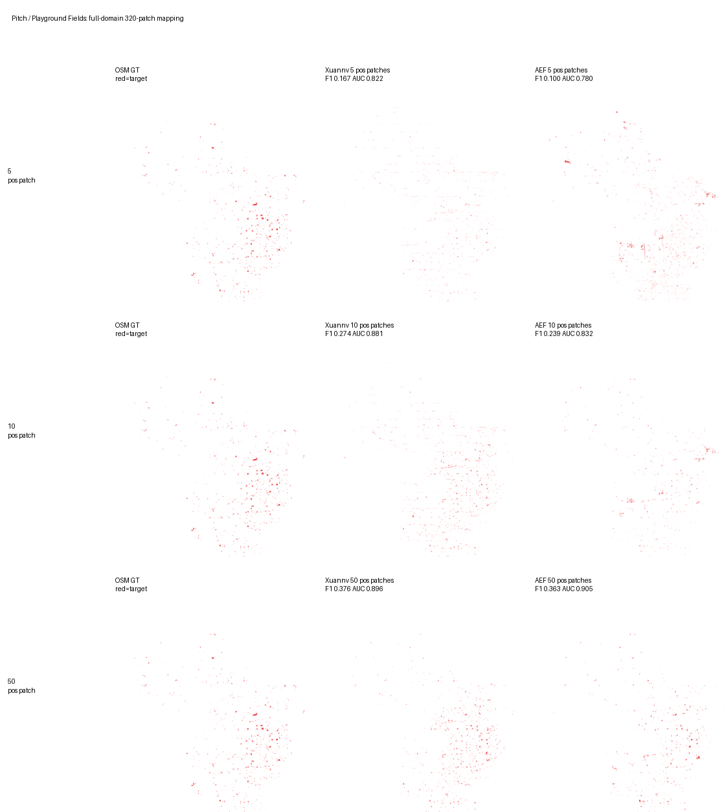
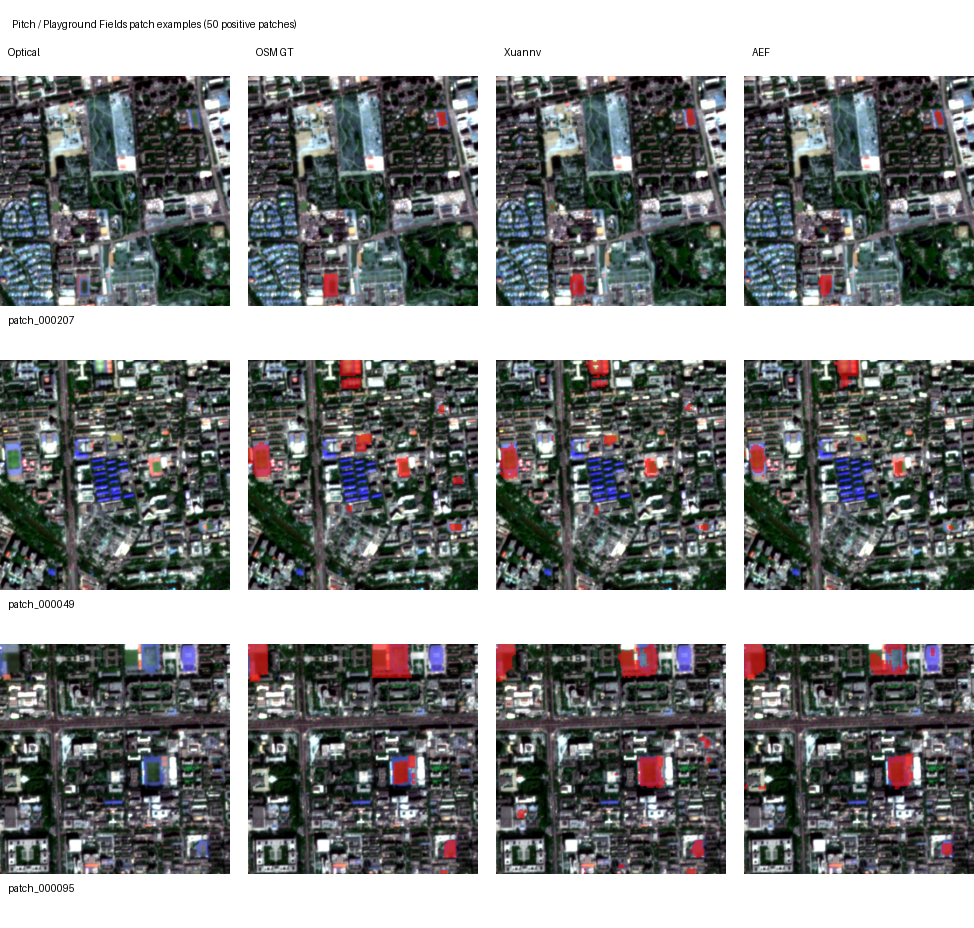
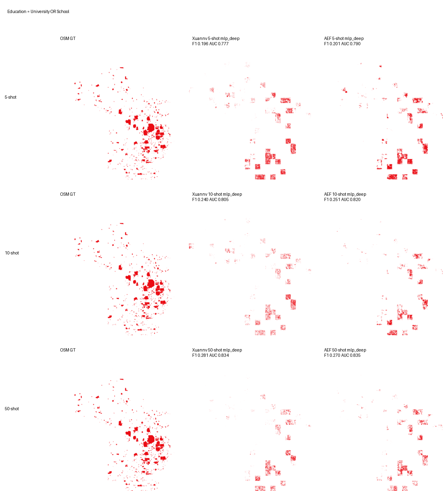
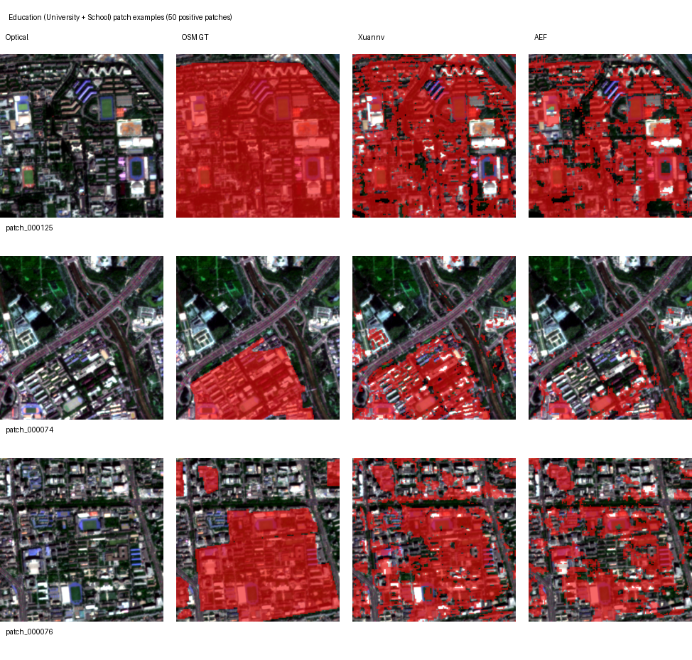
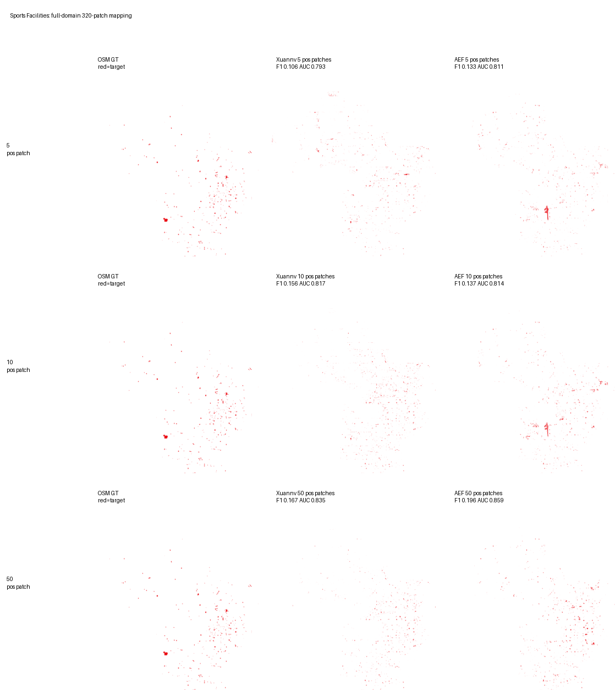
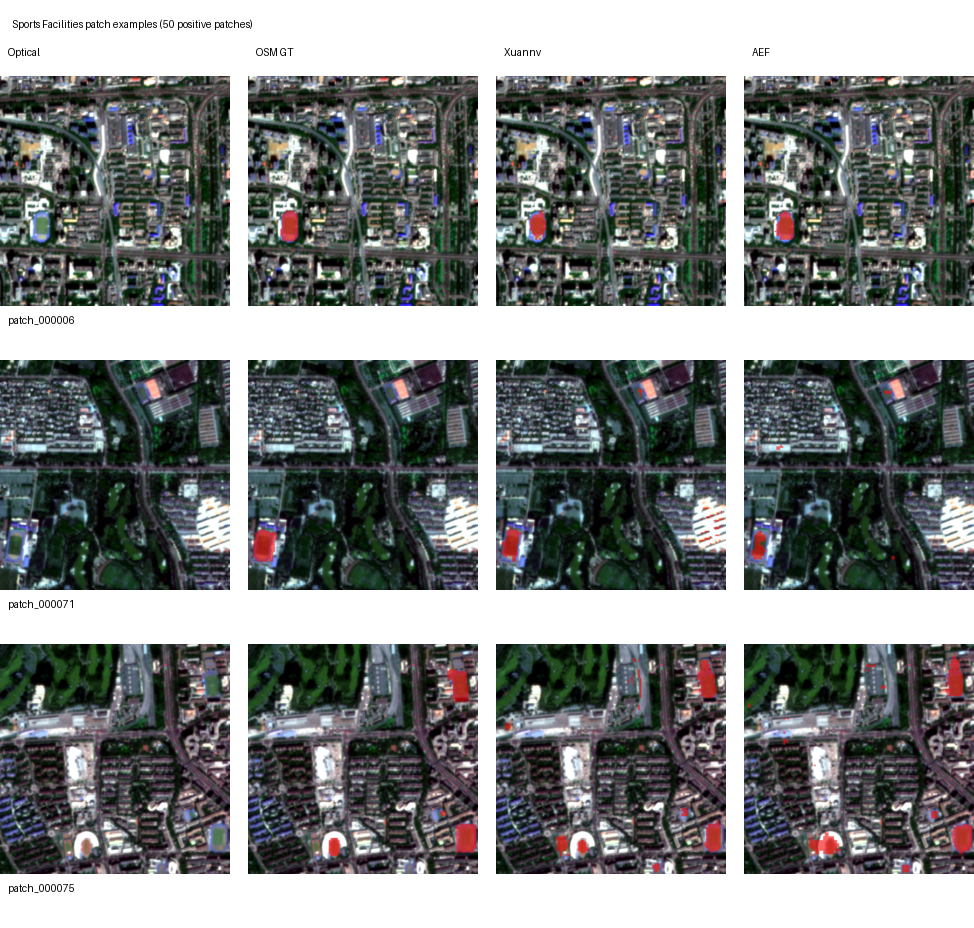
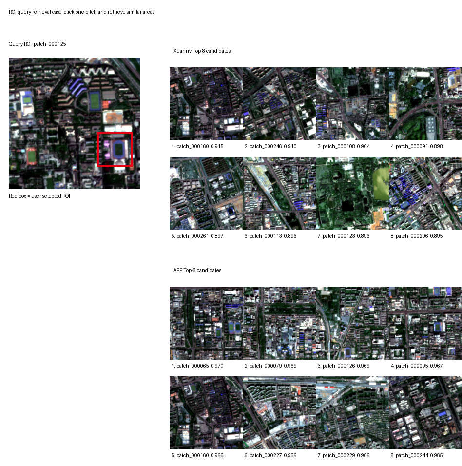

# 玄女海淀 V1 语义制图能力展示

日期：2026-07-05

## 1. 评估目标

本报告展示玄女海淀 V1 embedding 在海淀区的语义表达与少样本制图能力。评估内容包括 embedding 全域空间结构、道路/水体/建筑等基础地物制图，以及公园、操场/球场、教育区域、体育设施和草地/绿地等城市功能语义。

评估采用固定 embedding 后训练轻量下游头的方式。每个类别分别使用 5、10、50 个含目标的正样本 patch 训练，再在海淀区 320 个 patch 上做全域推理。玄女与 AEF 使用同一批 OSM 标签、同一数据划分、同一训练设置和同一阈值选择规则。

图中红色表示目标类别，白色表示非目标区域。单 patch 展示叠加高分辨率光学影像，用于观察预测区域是否落在真实地物上。

## 2. 核心结论

玄女海淀 V1 的全域 embedding 已形成清晰的山地、水体、道路、建筑区和城市功能区空间结构。在少样本制图中，`park / 公园` 与 `pitch / 操场球场` 是当前最适合展示的非建筑语义类别；在 5 个和 10 个正样本 patch 的极少样本设置下，玄女相对 AEF 有更明显优势。

| 类别 | 样本数 | Head | 玄女 F1 | AEF F1 | ΔF1 | 玄女 AUC | AEF AUC | ΔAUC |
| --- | ---: | --- | ---: | ---: | ---: | ---: | ---: | ---: |
| 公园 / park | 5 | mlp_deep | 0.3462 | 0.2657 | 0.0805 | 0.7887 | 0.7507 | 0.0380 |
| 公园 / park | 10 | mlp_deep | 0.4108 | 0.3439 | 0.0670 | 0.8291 | 0.8197 | 0.0095 |
| 操场球场 / pitch | 5 | mlp_deep | 0.1672 | 0.1004 | 0.0667 | 0.8224 | 0.7801 | 0.0423 |
| 操场球场 / pitch | 10 | mlp_deep | 0.2742 | 0.2391 | 0.0352 | 0.8810 | 0.8316 | 0.0495 |
| 草地绿地 / grass | 10 | mlp_deep | 0.0719 | 0.0144 | 0.0576 | 0.8142 | 0.6492 | 0.1650 |
| 草地绿地 / grass | 50 | mlp | 0.0703 | 0.0094 | 0.0608 | 0.7987 | 0.6357 | 0.1630 |

教育区域由 `university` 与 `school` 合并得到。OSM 中高校校园 polygon 面积差异较大，部分 patch 覆盖率很高，部分 patch 只有少量目标像素，因此全域图会呈现明显的空间不均匀分布。该类别更适合作为补充能力展示，不作为主视觉结论。

## 3. Embedding 全域结构

PCA 可视化将 64 维 embedding 投影到 RGB 三通道，用于直观观察模型是否学习到稳定的空间结构。图中每一个小块对应海淀区一个 1280 m × 1280 m patch，全部 320 个 patch 按真实地理位置拼接。

图 1. 玄女海淀 V1 与 AEF 年度 embedding 的全域 PCA 对比。上图为玄女海淀 V1 2026 年 4 月 embedding，下图为 AEF 2025 年年度 embedding。颜色相近表示 embedding 表达相近，连续的颜色边界通常对应山地、水体、道路、建筑密集区等真实地理结构。

## 4. 基础地物制图能力

道路、水体和建筑是城市遥感制图中的基础类别。该组结果展示玄女 embedding 固定不动后，仅训练轻量下游头即可在全海淀范围内输出基础地物分布。

图 2. 玄女海淀 V1 在建筑、水体、道路三类基础地物上的 320 patch 全域制图结果。红色表示模型预测的目标区域，白色表示背景，灰色为空间范围外区域。三张图均按真实地理位置拼接，可用于观察模型对城市建成区、河湖水系和路网结构的表达能力。

## 5. 公园制图展示

公园类别在 5 个和 10 个正样本 patch 下已经形成较清晰的空间响应，说明 embedding 中包含一定的城市功能区语义。

图 3. 公园类别的海淀全域 320 patch 制图。每一行对应 5、10、50 个正样本 patch 训练后的结果；三列分别为 OSM 标注参考、玄女预测、AEF 预测。

图 4. 公园类别典型 patch 展示。第一列为高分辨率光学影像，其余列分别叠加 OSM 标注、玄女预测和 AEF 预测。

## 6. 操场球场制图展示

操场/球场类别更接近“用户圈选一个操场，再寻找相似操场”的实际使用场景。玄女在 5-shot 和 10-shot 下相对 AEF 有更高 F1 与 AUC。

图 5. 操场/球场类别的海淀全域 320 patch 制图。

图 6. 操场/球场类别典型 patch 展示。红色叠加区域表示目标类别或模型预测结果。

## 7. 教育区域与体育设施补充展示

教育区域合并了高校与学校标签，能够展示模型对复合功能区的学习能力。由于高校校园面积较大、边界包含建筑、道路、绿地、操场等多类地物，该类别更适合用于说明复合语义区域的制图潜力。

体育设施类别目标更稀疏，图面上红色区域较少，建议作为补充展示或附录材料。

## 8. ROI 相似区域检索应用示例

相似区域检索用于模拟实际使用方式：用户在高分辨率影像上圈选一个操场 ROI，系统提取该 ROI 的 embedding 向量，并在海淀全域检索相似区域候选。

图 7. 操场 ROI 相似区域检索示例。左侧红框为用户圈选的操场区域，右侧为玄女和 AEF 分别返回的 Top-8 相似候选 patch。该能力可用于从一个已知样例快速发现全区相似地物候选，再交由人工复核。

当前 ROI 零样本检索能力仍处于优化阶段。按 ROI 平均向量做 cosine 检索时，草地类别已优于 AEF，公园接近 AEF，教育区域、体育设施和操场球场仍有提升空间。后续应将 ROI 检索作为固定评测项，继续优化 embedding 空间中同类区域的聚集性。

## 9. 模型训练方法

玄女海淀 V1 的目标是学习“每一个月份、每一个位置”的通用地理 embedding，而不是针对单一任务训练专用模型。训练时输入多源遥感数据，模型输出 64 维、128 × 128 空间分辨率的月度 embedding；下游道路、水体、建筑、公园和操场等任务只在固定 embedding 上训练轻量 head。

训练数据覆盖海淀区 320 个 patch，每个 patch 对应 1280 m × 1280 m 空间范围，模型输出保持 10 m 等效分辨率。使用的数据包括 Sentinel-2、Landsat、Sentinel-1、SAR、高分辨率光学影像、高分辨率 SAR、DEM/地形信息以及 OSM 弱语义标签。时间窗口聚焦 2025 年 12 月至 2026 年 5 月，其中 2026 年 4 月作为主要展示月份。

训练目标由三类信号共同约束。第一类是多源重建：从 embedding 恢复不同传感器观测，使 embedding 保留真实地表纹理和空间边界。第二类是困难重建：随机遮挡或弱化部分输入源，要求模型仍能从其他数据源推断稳定地物信息，从而减少云雾、噪声和单一传感器缺失带来的影响。第三类是 OSM 弱语义约束：将建筑、道路、水体、绿地、公园、教育、体育等 OSM 标签整理成统一语义组，作为低权重辅助监督，让 embedding 更容易形成可被少量标签快速调用的语义结构。

最终模型采用长训练策略，并以全域 PCA 连续性、基础地物制图效果、少样本语义制图指标和可视化质量共同筛选生产版本。该训练方式的核心价值是：先得到一个通用、稳定、可迁移的海淀月度 embedding，再用少量样本快速生成不同业务类别的专题图。

## 10. 完整指标表

| task | shot | head | xuannv_f1 | aef_f1 | delta_f1 | xuannv_auc | aef_auc | delta_auc | xuannv_ap | aef_ap | delta_ap |
| --- | --- | --- | ---: | ---: | ---: | ---: | ---: | ---: | ---: | ---: | ---: |
| education | 5 | mlp_deep | 0.1955 | 0.2007 | -0.0051 | 0.7773 | 0.7903 | -0.0131 | 0.1293 | 0.1273 | 0.0020 |
| education | 10 | mlp_deep | 0.2400 | 0.2510 | -0.0110 | 0.8051 | 0.8198 | -0.0147 | 0.1662 | 0.2044 | -0.0382 |
| education | 50 | mlp_deep | 0.2809 | 0.2696 | 0.0113 | 0.8342 | 0.8354 | -0.0011 | 0.2496 | 0.2482 | 0.0014 |
| sports | 5 | mlp_deep | 0.1064 | 0.1329 | -0.0265 | 0.7930 | 0.8108 | -0.0178 | 0.0366 | 0.0493 | -0.0128 |
| sports | 10 | mlp_deep | 0.1557 | 0.1372 | 0.0185 | 0.8175 | 0.8137 | 0.0038 | 0.0567 | 0.0597 | -0.0030 |
| sports | 50 | mlp_deep | 0.1668 | 0.1956 | -0.0287 | 0.8353 | 0.8586 | -0.0233 | 0.0611 | 0.0955 | -0.0344 |
| pitch | 5 | mlp_deep | 0.1672 | 0.1004 | 0.0667 | 0.8224 | 0.7801 | 0.0423 | 0.0942 | 0.0436 | 0.0505 |
| pitch | 10 | mlp_deep | 0.2742 | 0.2391 | 0.0352 | 0.8810 | 0.8316 | 0.0495 | 0.1902 | 0.1458 | 0.0444 |
| pitch | 50 | mlp_deep | 0.3759 | 0.3629 | 0.0130 | 0.8957 | 0.9046 | -0.0088 | 0.3064 | 0.2878 | 0.0187 |
| park | 5 | mlp_deep | 0.3462 | 0.2657 | 0.0805 | 0.7887 | 0.7507 | 0.0380 | 0.3276 | 0.2198 | 0.1078 |
| park | 10 | mlp_deep | 0.4108 | 0.3439 | 0.0670 | 0.8291 | 0.8197 | 0.0095 | 0.4183 | 0.3177 | 0.1005 |
| park | 50 | mlp_deep | 0.4499 | 0.4725 | -0.0227 | 0.8640 | 0.8810 | -0.0170 | 0.4344 | 0.5213 | -0.0870 |
| grass | 5 | mlp | 0.0452 | 0.0078 | 0.0374 | 0.6783 | 0.6236 | 0.0547 | 0.0236 | 0.0102 | 0.0134 |
| grass | 10 | mlp_deep | 0.0719 | 0.0144 | 0.0576 | 0.8142 | 0.6492 | 0.1650 | 0.0531 | 0.0120 | 0.0411 |
| grass | 50 | mlp | 0.0703 | 0.0094 | 0.0608 | 0.7987 | 0.6357 | 0.1630 | 0.1596 | 0.0118 | 0.1478 |
