# 玄女遥感 Embedding 模型阶段成果汇报

> **历史归档报告**  
> 原始汇报日期：2026-06-29 ｜ 覆盖区域：海淀、哈尔滨 ｜ 数据周期：2025-12 至 2026-05  
> 本文由 [`leadership_embedding_report_20260629.html`](leadership_embedding_report_20260629.html) 转换而来，保留当时的模型、数据和评测口径。P2A/P1B/AEF 数字均为当期历史结果，**不替代**当前 P10C 生产版结果或正在进行的论文级空间独立评测。
>
> **请优先阅读最新汇报：[`leadership_embedding_report_latest_20260720.md`](leadership_embedding_report_latest_20260720.md)。** 当前海淀生产版为 P10C `epoch_800`；P10A 是其训练链上的早期候选，并非当前生产定版。

## 目录

1. [一页结论](#一页结论)
2. [项目背景](#1-项目背景为什么要做这个-embedding)
3. [工作量总览](#2-本阶段工作量总览)
4. [数据、区域和下游任务](#3-数据区域和下游任务)
5. [两阶段训练策略](#4-两阶段训练思路先学稳定时序底座再融入高分细节)
6. [实验闭环](#5-已经搭好的实验闭环)
7. [工程与 API](#6-工程与后端-api-工作量)
8. [实验版本演进](#7-实验版本演进)
9. [核心指标与海淀专测](#8-核心指标对比)
10. [可视化证据](#10-可视化证据)
11. [风险与后续计划](#11-当前主要发现和问题)
12. [标签统计审计](#标签统计审计待补充)
13. [复现信息](#13-附录关键路径和复现信息)

---

## 一页结论

本阶段完成了海淀与哈尔滨两地、多时相、多源遥感 embedding 的训练、后端数据/API 对接、下游评测、报告自动化和可视化诊断。历史报告中的推荐结论为：**P2A 原版是当时综合最优底座**。

| 历史指标 | 结果 | 当时的解释 |
| --- | ---: | --- |
| 当前推荐模型 | P2A | 加入 semantic probe 的版本，变化检测与语义任务综合最稳。 |
| P2A 变化检测平均 `F1_best` | 0.3394 | 高于 AEF 当期均值 0.1305。 |
| P2A OSM U-Net 平均 F1 | 0.5077 | 建筑、道路空间语义已有可读性。 |
| P2A-Long | 不晋升 | 验证损失更低，但下游平均下降。 |
| 训练资源 | 6 张 Ascend NPU | 使用 NPU 0–5 做 DDP 训练。 |

> **历史汇报口径**：已跑通多源数据接入、后端区域/API 同步、预处理、训练、embedding 导出、下游快速测评、AEF/多版本对比、可视化诊断和政府报告/PPT 材料沉淀的闭环。当时的下一步重点是让 embedding 同时兼顾变化敏感性与建筑/道路语义可分性。

---

## 1. 项目背景：为什么要做这个 embedding

目标不是只训练一个单任务模型，而是训练一个**通用遥感地理 embedding**：给定一个 `1280 m × 1280 m` patch，模型输出 `128×128` 的空间 embedding，使其可被简单下游头或分割头用于多种任务。

| 维度 | 目标 | 说明 |
| --- | --- | --- |
| 业务价值 | 少标注 | embedding 学好后，下游任务只需要少量标签或弱标签。 |
| 技术目标 | 一套特征 | 服务变化检测、建筑提取、道路提取、土地利用等任务。 |
| 汇报目标 | 可解释 | 不只报告指标，还展示预测、GT、embedding PCA 和失败案例。 |

可以把 embedding 理解为“遥感图像的地理语义底图”。如果底图学得好，建筑提取、道路提取、施工地检测、变化检测等任务就不需要每次从零开始学习，而是在统一表征上增加小型任务头即可。

---

## 2. 本阶段工作量总览

这不是单个模型训练实验，而是一套“数据工程 + 模型工程 + 后端接口 + 下游评测 + 报告交付”的系统建设。

| 工作模块 | 当期规模 | 完成内容 | 沉淀资产 | 汇报价值 |
| --- | --- | --- | --- | --- |
| 多源数据工程 | 2 区域 | 海淀、哈尔滨 AOI/patch 网格；S1/S2/Landsat、高分光学、高分 SAR、WorldCover/OSM/人工标签接入与 QA。 | 可复用数据目录、manifest 与 QA 文档。 | 证明项目不是 demo，而是可持续的数据资产。 |
| 模型训练迭代 | 8+ 轮 | P1B、P2A、P2B、P2C、P2D、P2E、P2A-Long 等假设验证。 | 自包含 YAML、权重、训练日志与对比报告。 | 形成可回溯的模型升级路线。 |
| 下游验证 | 12+ 组 | 变化检测 5 类；OSM 建筑/道路 × Linear/MLP/U-Net；海淀专测与 AEF 对比。 | 固定后训练评测流程。 | 每轮可判断是否真实提升，而非只看 loss。 |
| 可视化与报告 | 多套 | 两期高分影像、PCA、预测、GT、红白诊断图、PPT/HTML/政府报告素材。 | 指标图、专题图、失败案例。 | 让业务方可直接检查效果。 |
| 后端/API 工程 | 已接入 | AOI/patch 网格同步、静态报告服务、评测结果目录化。 | API 对接、服务脚本、交付目录。 | 为驾驶舱和接口化交付做准备。 |

---

## 3. 数据、区域和下游任务

| 项目 | 内容 | 说明 |
| --- | --- | --- |
| 区域 | 海淀、哈尔滨 | 海淀偏城市精细目标；哈尔滨承担跨区域和变化类任务。 |
| 月份 | 2025-12 至 2026-05 | 用于构造两期和多期时序 embedding。 |
| 模态 | S2、S1、Landsat、高分光学、高分 SAR | 兼顾光谱、雷达和高分辨率空间纹理。 |
| 输出分辨率 | `128×128` embedding map | 保持空间结构，便于像素级分割和变化检测。 |
| 下游任务 | 施工地、建筑变化、农田变化、裸地/垃圾、建筑 OSM、道路 OSM | 同时评估变化敏感性和语义可分性。 |

> 当期已发现标签和坐标转换可能影响效果，因此加入了 GT 可视化、红白预测图、embedding PCA 图和任务级诊断图，避免只看 AUC 或平均数造成误判。

---

## 4. 两阶段训练思路：先学稳定时序底座，再融入高分细节

低分辨率时序数据覆盖稳定、时间连续，适合先学习长期地理语义；高分辨率数据空间细节强，但覆盖稀疏、模态不齐，适合在底座稳定后持续预训练融入。

### 4.1 两个阶段

| 阶段 | 输入 | 目的 | 预期能力 |
| --- | --- | --- | --- |
| 阶段一：低分多源时序预训练 | S2 + S1 + Landsat + WorldCover | 在 10 m 等效网格学习月度地理 embedding。 | 季节变化、地物、雷达/光学互补、缺失月份处理。 |
| 阶段二：高分持续预训练 | 海淀/哈尔滨高分光学 + 海淀高分 SAR | 将建筑边界、道路细线和小目标纹理融入同一 `128×128` embedding。 | 细粒度空间结构与边界表达。 |

### 4.2 阶段一：低分多源时序预训练细节

| 输入 | 模型处理 | 训练目标 | 学到的能力 |
| --- | --- | --- | --- |
| S2 12 波段 | 按月聚合至 2025-12 至 2026-05 的月度 bin。 | S2 连续值重建。 | 植被、裸地、水体、建筑等光谱语义。 |
| S1 VV/VH | 雷达单独编码，再与光学时序融合。 | S1 连续值重建。 | 补充云遮挡、夜间/雨雾等光学不稳定场景。 |
| Landsat 7 波段 | 作为另一套中分辨率光学时序输入。 | Landsat 重建。 | 增强跨传感器一致性，降低单源偏差。 |
| WorldCover/弱语义标签 | 仅作为 target 分类监督，不作为普通影像输入。 | 分类交叉熵，`0` 为 ignore。 | 提供基础地表覆盖语义。 |

### 4.3 阶段二：高分数据的接入方式

高分数据不直接拉伸到 10 m 输入，也不是简单拼接到 S2；采用“独立高分编码分支 + 可用性感知融合”。

| 高分源 | 区域 | 原始尺寸/分辨率 | 进入模型方式 | 主要贡献 |
| --- | --- | --- | --- | --- |
| `highres_optical_haidian` | 海淀 | 约 `427×427`、约 3 m | `NativeResolutionHighResEncoder` 独立编码，adaptive pool 至 embedding 网格。 | 高密城区建筑边界、道路纹理和小目标。 |
| `highres_optical_harbin` | 哈尔滨 | 约 `2560×2560`、约 0.5 m | 独立高分编码器处理原生分辨率，再与月度 base embedding 融合。 | 施工地、建筑变化、裸地/垃圾等细粒度纹理。 |
| `highres_sar_haidian` | 海淀 | 约 `427×427`、约 3 m | SAR 高分分支独立编码，availability mask 控制是否参与融合。 | 补充结构与散射信息。 |

高分数据并非每个区域、每个月和每个模态均可用。availability mask 的作用是：有数据时参与融合；缺失时不将其伪造成零值或假观测。最终输出仍为统一的 `128×128` embedding，下游任务不必了解底层来源。

---

## 5. 已经搭好的实验闭环

1. **训练 embedding**：使用 6 张 NPU（NPU 0–5）进行 DDP 训练，实验配置自包含。
2. **导出 embedding**：从 best checkpoint 为每个区域、patch、月份导出 `128×128` embedding map。
3. **下游快速测评**：固定执行变化检测，以及 OSM 建筑/道路的 Linear、MLP、U-Net 下游头。
4. **可视化诊断**：对齐展示两期高分影像、embedding、PCA、模型预测和 GT；预测用红色、背景用白色。
5. **版本对比与文档沉淀**：每轮记录权重、embedding、评测路径、指标、结论和下一轮假设。

---

## 6. 工程与后端 API 工作量

除模型外，当期还补齐了区域网格 API 同步、训练/评测结果结构化落盘和静态报告服务，为后续驾驶舱、接口服务和业务交付打下基础。

| 工程资产 | 文件/目录 | 作用 |
| --- | --- | --- |
| 后端区域同步 | `scripts/data/update_aoi_and_patches.py` | 从上游展示/API 仓库同步哈尔滨、海淀 AOI GeoJSON 与 patch 网格元数据，避免手工维护区域切片。 |
| 报告服务 | `scripts/serve_leadership_report.py` | 将报告部署到 8001 端口，并映射 `/data/xuannv_embedding` 图片资源。 |
| 后训练评测 | `scripts/scale/post_training_eval.py`、`skills/xuannv-post-training-eval` | 固定执行 embedding 导出、下游评测、AEF 对比、可视化和报告生成。 |
| 报告生成链路 | `reports/harbin_202512_202605/` | 归档哈尔滨新区城市管理总报告及各专题报告。 |
| PPT/BP 素材 | `docs/bp_deck/outputs/` | 将模型能力转化为“地理嵌入、一次表征多次复用、任务组件库、接口生态”等业务语言。 |


*图 1. 数据、模型、任务组件与业务交付工作流。*

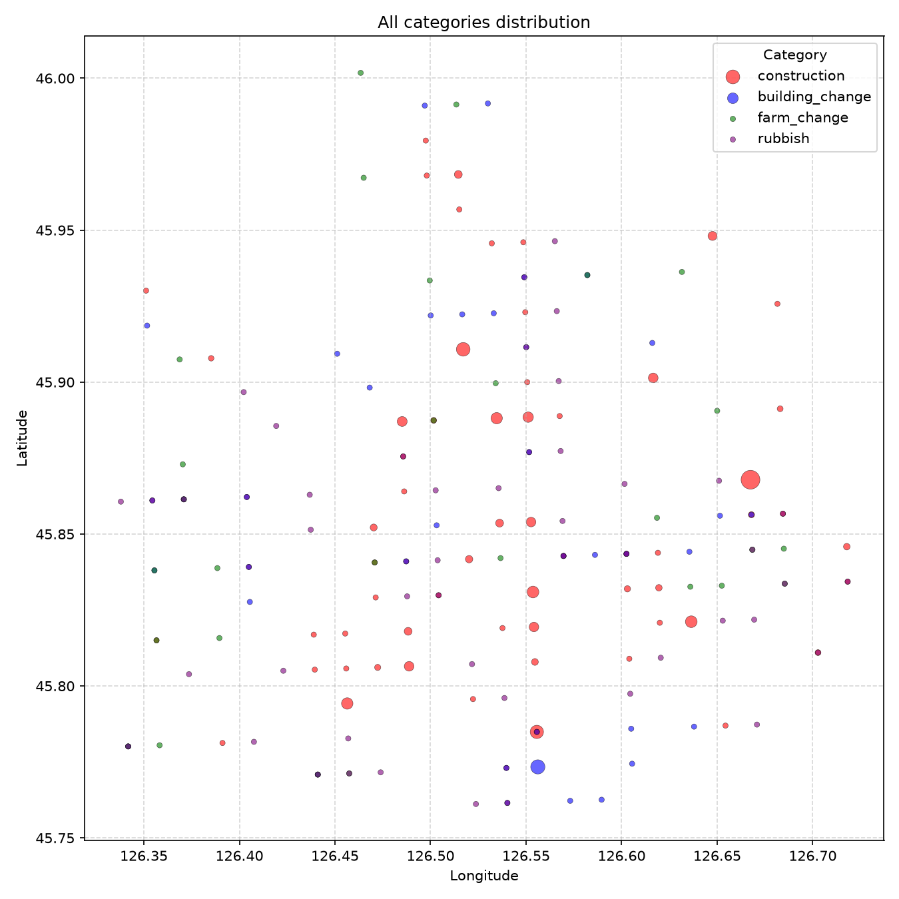

*图 2. 哈尔滨新区报告图斑总览：施工、建筑变化、耕地、垃圾渣土等结果被组织为可复核的业务证据。*

---

## 7. 实验版本演进

| 版本 | 核心改动 | 目的 | 当期结论 | 是否晋升 |
| --- | --- | --- | --- | --- |
| P1B | 稀疏采样 + hard negative 基线 | 修复早期问题后建立可用底座。 | 变化检测可用，但 OSM 语义能力不足。 | 否 |
| **P2A** | semantic probe 辅助训练 | 提升建筑、道路等语义表达。 | **综合最稳，作为当期推荐 baseline。** | 是 |
| P2B | 线性 semantic probe | 测试简单监督是否提高线性可分性。 | 整体不如 P2A，变化检测下降。 | 否 |
| P2C | semantic hard negative | 压制建筑/道路误检背景。 | Linear 略升，变化检测与 MLP 不稳定。 | 否 |
| P2D | 延迟 hard-negative warmup | 减少 hard negative 对主训练冲击。 | OSM U-Net 均值最高，但变化检测不如 P2A。 | 否 |
| P2E | change-anchor balance | 保护变化检测敏感性。 | `construction_joint` 提升，但 `farm_change` 退化。 | 否 |
| P2A-Long | P2A 继续训练 100 epoch，`lr=5e-5` | 检验长训是否改善。 | 验证损失更低，但下游整体下降。 | 否 |

> **关键认识**：P2A-Long 的 validation loss 从 P2A 的 `1.7069` 降至 `1.5982`，但变化检测、MLP、U-Net 下游指标均下降。因此，训练损失不能作为 embedding 升级的唯一判断依据。

---

## 8. 核心指标对比

### 8.1 P2A / P1B / AEF 总览

| 任务组 | AEF | P1B | P2A | 当期结论 |
| --- | ---: | ---: | ---: | --- |
| 变化检测平均 `F1_best` | 0.1305 | 0.3148 | **0.3394** | P2A 高于 AEF 和 P1B。 |
| 变化检测平均 AUC | 0.7848 | 0.9452 | 约 0.9350+ | 自研 embedding 的变化排序能力优于 AEF。 |
| 变化检测平均 mIoU | 0.0491 | 0.1360 | 约 0.1579 | P2A 的区域质量改善，但稀疏任务仍需优化。 |
| OSM 建筑/道路 U-Net F1 | 未评测 | 部分任务 | **0.5077** | P2A 新增验证建筑/道路语义能力。 |

> **口径限制**：AEF 为已有 5-fold 均值；P2A 为当期 quick fold-0，用于快速方向判断。该历史对比不能替代后续严格空间 5-fold 公平评测。

### 8.2 变化检测：P2A 与 AEF

| 任务 | AEF F1 均值 | P2A F1 fold-0 | 差值 | P2A AUC | P2A mIoU |
| --- | ---: | ---: | ---: | ---: | ---: |
| `construction` | 0.2116 | 0.2978 | +0.0862 | 0.8744 | 0.1593 |
| `building_change` | 0.0245 | 0.3229 | +0.2983 | 0.9579 | 0.1363 |
| `farm_change` | 0.0147 | 0.1421 | +0.1274 | 0.8961 | 0.0000 |
| `rubbish` | 0.0365 | 0.5971 | +0.5606 | 0.9989 | 0.2917 |
| `construction_joint` | 0.3650 | 0.3371 | -0.0279 | 0.9480 | 0.2021 |

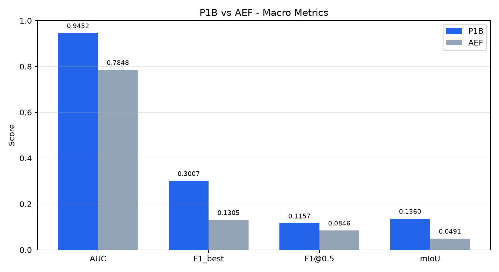

*图 3. 历史 P1B 汇报包中的宏观指标对比 AEF 图表。*

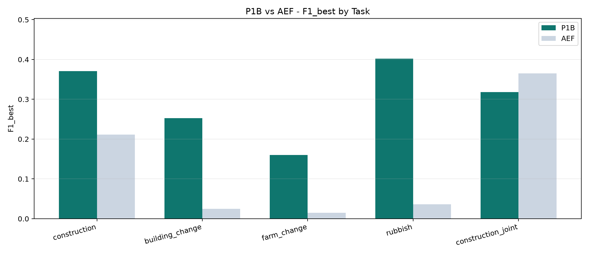

*图 4. 历史 P1B 汇报包中的分任务 `F1_best` 对比。*

### 8.3 不同 embedding 版本的变化检测均值

| 版本 | construction | building_change | farm_change | rubbish | construction_joint | 平均 |
| --- | ---: | ---: | ---: | ---: | ---: | ---: |
| P1B | 0.3696 | 0.2732 | 0.0534 | 0.5359 | 0.3420 | 0.3148 |
| **P2A** | 0.2978 | 0.3229 | 0.1421 | 0.5971 | 0.3371 | **0.3394** |
| P2C | 0.2650 | 0.3033 | 0.1599 | 0.5581 | 0.3608 | 0.3294 |
| P2D | 0.2659 | 0.3028 | 0.1594 | 0.5597 | 0.3591 | 0.3294 |
| P2E | 0.2656 | 0.3141 | 0.0563 | 0.5332 | 0.4596 | 0.3258 |
| P2A-Long | 0.2600 | 0.3067 | 0.0666 | 0.5601 | 0.3312 | 0.3049 |

### 8.4 OSM 建筑/道路下游任务

| 版本 | Linear 平均 F1 | MLP 平均 F1 | U-Net 平均 F1 | 历史解读 |
| --- | ---: | ---: | ---: | --- |
| P1B | 0.2373 | 0.3000 | 未跑全 | 旧底座，语义可分性不足。 |
| **P2A** | 0.2463 | **0.3403** | 0.5077 | 变化检测与 MLP 语义能力综合最稳。 |
| P2C | 0.2540 | 0.3357 | 0.5063 | Linear 略好，但综合不如 P2A。 |
| P2D | **0.2546** | 0.3386 | **0.5148** | U-Net 最好，但变化检测较弱。 |
| P2E | 0.2528 | 0.3331 | 0.5090 | 海淀道路变好，跨区域退化。 |
| P2A-Long | 0.2467 | 0.3100 | 0.4646 | 长训后下游下降。 |

---

## 9. 海淀区专测：若只服务海淀，哪个模型更好

仅纳入海淀施工地、海淀 `construction_joint` 子集、海淀建筑 OSM 和海淀道路 OSM；哈尔滨为主的 `farm_change`、`rubbish`、`building_change` 不进入该专测。

| 任务组 | P2A F1 | P2A-Long F1 | 差值（Long − P2A） | 当期判断 |
| --- | ---: | ---: | ---: | --- |
| 施工类平均 | 0.3330 | 0.3070 | -0.0261 | P2A 更好。 |
| OSM Linear 平均 | 0.2923 | 0.3074 | +0.0151 | P2A-Long 更好。 |
| OSM MLP 平均 | 0.2960 | 0.3053 | +0.0093 | P2A-Long 略好。 |
| OSM U-Net 平均 | 0.4358 | 0.4150 | -0.0208 | P2A 更好。 |
| **海淀整体平均** | **0.3393** | 0.3337 | -0.0056 | **P2A 略好。** |

历史结论是：P2A-Long 更容易被简单头 Linear/MLP 读出，但 P2A 在施工任务与 U-Net 强分割头上更稳，因此当时面向实际应用和汇报仍推荐 P2A。

---

## 10. 可视化证据

所有图片均已迁移到仓库，Markdown、GitHub 和 PDF 导出不再依赖原 HTML 的 `/data/...` 或旧报告服务路径。

### 10.1 变化检测任务对比

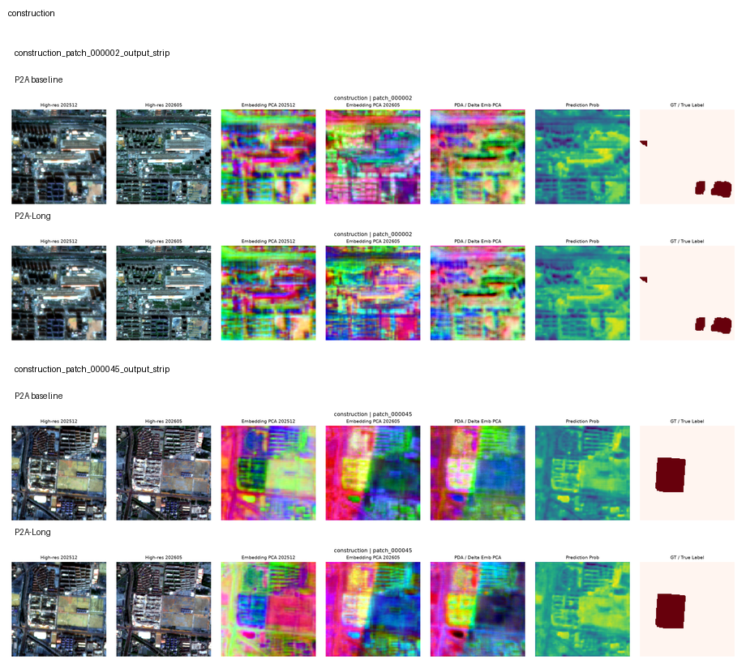

*图 5. 施工地检测：P2A 在该历史任务上更稳，P2A-Long 更容易漏检或出现校准不稳定。*

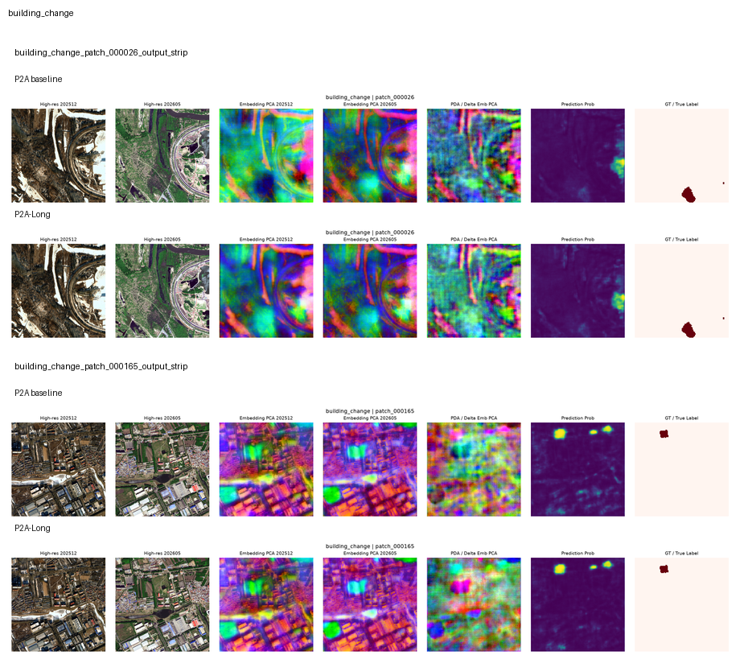

*图 6. 建筑变化：两期高分影像、embedding、预测和 GT 对齐，辅助判断坐标与标签问题。*

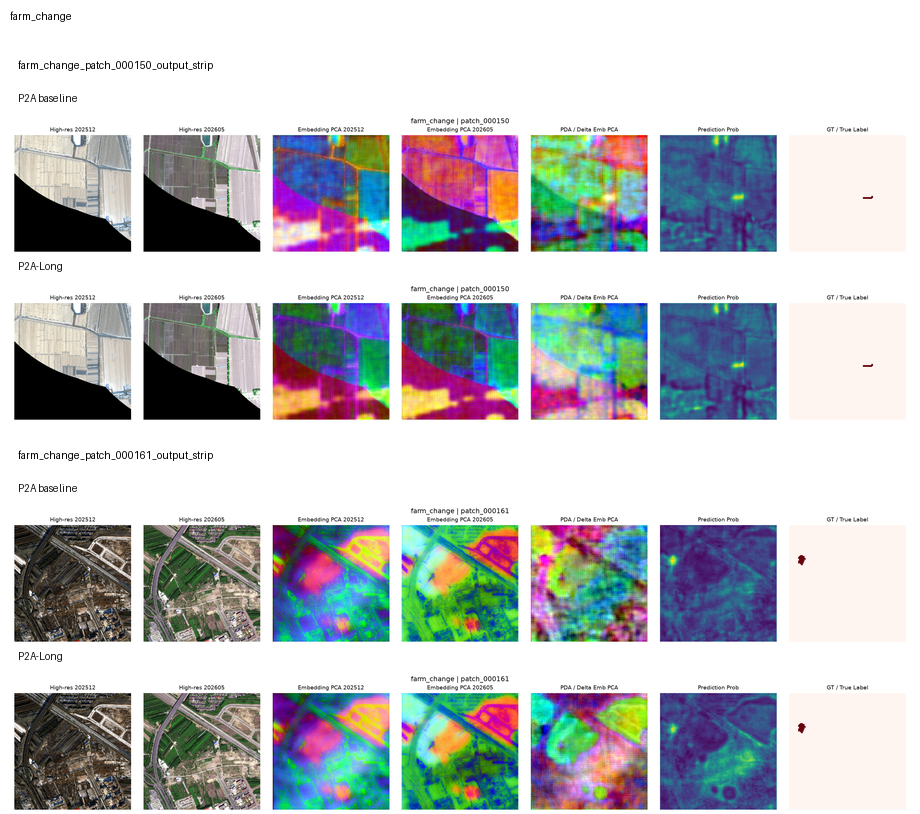

*图 7. 农田变化：当期最弱任务之一，长训后退化明显。*

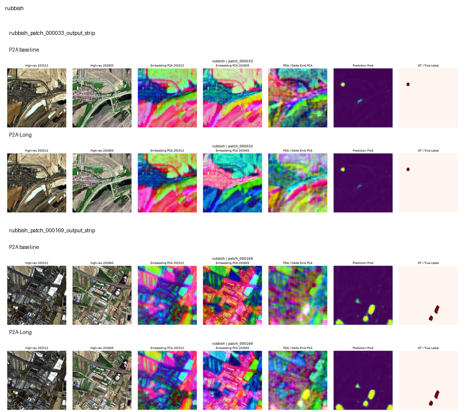

*图 8. 裸地/垃圾变化：P2A 对 AEF 的历史增益显著，但仍须结合阈值、mIoU 和可视化判断。*

### 10.2 海淀与哈尔滨建筑/道路语义

| 海淀建筑 | 海淀道路 |
| --- | --- |
| 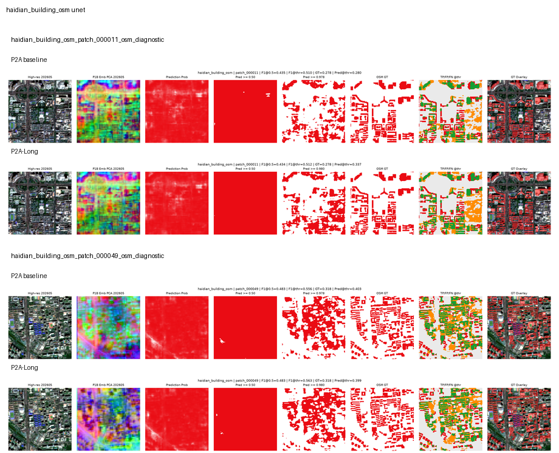 | 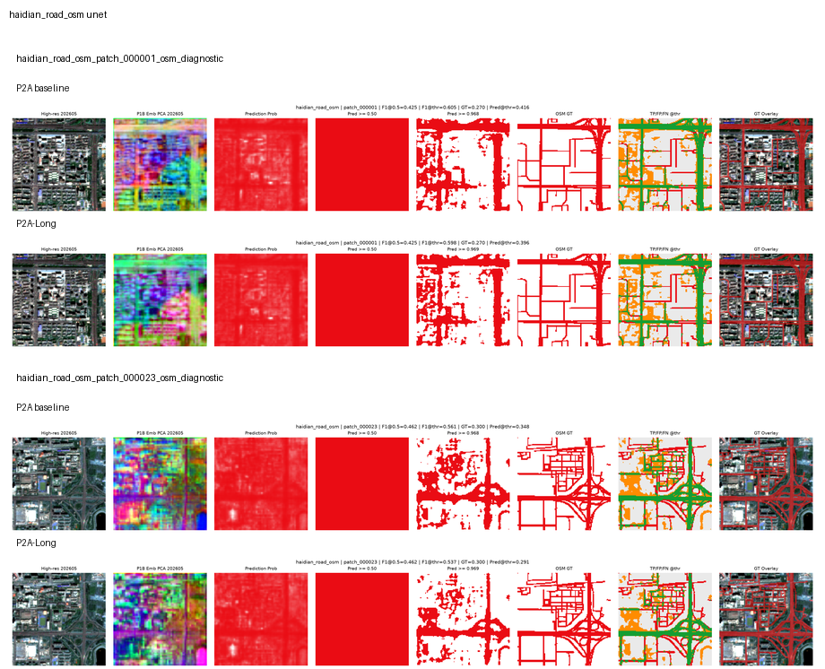 |
| P2A 在 U-Net 下游头上的建筑空间语义更稳。 | 道路为细线目标，断裂与误扩张仍是主要问题。 |

| 哈尔滨建筑 | 哈尔滨道路 |
| --- | --- |
| 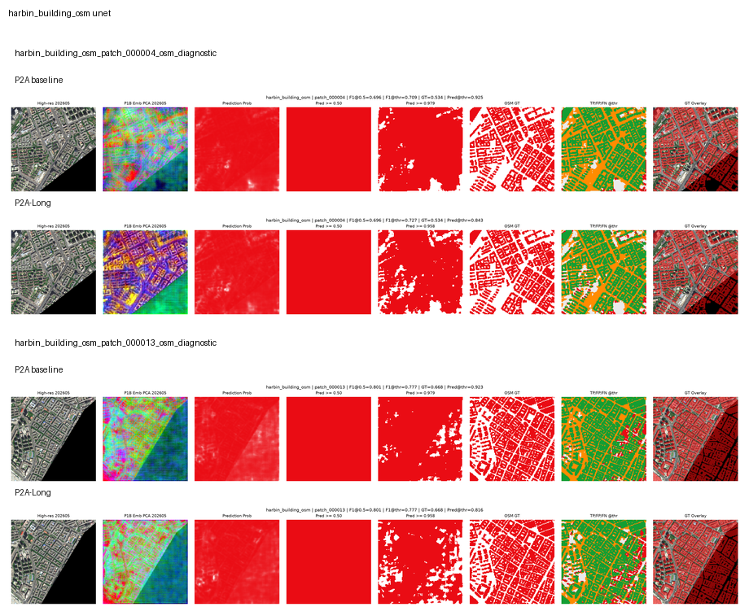 | 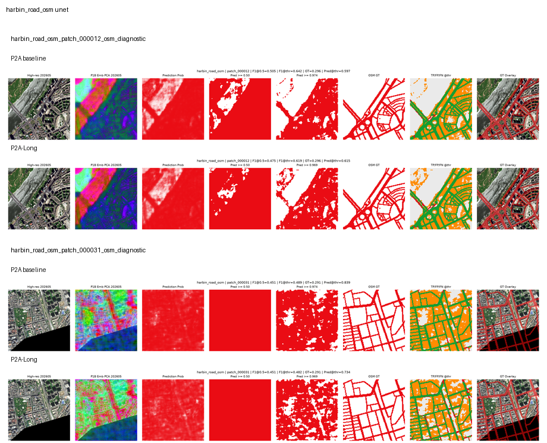 |
| P2A 的跨区域建筑语义在当期更稳定。 | 跨区域道路可提取，但细线结构与阈值校准仍需改善。 |

### 10.3 业务报告案例

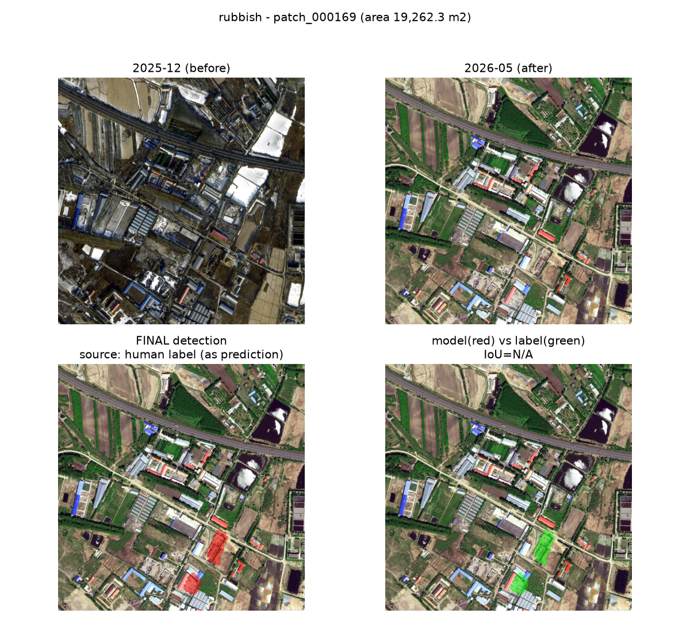

*图 9. 历史哈尔滨疑似垃圾/堆场专题案例：从模型结果到可复核图斑的报告闭环。*

> 可视化审计结论：道路会断裂，建筑边界会粘连或过度扩张；部分任务虽然 AUC 高，但正类预测比例很低。因此必须同时检查 F1、mIoU、预测正类比例和 GT，不以单一 AUC 作结论。

---

## 11. 当前主要发现和问题

| 发现 | 历史结论 |
| --- | --- |
| P2A 最稳 | 变化检测均值、MLP 语义能力和海淀任务较均衡。 |
| loss 不可靠 | P2A-Long 损失更低，但下游效果更弱。 |
| 语义与变化存在拉扯 | hard negative 可提高建筑/道路线性可分性，但可能损伤变化敏感性。 |
| 校准仍弱 | `F1@0.5` 与 `F1_best` 差距大，说明概率阈值不稳定。 |

### 需要坦诚说明的风险

| 风险 | 表现 | 当时处理方式 | 后续方向 |
| --- | --- | --- | --- |
| OSM 标签噪声 | 建筑/道路可能漏标、错标，且道路宽度近似。 | 可视化核查，不将单个样本视为绝对真值。 | 采用更高质量独立标签或视觉模型辅助弱标签。 |
| 坐标转换误差 | 早期怀疑标签区域与影像未完全对齐。 | 加入 GT 列与高分影像逐任务核查。 | 持续 label QA 与随机可视化抽检。 |
| 变化任务稀疏 | `farm_change` 正类少、mIoU 低，AUC 易产生误导。 | 同时报 F1、mIoU、预测正类比例。 | 变化区域采样与正负样本再平衡。 |
| 强头与简单头结论分裂 | P2A-Long 简单头略好，但 U-Net 和施工任务变差。 | 按应用目标优先 P2A。 | 同时优化简单可分性与空间语义。 |

---

## 12. 历史下一步升级计划

| 方向 | 原计划 | 验收标准 |
| --- | --- | --- |
| P3A：语义区域约束 | 保留 P2A 底座，引入区域平衡语义监督。 | 海淀 Linear/MLP 不低于 P2A-Long，U-Net 与变化检测不低于 P2A。 |
| P3B：变化锚点 | 加入变化区域正样本采样和变化锚点保护。 | `farm_change`、`construction_joint` 不再互相拉扯，变化检测均值超过 P2A。 |
| P3C：边界与细线 | 强化道路与建筑边界、细目标学习。 | 海淀道路 U-Net 与道路可视化明显改善。 |
| 汇报包 | 固定生成指标表、红白预测图、GT、embedding PCA 和失败案例。 | 每次训练后形成一套可交付报告。 |

> 以上为 2026-06-29 的历史计划。后续版本已经转向 OSM 弱语义、高分路径、严格空间评测、P10C 生产版和全国数据计划，当前路线请参考 `docs/paper/`、`docs/production/` 与 `docs/plans/`。

---

## 标签统计审计（待补充）

用户提供的临时数据地址为：

```text
http://localhost:58491/Tmp/pu_query_label_counts_20260720_154700/
```

在转换时该端口未启动，且当前容器中未找到同名目录或导出文件，因此无法读取其具体统计结果。为保证事实准确性，未在此处虚构标签计数。

恢复数据后，应将其加入本节，至少包含：

| 建议字段 | 用途 |
| --- | --- |
| 标签类别与来源 | 说明统计的是人工标签、OSM、变化标签还是其他弱标签。 |
| patch 数、正像素数、正样本比例 | 判断类别不均衡程度与评测可行性。 |
| 区域与时间范围 | 防止海淀、哈尔滨、不同月份统计混用。 |
| 训练/验证/测试或空间 fold 分布 | 检查是否存在某一划分没有正样本。 |
| 统计脚本、生成时间和输入版本 | 保证统计结果可复现。 |

---

## 13. 附录：关键路径和复现信息

### 当时推荐模型 P2A

```text
权重：/data/xuannv_embedding/outputs/v2_p2a_semantic_probe_full_20260627/best.pt
Embedding：/data/xuannv_embedding/embeddings/v2_202512_202605/20260627_v2_p2a_semantic_probe_full_20260627_best_p2a_semantic_probe_full_best_20260627
变化检测评测：/data/xuannv_embedding/experiments/v2_202512_202605/benchmarks/p2a_semantic_probe_full_quick_20260627_185700
OSM 下游评测：/data/xuannv_embedding/experiments/v2_202512_202605/expanded_downstream/p2a_semantic_probe_full_quick_20260627_185700
```

### P2A-Long 对比实验

```text
权重：/data/xuannv_embedding/outputs/v2_p2a_long_lr5e5_full_20260628/best.pt
Embedding：/data/xuannv_embedding/embeddings/v2_202512_202605/20260628_v2_p2a_long_lr5e5_full_20260628_best_p2a_long_lr5e5_full_best_20260628
评测：/data/xuannv_embedding/experiments/v2_202512_202605/benchmarks/p2a_long_lr5e5_full_quick_20260628_090032
```

### 当期关联文档

- `docs/experiments/p2a_semantic_probe_results_20260627.md`
- `docs/experiments/p2d_delayed_hardneg_results_20260628.md`
- `docs/experiments/p2e_change_anchor_balance_results_20260628.md`
- `docs/experiments/p2a_vs_p2a_long_downstream_comparison_20260628.md`
- `docs/experiments/p2a_vs_p2a_long_haidian_only_comparison_20260628.md`

### 当前成果索引

- [海淀 P10C 生产版阶段汇总](../experiments/haidian_embedding_report_summary_20260714_zh.md)
- [当前模型训练与全国计划汇报](weekly_20260719/model_training_report.html)
- [当前论文规划与实验进度汇报](weekly_20260719/paper_progress_report.html)
