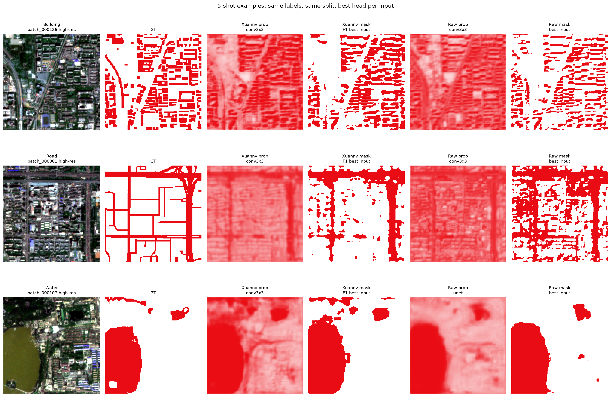
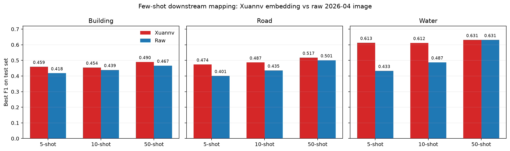

# 玄女海淀月度地理 Embedding 最新成果汇报

> 更新日期：2026-07-20  
> **当前生产版：P10C `epoch_800`**（64 维、128×128 月度 embedding map）  
> 范围：海淀区 320 个 patch；训练月份为 2025-12 至 2026-05；核心下游评测使用 2026-04 月度 embedding。  
> 本文替代历史 P2A 阶段结论；历史材料仍保留于 [`leadership_embedding_report_20260629.md`](leadership_embedding_report_20260629.md)。

## 一页结论

- **当前版本是 P10C epoch 800，而不是 P2A 或 P10A。** P10A 是 P9B 长训链上的延续候选；P10C 在此基础上加入 OSM 弱语义探针与困难负样本加权，经过多版本统一下游横评后定为海淀生产版。
- 模型将多源月度遥感压缩为每像素 64 维地理语义向量。同一份 embedding 可复用于建筑、道路、水体、施工工地、绿地与细粒度 OSM 类别，不需要为每类从头训练主模型。
- 在与 Google AEF 相同的 64 维、相同 patch/标签/轻量探针协议下，P10C 在施工工地与道路上持平或略优，建筑基本持平；水体仍落后 AEF。充分标注时，原始影像加 UNet/DeepLab-lite 仍是强上限；玄女的核心价值在少标注快速制图。
- 已形成数据质检、训练、导出、轻量下游头、阈值选择、全域拼图和报告生成的闭环。论文级空间独立评测正在推进，生产结果与论文主结论严格区分。

## 版本口径与选型

| 版本 | 角色 | 结论 |
| --- | --- | --- |
| P2A / P1B | 2026-06 历史实验 | 保留为技术演进记录，不能代表当前效果。 |
| P10A `epoch_800` | P10 训练链早期候选 | 为后续 P10C 提供初始化与长训基础。 |
| **P10C `epoch_800`** | **当前海淀生产版** | 多任务、few-shot 与检索综合最优，稳定别名为 `haidian_production_v1.pt`。 |
| V4A | 施工工地专用候选 | 施工 F1/AP 更高，但其他任务退化，不替代通用生产版。 |
| P11-P14、V5 | 后续升级验证 | 有效秩或单项能力有所改善，但未稳定超过 P10C 的通用 few-shot 与多任务表现。 |

生产选型依据：在 P10C、P11、P12、P13、P14A、V4A、V5 的统一协议比较中，P10C 在 6 类任务 × 3 个 shot 的 few-shot 横评全面最优，并在建筑、道路、水体的轻量 `conv3x3` 探针以及三类原型检索中保持最均衡表现。

## 模型与训练数据

**输入数据。** 按月组织 Sentinel-2、Sentinel-1、Landsat、高分辨率光学与高分辨率 SAR；云雾、无效像素和配准问题在输入质检与有效像素 mask 中处理。OSM 矢量经过清洗、合并与栅格化，作为广义地物弱语义，而非直接使用最终人工下游标签训练主模型。

**训练目标。** 模型保持 128×128 输出分辨率，通过多模态重建学习光谱、雷达和纹理信息；随机遮挡月份、模态与空间块，迫使模型在缺失输入下恢复有效目标；P10C 额外使用 13 类 OSM 弱语义探针与困难负样本加权，提升相似地物之间的可分性。输出采用 64 维月度语义 embedding，可冻结后接轻量任务头。

**质量控制。** 每次训练前抽检每月各数据源、云/无效 mask、空间对齐和 OSM 标签；训练后以 F1、AP、AUC、阈值化掩膜、概率图、GT 和全域拼图共同验收，不只看单一 loss 或 AUC。

## 核心下游结果

评测设置：冻结 2026-04 embedding，以同一训练/验证/测试划分训练 `conv3x3` 轻量探针；阈值在验证集选择后报告测试结果。

| 任务 | F1 | AP | AUC | 解读 |
| --- | ---: | ---: | ---: | --- |
| 施工工地检测 | 0.5495 | 0.5435 | 0.9590 | 对月度敏感目标具备可用检出能力。 |
| 建筑物提取 | 0.4842 | 0.4497 | 0.8956 | 建筑纹理相近区域仍易出现假正例。 |
| 道路提取 | 0.5218 | 0.5664 | 0.8340 | 轻量空间头能释放道路的局部连续性。 |
| 水体提取 | 0.6237 | 0.6041 | 0.8910 | 三类基础地物中最稳定，但仍低于 AEF。 |

## 同协议基线比较

所有模型接入同一批海淀 patch、同一套标签、同一 fold 和 `conv3x3` 探针。F1/AP 越高越好。

| 任务 | P10C 64维 | Google AEF 64维（年度） | DINOv3 1024维 | 结论 |
| --- | --- | --- | --- | --- |
| 施工工地 | 0.5495 / 0.5435 | 0.5453 / 0.5669 | 0.5817 / 0.5219 | P10C 的 F1 与 AEF 基本持平，月度产品适合继续验证时序业务价值。 |
| 建筑物 | 0.4842 / 0.4497 | 0.4856 / 0.4219 | 0.4991 / 0.4821 | P10C 与 AEF 接近；DINOv3 为更高维特征上界。 |
| 道路 | 0.5218 / 0.5664 | 0.5169 / 0.5642 | 0.6020 / 0.6733 | 同 64 维条件下 P10C 略优于 AEF。 |
| 水体 | 0.6237 / 0.6041 | 0.6661 / 0.6869 | 0.6774 / 0.7201 | 水体仍是 P10C 的主要短板。 |

> DINOv3 的输出为 1024 维，是 P10C 的 16 倍信息维度，且其原生空间栅格更粗后再上采样；因此作为高预算能力参照，不应表述为同成本产品对比。

## 少样本快速制图

`5-shot / 10-shot / 50-shot` 分别表示只使用 5 / 10 / 50 个正样本 patch，并配同数负样本训练下游头。与 2026-04 原始多源影像强头使用相同标签、划分和验证集阈值选择。

| 任务 | 5-shot：玄女 / 原始影像 | 10-shot：玄女 / 原始影像 | 50-shot：玄女 / 原始影像 |
| --- | --- | --- | --- |
| 建筑 | 0.459 / 0.418（+9.8%） | 0.454 / 0.439（+3.5%） | 0.490 / 0.467（+5.0%） |
| 道路 | 0.474 / 0.401（+18.3%） | 0.487 / 0.435（+11.8%） | 0.517 / 0.501（+3.3%） |
| 水体 | 0.613 / 0.433（+41.5%） | 0.612 / 0.487（+25.6%） | 0.631 / 0.631（持平） |

这说明 embedding 的实际价值在于：面对新类别时，业务人员只需标少量样例，即可使用轻量头快速形成全域初图；当每类都拥有充分标注时，原始影像配重型分割模型仍是更高的任务上限。

## 可视化证据

**全域 embedding 地理一致性。** 左侧为玄女 P10C，右侧为 AEF；同色代表语义相近。图用于检查建成区、水系、林地和道路周边是否形成连续的空间结构，不作为单独的定量指标。

**建筑、道路与水体全域制图。** 每个镶嵌单元对应一个海淀 1280m×1280m patch，展示 P10C 生产 embedding 经下游头得到的区域级结果。

**少样本代表性样例。** 图中同时呈现原始高分影像、真实标签、玄女预测与原始影像强头预测，用于直接观察漏检与假正例，而非只比较指标。

## 已形成的可交付能力

1. **月度 embedding 生成：** 对 2025-12 至 2026-05 输出海淀 64 维 embedding，支撑按月更新与后续变化分析。
2. **轻量下游制图：** 建筑、道路、水体、施工工地可直接接入 `conv3x3` 头；公园绿地、教育用地、运动场等可按 few-shot 流程新增。
3. **零训练检索：** 以少量查询区域构建类别原型，在全域 embedding 中检索相似地物，适合标注前的候选筛选。
4. **可追溯交付：** 生产 checkpoint、月度 embedding、基础下游头、配置、可视化与说明已按代码/大文件分离方式打包；代码和文档在 Git，权重与产物在 ModelScope。

## 边界与下一步

- P10C 是海淀全域训练的区域产品，不能据此直接声称跨区域空间泛化；论文主实验正使用严格空间独立的训练/评测协议。
- OSM 是弱标签，空白处不等于真实负类。后续需以 Dynamic World/ESRI、人工验证集与留出类别补足独立证据。
- 云雾、传感器缺失、跨源配准和 10m 小目标仍是最主要误差来源，尤其影响水体边界和建筑假正例。
- 下一阶段重点不是继续以单任务最高分替换生产底座，而是完成空间独立统计评测、跨区域哈尔滨复现、数据规模曲线和全国数据试点，为论文与下一代通用模型提供可靠证据。

## 追溯入口

- [生产版阶段总结](../experiments/haidian_embedding_report_summary_20260714_zh.md)
- [P10C 权重登记与稳定别名](../checkpoint_registry.md)
- [少样本与原始影像基线对比](../production/haidian_fewshot_raw_vs_xuannv_20260708.md)
- [完整监督下游头与原始影像基线](../production/haidian_raw_image_baseline_comparison_20260708.md)
- [周度模型汇报网页](weekly_20260719/model_training_report.html)
- [论文进度汇报网页](weekly_20260719/paper_progress_report.html)
